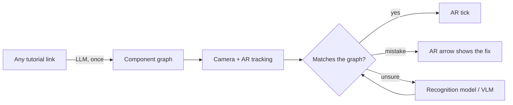

# Pinpoint — Business Proposition

### An adaptive augmented reality guide for anything you build

> **Working name:** Pinpoint · **Date:** 29 September 2026 · **Status:** concept

---

## At a glance

| | |
|---|---|
| **What** | An AR guide that turns **any** build instructions into a map of how the parts connect, then guides you live through your phone camera |
| **What's different** | It checks the **result, not the order**. Step 3 before step 2 is fine, and so is a different-but-correct way of doing it |
| **How it stays cheap** | The core is a plain **algorithm**. AI models are used only for a few small jobs |
| **Who pays** | **Companies** (Arduino, IKEA, kit makers, internet providers) license it; **users** get a free tier plus a subscription |
| **First market** | Arduino and Raspberry Pi learners |
| **Already built** | [**CircuitQuest**](https://circuitquest.onrender.com), my own project: upload a well-written tutorial and get a step-by-step lesson, as a game, for Arduino and Raspberry Pi |

---

## 1. The problem

- **Instructions assume one fixed order**, but people skip ahead and batch steps.
- **Instructions show one way**, but many ways are correct. Users can't tell whether their version is fine.
- **Mistakes are found too late**, when the finished thing doesn't work.
- **Help is expensive.** Companies pay for it through support calls, returns and technician visits.

---

## 2. The solution

1. **Paste a link.** The instructions become a **component graph**: parts, connections, and which alternatives are equally correct.
2. **Point the camera.** The guide draws **on the real object**: where the next part goes, and ticks on finished connections.
3. **Build your way.** Any valid order and any equivalent variation is accepted.
4. **Talk to it.** Ask questions by voice; the guide answers and encourages.

**Algorithm first, AI only where needed**
- **Geometry** checks each small step. On flat builds (Arduino, LEGO) a known grid maps every hole or stud.
- A small **recognition model** on the phone identifies parts, and re-checks them only when unsure.
- A **VLM + speech-to-text** does one final check that everything is connected properly.
- An **LLM** turns each tutorial into a graph **once** and answers questions.

> A general AI assistant streams video to a large model the whole time. Pinpoint's cost per build is **close to zero**, so a company can offer it free to all its customers.

**Scope:** things people **build or assemble** that can be described as a few graphs of components, ideally checked by **real laws**, as in electronics.

### Already built: CircuitQuest

**[CircuitQuest](https://circuitquest.onrender.com)** is a project I built that already does the first half of Pinpoint, for **Arduino and Raspberry Pi only**:

- **Upload any well-written tutorial and get a step-by-step lesson** ("Create my own lesson"): the same tutorial → structured lesson idea that Pinpoint generalises.
- **A game:** a world map of levels you can **play in any order**, with progress tracking.
- **Parts-aware:** you enter the parts you own, and it unlocks projects you can build with them.
- **Virtual circuit building:** a 3D breadboard where you drag wires between holes and header pins. It checks the circuit, shows currents, LED brightness and pin readings, and adjusts the Arduino code to the pins you actually used.

**From CircuitQuest to Pinpoint:**

| | CircuitQuest (built) | Pinpoint (proposed) |
|---|---|---|
| Domains | Arduino and Raspberry Pi | Anything built from components |
| Where you build | On screen (virtual 3D breadboard) | On the **real** object, seen through the camera |
| Guidance | Step-by-step lesson, as a game | Live AR overlay, any order, "different but correct" accepted |
| Checking | Simulated circuit | Geometry, recognition model and VLM on the real build |

---

## 3. Value proposition

| Selling point | Why it matters |
|---|---|
| **Any instructions in, AR guide out** | No 3D authoring or CAD needed |
| **Checks the result, not the sequence** | Build in your own order |
| **Understands "different but correct"** | No false alarms |
| **Grounded in real laws** (circuits, fit, stability) | Catches mistakes even when the tutorial is wrong |
| **AR on the real object** | No switching between manual and build |
| **Near-zero running cost** | Free for users, cheap for companies |

**For users:** *"A patient expert looking over your shoulder, for any build, that only stops you when you're actually wrong."*

**For companies:** *"Turn your existing instructions into live AR guidance, with no authoring and almost no running cost."*

---

## 4. Business Model Canvas

| Key Partners | Key Activities | Value Propositions | Customer Relationships | Customer Segments |
|---|---|---|---|---|
| • Kit makers (Arduino, Raspberry Pi, LEGO Education) • Furniture and appliance brands • Internet providers • Schools | • Tutorial → graph • AR tracking and checking • SDK for brand apps | **Users:** finish without getting stuck **Companies:** fewer returns and support calls **Schools:** a tutor at every bench | • Self-service app • A guide that remembers you • Support for companies | • Makers and STEM learners (first) • PC, network and furniture builders • Companies and schools |
| | **Key Resources** | | **Channels** | |
| | • The graph algorithm • Library of verified graphs | | • App stores • QR code on the box • Inside brand apps | |

| Cost Structure | Revenue Streams |
|---|---|
| • Engineering (the main cost) • Small AI cost per tutorial and per build | • Company and school licences • Consumer freemium subscription • Kit bundles |

---

## 5. Market

| Level | Meaning | Pinpoint |
|---|---|---|
| **TAM** | Everyone who could ever use it | Everyone who builds or assembles things from instructions |
| **SAM** | Those we can reach | Electronics learners, PC builders, home network setup, flat-pack buyers |
| **SOM** | What we can win first | Arduino and Raspberry Pi learners, plus a first company or school deal |

**Why now:** AI can see and talk in real time, phone AR is mature, STEM education is growing, and companies already pay to cut returns.

---

## 6. Competitors

| Competitor | What they do | AI-powered |
|---|---|---|
| **Gemini Live, ChatGPT video, Meta AI** | General AI assistants on phones and smart glasses. You point the camera at anything and talk about what it sees | ✅ Fully: a large AI model watches and talks for the whole session |
| **BILT** | Interactive 3D instructions made from manufacturers' design files. Free for users, paid for by around 300 brands | ⚠️ Only behind the scenes: AI helps brands author guides faster; no AI for the user |
| **TeamViewer Frontline** | AR software for factory workers on smart glasses: guided assembly steps and live help from a remote expert | ✅ Computer vision and image recognition check factory steps |
| **Scope AR WorkLink** | AR work instructions for industry, built from companies' CAD files, plus remote expert help | ✅ AI-assisted authoring, plus AI detection and validation |
| **Pinpoint** | AR guide for anything built from components, generated from any tutorial link | ✅ Algorithm first: AI only for small jobs (graph extraction, unclear cases, final check, questions) |

| | Any link in | Watches the real build | AR on the object | Any-order checking | "Different but correct" | Low running cost |
|---|:---:|:---:|:---:|:---:|:---:|:---:|
| Gemini Live, ChatGPT video, Meta AI | ✅ | ✅ | ❌ | ❌ | ⚠️ | ❌ |
| BILT (3D instructions) | ❌ | ❌ | ❌ | ❌ | ❌ | ✅ |
| TeamViewer Frontline | ❌ | ✅ | ✅ | ❌ | ❌ | — |
| Scope AR WorkLink | ❌ | ✅ | ✅ | ❌ | ❌ | — |
| **Pinpoint** | ✅ | ✅ | ✅ | ✅ | ✅ | ✅ |

✅ yes · ❌ no · ⚠️ partly · — uses paid human experts

> **Positioning:** AI assistants are **wide but shallow**: they see anything but don't know what "correct" means. Instruction and enterprise AR tools are **deep but rigid**: fixed steps, authored content. Pinpoint sits in between.

---

## 7. SWOT

| **Strengths** | **Weaknesses** |
|---|---|
| • One engine, many domains • Any-order and "different but correct" checking • Very low running cost | • AR tracking across many objects is hard |
| **Opportunities** | **Threats** |
| • Companies paying to cut returns • Schools needing lab tutors • AR glasses going mainstream • Research gap: AI is weak at exact positions (§8) | • Big tech adds a "task mode" • Brands build it in-house |

---

## 8. Research opportunity and contributions

### The gap: AI models are weak at exact positions

Vision-language models (VLMs) such as Claude, GPT and Gemini can recognise objects well, but published research shows they are **unreliable at exact spatial positions** in an image ([Spatial Blindspot of VLMs](https://arxiv.org/pdf/2601.09954)). On a flat, dense grid they struggle to answer "is this wire in hole 18d or 18e?" or "which stud is this brick on?", which is exactly what checking a breadboard or a LEGO build needs.

The same research also points to a fix: models do much better when a **labelled grid is drawn onto the image**, which turns "find the exact position" into "read the label" ([Grid-augmented vision](https://arxiv.org/pdf/2411.18270), [Visual Position Prompt](https://arxiv.org/pdf/2503.15426)). **No one has applied and tested this on breadboards or LEGO.** The closest attempt, SmartBreadboard-3D, never built its hole-detection module.

### The opportunity: flat builds with a known grid

Breadboards, Arduino and Raspberry Pi pin headers, LEGO baseplates and PCB kits all share one property: a **fixed, documented grid**. That makes geometry do the hard part:

1. **Geometry finds the grid.** Markers or board corners map the camera image onto the flat board, so every hole, pin or stud has a known position.
2. **Geometry checks the small steps**, with no AI.
3. **The VLM only reads a labelled picture** in the final check, together with the user's spoken confirmation (speech-to-text).

### Contributions

| # | Contribution |
|---|---|
| 1 | **A new application of grid-augmented VLM grounding** to flat builds (breadboard, Arduino, LEGO), where exact position matters |
| 2 | **An evaluation against baselines:** geometry + labelled grid + VLM, compared with a VLM on the raw photo and with a classical computer-vision detector, measuring accuracy at the exact hole, pin or stud |
| 3 | **An algorithm-first design**, measured for accuracy **and cost per build** against a VLM watching the whole time |
| 4 | **A generic, order-free checker**: a component graph that accepts any valid order and "different but correct" builds, checked against real laws (e.g. circuit rules) |
| 5 | **A three-way final check** (geometry, VLM and speech agree) and whether it catches more errors |

> **Either result is useful.** If the labelled-grid approach works, it is a new, practical way to make general AI models precise. If a classical detector does just as well, that is a clear, publishable answer to when large models are worth using.

---

## Sources

- Competitors: [BILT](https://biltapp.com/brands-and-retailers/) · [BILT platform](https://bilt.ai/platform/) · [TeamViewer Frontline Make](https://www.teamviewer.com/en/frontline/xmake/) · [Scope AR: AI + AR](https://www.scopear.com/ai-ar) · [TeamViewer Frontline](https://www.teamviewer.com/en-us/solutions/frontline/) · [Scope AR (ContinuumAR comparison)](https://www.continuumar.io/resources/compare/best-ar-remote-assistance-software.html)
- Research: [Spatial Blindspot of VLMs](https://arxiv.org/pdf/2601.09954) · [Grid-augmented vision](https://arxiv.org/pdf/2411.18270) · [Visual Position Prompt](https://arxiv.org/pdf/2503.15426) · [SmartBreadboard-3D](https://github.com/sasivaradhansbee25-hue/SmartBreadboard-3D)
- My project: [CircuitQuest](https://circuitquest.onrender.com)
- Full research notes: `research-log.md`
