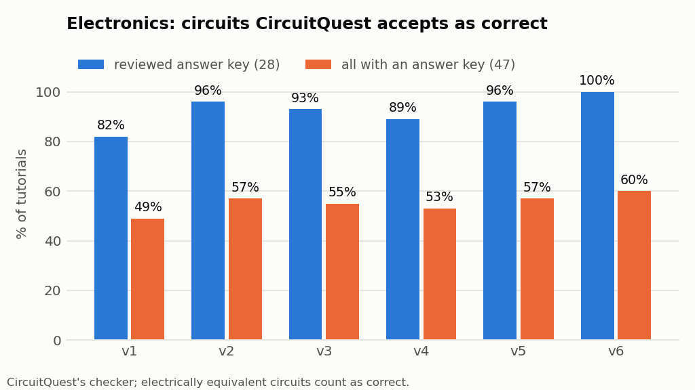
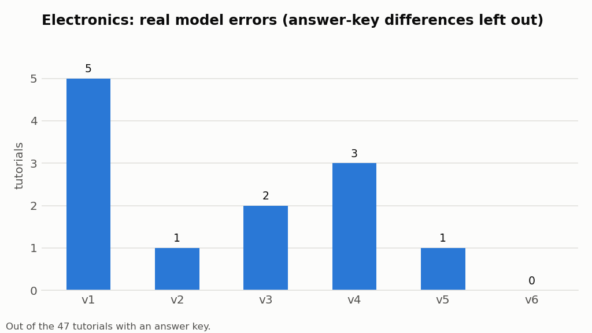
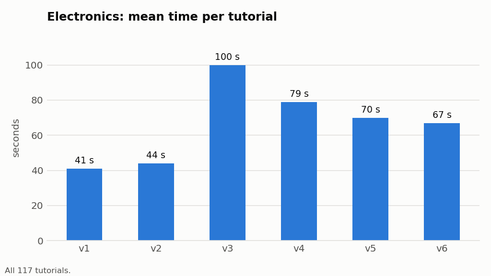
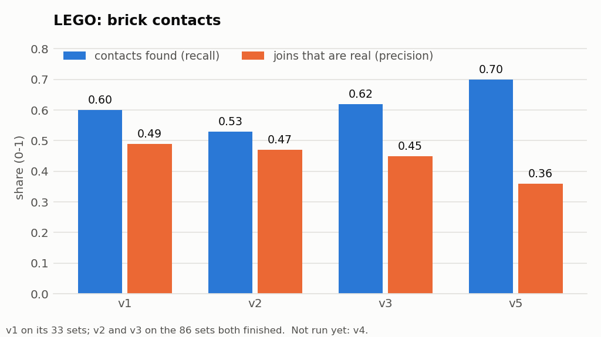
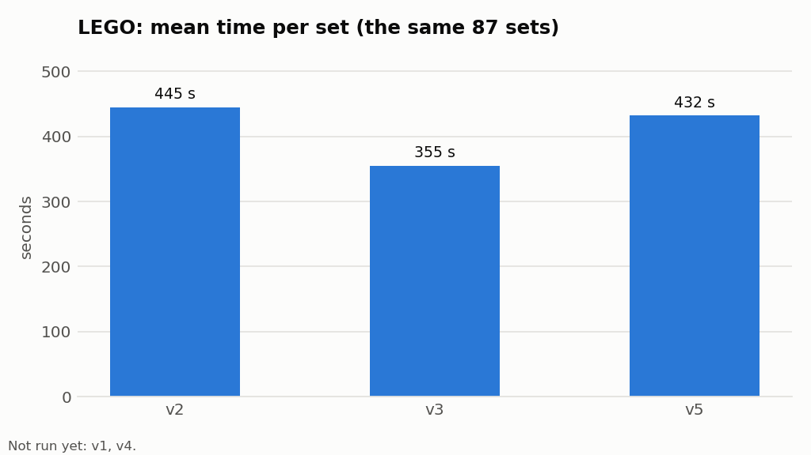

# Graph generation: results

> Can Claude turn a real manual into one build graph that follows [GRAPH_SPEC.md](./GRAPH_SPEC.md)? How accurate, how fast, how expensive, and which design works best?
> Method and test sets: [RESEARCH.md](./RESEARCH.md) R21; architecture of v3–v7: R22. Code: [`graphgen/`](./graphgen/). Raw results: `experiments/graphgen/`. Full tables: `experiments/graphgen/electronics_eval.md`, `electronics_judged.md`, `lego_studkey_all.md`, `lego_studkey_v1235.md` (made by `python -m graphgen.evaluate`). Charts: `figures/graphgen/` (`python -m graphgen.plots`).

*Updated 7 October 2026.*

| Run | Status |
|---|---|
| Electronics v1–v6 | ✅ complete (117 tutorials) |
| Electronics v6 from links (browser) | ✅ complete (48 tutorials with an answer key) |
| LEGO v1 | stopped at 34 sets (kept as the baseline) |
| LEGO v2, v3, v5 | ✅ complete (100 sets) |
| LEGO v4 | Path A (3D model by code) ✅ on all 100 sets; Path B stopped at 11 sets |
| LEGO v6 | **running** (whole booklet; 76 of 100) |
| LEGO v7 | **running** (one id per piece, positions, laws; started 7 October) |

**Model in every version:** Claude Sonnet (`claude-sonnet-5-5`), effort `high`, on the Claude subscription through headless Claude Code. **Cost** is Claude Code's estimate at **API list prices**, not what the subscription charges.

---

## 1. Summary

| | Best for accuracy | Best for time and cost | Why |
|---|---|---|---|
| **Electronics** | **v6** | v2 | v6 is the only version with no real wiring mistakes; v2 has one, but is 23 s and $0.06 cheaper per tutorial |
| **LEGO** | **v3** (v6/v7 still running) | v3 | Every piece right, the best balance of connections found and real, the fastest and cheapest |

| | v1 | v2 | v3 | v4 | v5 | v6 | v7 |
|---|---|---|---|---|---|---|---|
| **Idea** | Claude reads the manual, writes the graph | + code checks, Claude repairs | Know the parts first | One generic pipeline | One fix per weakness found | Breadboard sense, pin tables; reads links | LEGO: one id per piece, positions, laws, stud answer key |
| **Electronics: circuit correct** (reviewed answer key, 28) | 82% | 96% | 93% | 89% | 96% | **100%** | = v6 |
| **Electronics: real wiring mistakes** (of 47) | 5 | 1 | 2 | 3 | 1 | **0** | = v6 |
| **Electronics: time / cost per tutorial** | 41 s / $0.10 | 44 s / $0.12 | 100 s / $0.19 | 79 s / $0.15 | 70 s / $0.16 | 67 s / $0.18 | = v6 |
| **LEGO: sets with exactly the right pieces** | 25% | 27% | **100%** | – | 65% | *running* | *running* |
| **LEGO: connections found / real** (stud key) | 0.50 / **0.57** | 0.47 / 0.52 | 0.58 / 0.53 | – | **0.61** / 0.46 | *running* | *running* |
| **LEGO: time / cost per set** | 221 s / $0.55 * | 452 s / $1.47 | **362 s / $0.95** | – | 432 s / $1.71 | *running* | *running* |

\* v1 only ran 34 sets (it was stopped and kept as the baseline); on those same sets v2 took 363 s / $1.08, v3 311 s / $0.79, v5 391 s / $1.14. LEGO v4's Path B was not run in full.



---

## 2. How we measure

**Test sets:** 117 electronics tutorials (95 official Arduino + 22 Raspberry Pi) and 100 official LEGO instruction PDFs (31–498 pieces). Every version runs all of them; time and cost are over all of them.

Every result is split into the same four questions:

| | Electronics | LEGO |
|---|---|---|
| **1. Parts:** are the right parts there? | Kinds of part (board, LED, resistor …) against the answer key | Pieces against the official inventory (Rebrickable): count, shape, shape + colour |
| **2. Graph:** are they connected right? | Is the circuit right? Judged by **CircuitQuest's own checker** | Which pieces really connect, from the set's 3D model (**stud key**) |
| **3. Mistakes:** what goes wrong, and whose fault? | Each wrong circuit explained; model or answer key | Pieces missing / extra; connections missed / invented |
| **4. Time and cost** | Per tutorial, per phase | Per set, by set size |

**Electronics answer key.** Only **47** of the 117 tutorials have one (a verified CircuitQuest lesson), so circuits can be judged right or wrong only on those 47. For the other 70 we check that the listed parts are in the graph and that the circuit laws hold. The rule, the same for every version (`python -m graphgen.evaluate --judged`; `graphgen/cq_score.py` calls CircuitQuest's `checker.check` and `engine._try_pin_substitution`):
- **correct:** exactly right; or right apart from a symmetric-leg swap (resistor legs, potentiometer ends, button sides); or a part on another board pin of the same kind (digital for digital); or connected in an **electrically equivalent** way (resistors and LEDs in another series order). Polarity still counts: a reversed buzzer is wrong;
- **wrong:** anything else, explained (what is missing, what the graph has instead) and put down to the **model** or to the **answer key**.
- **Reviewed answer key:** in 19 of the 47, CircuitQuest's circuit is not the only right answer (extra LEDs, a buzzer where the tutorial has a speaker, one of several set-ups the tutorial offers). Claude follows the official tutorial there, so the headline is on the other **28** (reasons: `research/data/answer_key_review.json`). Every table also shows the score on **all 47** (the strict one); no version can get above 28 of 47 (60%) there, because those 19 fail in every version for the same answer-key reason. A hand check of these tutorials (20 in the link test, which had one more) found every one wired as its tutorial says (section 3.5); turning that check into corrected answer keys would let all 47 count.

**LEGO answer key (from v7, used for every version).** The **stud key** (`graphgen/stud_key.py`) finds every real connection in a set's LDraw 3D model from the parts library's own geometry: a stud of one piece inside another piece, or a pin or axle through a hole, for every kind of piece. It replaced the old **box key**, which only compared the footprints of plain bricks, plates and tiles. The old key's numbers are kept in section 4.2 for comparison. How we know the stud key is right, and what it fixed: section 4.5. Scores are given for all sets and for the **38 trusted sets**, whose model has exactly the set's pieces.

---

## 3. Electronics

### 3.1 Parts: are the right parts there?

| | v1 | v2 | v3 | v4 | v5 | v6 |
|---|---:|---:|---:|---:|---:|---:|
| Tutorials with every part exactly right (of 47) | 62% | 62% | **64%** | 62% | 62% | 62% |
| Parts that are right (precision) / parts found (recall) | 0.86 / 0.85 | 0.85 / 0.84 | **0.91 / 0.87** | 0.87 / 0.86 | 0.87 / 0.86 | 0.87 / 0.86 |
| Other 70 tutorials: listed parts present | 0.97 | 0.96 | **0.98** | 0.96 | 0.97 | 0.97 |

The parts that differ are almost all answer-key cases: the tutorial uses the built-in LED where the answer key adds one (resistor and LED "missing"), or force sensors and speakers where the answer key has potentiometers and buzzers ("extra"). v3's higher precision is mostly the answer key's own choice ("any analog sensor" → potentiometer).

### 3.2 Graph: is the circuit right?

| | v1 | v2 | v3 | v4 | v5 | v6 |
|---|---:|---:|---:|---:|---:|---:|
| **Correct, reviewed answer key (28)** | 82% | 96% | 93% | 89% | 96% | **100%** |
| Correct, all 47 | 49% | 57% | 55% | 53% | 57% | **60%** |
| …exactly right / right with a harmless leg swap | 16 / 7 | 22 / 5 | 19 / 7 | 16 / 9 | 18 / 9 | 22 / 6 |
| When the parts were right: circuit right | 23 / 29 | 27 / 29 | 26 / 30 | 25 / 29 | 27 / 29 | **28 / 29** |
| Connections right (precision) / found (recall) | 0.64 / 0.61 | 0.67 / 0.64 | 0.67 / 0.65 | 0.69 / 0.67 | 0.70 / 0.67 | **0.71 / 0.68** |

### 3.3 Mistakes made

**Real wiring mistakes** (the model's fault; ✗ = wrong in that version):

| Mistake | v1 | v2 | v3 | v4 | v5 | v6 |
|---|:-:|:-:|:-:|:-:|:-:|:-:|
| **row-column-scanning:** LED-matrix rows and columns crossed (row 1 belongs on pin 2, row 2 on pin 7) | ✗ | ✗ | ✗ | ✗ | ✗ | |
| **tone-melody:** buzzer reversed (+ to GND, − to pin 8) | ✗ | | ✗ | ✗ | | |
| **button, digital-read-serial:** pull-down resistor on the button's 5V side, so the input floats | ✗ | | | | | |
| **keyboard-message:** the input pin wired straight to 5V through the button side | ✗ | | | | | |
| **read-ascii-string:** RGB LED's common pin wired as "A" instead of COM | | | | ✗ | | |
| **Total** | 5 | 1 | 2 | 3 | 1 | **0** |

**Answer-key cases** (the same 19 in every version, not the model's fault): CircuitQuest adds an external LED where the tutorial uses the built-in one (debounce, if-statement, knock, calibration, while-loop, state-change-detection, input-pullup-serial), uses other parts (buzzers for speakers, potentiometers for force sensors, another sensor name), or picked another of the tutorial's set-ups (arduino-isp, arduino-to-breadboard, led-bar-graph, serial-call-response). Full list with explanations: `experiments/graphgen/electronics_judged.md`.



**Problems the checks still find at the end** (form and law problems, not judged wrong by CircuitQuest):

| | v1 | v2 | v3 | v4 | v5 | v6 |
|---|---:|---:|---:|---:|---:|---:|
| Problems left | 210 (no checks) | **2** | 251 | 12 | 24 | 19 |
| Most common | invented part numbers, port names | 2 circuit-law issues | missing / bad port names, 14 pins shorted | port names | port names, supply range | supply range, 3 shorted parts |

### 3.4 Time and cost

| | v1 | v2 | v3 | v4 | v5 | v6 |
|---|---:|---:|---:|---:|---:|---:|
| Mean time per tutorial | **41 s** | 44 s | 100 s | 79 s | 70 s | 67 s |
| Mean cost per tutorial | **$0.104** | $0.122 | $0.187 | $0.154 | $0.160 | $0.182 |
| Parts step | – | – | 54 s | 34 s | 24 s | **18 s** |
| Build | 41 s | 39 s | 40 s | 39 s | 36 s | 37 s |
| Tutorials repaired | 0 | 22 | 12 | 21 | 26 | 33 |

The parts step got faster with every version because the parts database grows: v5 looked up 84 parts on shop sites, v6 only 40. v6 repairs more tutorials than v5 mostly because of stricter port-name and placement checks, not wrong circuits.



### 3.5 Reading the tutorial from its link

The v6 pipeline, but Claude gets only the tutorial's URL and opens it itself with the `open_page` tool (a real browser, `graphgen/browser.py`; docs.arduino.cc builds its pages with JavaScript, so a plain fetch returns nothing). Tested on the 48 built-in examples with an answer key.

| | v6 (saved text) | v6 (link + browser) |
|---|---:|---:|
| Correct, reviewed answer key (28) | **100%** | **100%** |
| Correct, all 48 | 58% | 58% |
| Real wiring mistakes | 0 | 0 |
| **Wired as the tutorial says (hand check, 48)** | – | **48 / 48** |
| Opened the page | – | 48 / 48 |
| Mean / median time | 49 s / 41 s | 49 s / 44 s |
| Mean cost | $0.131 | **$0.106** |
| Tutorials repaired | 2 | 6 |

The hand check compared each of the 20 answer-key cases with the tutorial's own circuit text and code: every connection matches (e.g. adxl3xx powered from A4/A5 as the code does; speakers with 100 Ω resistors on the tutorial's pins). One small flaw: in joystick-mouse-control Claude added the USB cable as a part. **The app can therefore take a link;** it needs headless Chrome on the server.

---

## 4. LEGO

Same sets in every column: v2, v3 and v5 on all 97 sets with a graph in every version (3 sets with an empty graph in one version left out); v1 on its 32. Time and cost on 98 sets (two v2 sets paused by the Mac sleeping left out).

### 4.1 Parts: are the right pieces there?

| | v1 (32 sets) | v2 | v3 | v5 |
|---|---:|---:|---:|---:|
| Sets with exactly the right number of pieces | 25% | 27% | **100%** | 65% |
| Pieces right by shape: recall / precision | 0.81 / 0.83 | 0.86 / 0.86 | **1.00 / 1.00** | 0.98 / 0.97 |
| Right shape AND colour | 0.74 | 0.83 | **1.00** | 0.97 |

v1 and v2 read the pieces from the booklet pictures. From v3 on Claude is given the official parts list, so these rows show whether it **used** the list. v3 does exactly. v5, reading one page at a time, adds and drops pieces (section 4.3).

### 4.2 Graph: are the pieces connected right?

| | v1 (32 sets) | v2 | v3 | v5 |
|---|---:|---:|---:|---:|
| **Connections found** (stud key, recall) | 0.50 | 0.47 | 0.58 | **0.61** |
| **Joins that are real** (stud key, precision) | **0.57** | 0.52 | 0.53 | 0.46 |
| Found / real, 38 trusted sets only | 0.51 / **0.62** | 0.49 / 0.56 | 0.62 / 0.57 | **0.64** / 0.45 |
| Joins written per piece | 1.08 | 1.05 | 1.15 | 1.36 |
| *Old box key: contacts found / real (plain bricks, plates, tiles)* | *0.60 / 0.49* | *0.55 / 0.49* | *0.64 / 0.46* | *0.70 / 0.36* |

How to read it: **found** = of the real connections, how many the graph has; **real** = of the joins the graph has, how many exist. v3 balances both. v5 asks each piece for *everything* it rests on, so it writes more joins (1.36 per piece) and finds the most, but invents the most. Every version finds only about half of the real connections, and about half of what it writes is real: this is the main LEGO weakness, and the target of v6 and v7.



### 4.3 Mistakes made

**Pieces** (all 97 sets):

| | Most often missing | Most often extra |
|---|---|---|
| v1 (32 sets) | Plate 1×2 ×26, Tile 1×6 ×19, Plate Round 1×1 ×19 | Plate 2×4 ×16, Panel 1×2×1 ×16, Brick 1×2 with handle ×16 |
| v2 | Plate 1×2 ×62, Jumper plate ×52, Curved brick 4×1 ×51 | Jumper plate (other mould) ×43, Tyre ×42, Plate 2×2 ×33 |
| v3 | 2 pieces in all 97 sets (a Technic brick and an axle, look-alike moulds) | the same 2 |
| v5 | Plate 1×1 ×23, Plate Round 1×1 ×13, Tile 1×2 ×13 | Plate Round 1×1 ×39, Plate 1×2 ×15, Plate 2×4 ×14 |

- **v1/v2: reading pieces from pictures.** Small and similar pieces get confused (two jumper-plate moulds; Plate 1×2 vs 1×3).
- **v5: drift.** A page shows the pieces already built as well as the new ones, so pieces are added twice or dropped. Repair can add pieces in a later turn but cannot remove them.

**Connections** (old box key, all 97 sets):

| | Most often missed | Most often invented |
|---|---|---|
| v2 | Plate 1×2 on Plate 1×2 ×43, Plate 3×3 + Plate 1×2 ×27 | Plate 1×2 + Plate 1×1 ×34, Plate 1×2 + Plate 1×3 ×30 |
| v3 | Plate 3×3 + Plate 1×2 ×30, Plate 1×2 on Plate 1×2 ×23 | Plate 2×4 + Plate 1×2 ×42, Plate 1×2 + Plate 1×1 ×35 |
| v5 | Plate 1×2 on Plate 1×2 ×32, Plate 1×1 on Plate 1×1 ×26 | Plate 2×4 + Plate 1×2 ×58, Plate 1×8 + Tile 1×8 ×57 |

- **Missed: identical pieces stacked** (Plate 1×2 on Plate 1×2). Claude loses track of which copy is which. v7 gives each copy its own id.
- **Invented: look-alike plates.** Claude knows a piece sits on "a plate" but picks the wrong one. v7 adds positions and laws.
- **v5 invents joins to pieces on earlier pages** that the piece does not touch.

### 4.4 Time and cost

| | v2 | v3 | v5 |
|---|---:|---:|---:|
| Mean / median time per set | 452 s / 408 s | **362 s / 307 s** | 432 s / 326 s |
| Mean cost per set | $1.47 | **$0.95** | $1.71 |
| Sets repaired | 96 | 47 | 82 |

v3 by set size (87 sets, against v2):

| Pieces | Sets | v3 time | v3 cost | v2 time | v2 cost |
|---|---:|---:|---:|---:|---:|
| under 50 | 22 | 134 s | $0.26 | 133 s | $0.47 |
| 50–119 | 34 | 268 s | $0.67 | 360 s | $1.14 |
| 120–199 | 11 | 491 s | $1.34 | 598 s | $1.92 |
| 200+ | 20 | 672 s | $1.85 | 847 s | $2.67 |

v1 on its 34 sets: 221 s, $0.55 (v2 363 s / $1.08, v3 311 s / $0.79, v5 391 s / $1.14 on the same sets). v1 is fastest because it neither checks nor repairs.



### 4.5 The stud answer key: why it replaced the box key

The box key compared the footprints of plain bricks, plates and tiles, standing upright. Building the stud key exposed three problems with it:

| Problem | Example | Fix |
|---|---|---|
| Only plain bricks, plates and tiles were scored | slopes, round and special pieces, Technic pins left out | the stud key scores every piece with studs, holes or pins |
| Models built at an angle could not be read | 40457-1 is built tilted 45°: the box key found 30 contacts, the stud key 177 | studs are matched in any direction |
| Custom parts in 26 model files were split into their drawing primitives | 7893-1 counted 803 "pieces" instead of 419 | the model reader now treats a custom part as one piece |

**How we know the stud key is right:**
- **Hand-built test models** with known answers all pass: stacked, offset by a stud, crossed at 90°, side by side, floating, half a stud off the grid, a plate bridging two bricks, a tile on a brick, a brick on a tile, a tower (`tests/test_graphgen.py`).
- **Physical laws** run on every model: a stud fits only one piece; nothing clutches itself; no more clutches than studs; no floating pieces.
- **Odd shapes:** corner, round and wedge pieces were at first treated as full rectangles. A stud under an L-shaped brick's empty corner seemed held twice; the piece with material over that cell now wins. 310 of 12,682 joins remain undecidable (curved slopes, wing plates) and are not scored.
- **Spot checks** where the stud and box keys disagree favour the studs (e.g. a jumper plate on a plate, which the box key missed).
- **One name per piece:** the parts list (Rebrickable) and the 3D models (LDraw) sometimes name one piece differently (mould variants such as `3794a` / `3794b` / `15573`, prints, the cheese slope `54200` / `50746`). Rebrickable's own part relationships, letter variants of one number, and a one-line alias list put them under one name (`stud_key.canon`). Before this, 10% of pieces could not be scored at all; now 3%.

**What it changes:** the old key undercounted real joins (v3: 53% real, not 46%). It also missed connections between non-plain pieces, so every version now finds a smaller share of a larger set of real connections. The ranking of the versions does not change.

---

## 5. The versions

### v1: Claude builds the graph in one go

```
manual (text + 2 images, or the LEGO PDF) + spec + catalogue
        │
        ▼
   Claude, 1 turn ──► graph ──► expand repeats ──► spec rules (report only) ──► score
```

Claude reads the whole manual and writes the whole graph. Electronics catalogue: 82 verified CircuitQuest cards; LEGO: empty. **Main issues:** no checks, so form problems stay (invented part numbers and port names); LEGO pieces guessed from small pictures; pushbutton legs wired wrongly (4 tutorials).

### v2: check and repair

```
manual + spec + catalogue ──► Claude ──► graph ──► CHECK (code) ──► problems? ──yes──► same Claude repairs (≤2 rounds)
                                                     │                                        │
                                                     no                                        └──► CHECK again
CHECK = circuit laws (short, pin to supply, part shorted, unconnected leg, floating input)
        + LEGO laws (parts page, real part numbers, build in one piece) + spec rules
```

Code checks the graph; every problem goes back to the same conversation. The catalogue got the pushbutton's internal leg pairs and missing pinouts. **Main issues:** electronics good (the pushbutton tutorials became right); LEGO repair fixes form, not content, and doubles time and cost.

### v3: parts first

```
LEGO:        set number ──► Rebrickable (local dump) ──► parts list + cards ─┐
Electronics: tutorial ──► Claude call A: "list the parts" ──► shop lookups ──┤
                                                                              ▼
             manual + ONLY these cards + parts list ──► Claude call B ──► graph ──► CHECK ──► repair REAL errors only
```

The parts are known before the build. LEGO: the official inventory and 1,018 reusable part cards. Electronics: a separate Claude call and shop lookups. **Main issues:** LEGO a clear win (every piece right, faster, cheaper) but still guesses which piece sits on which; electronics a loss (twice as slow, pin-name clashes left unrepaired).

### v4: one generic pipeline

```
                         recipe (domains.py: data only)
                                   │
manual ──► 1 PARTS ──► 2 BUILD ──► 3 CHECK (laws) ──► 4 REPAIR ──► graph ──► 5 UPKEEP (card new part types)
              │           ├─ LEGO: Path A = LDraw 3D model by code (if it matches the set)
              │           │        Path B = booklet one page per turn
              │           └─ Electronics: one shot, full catalogue (as v2)
              ├─ LEGO: Rebrickable inventory + cards
              └─ Electronics: code reads the parts list, free-text search, shop lookups
parts machinery (all domains): registry.json ──► site adapters ──► scrape + JSON-LD ──► prompt engine ──► schema gate ──► card store
```

Everything runs through one pipeline; a domain changes only its recipe. LEGO Path A builds the graph from the 3D model by code (3 s, free) when the model matches the set. **Main issues:** electronics ≈ v2 but 35 s slower (shop lookups before the build; reading parts lists by code is brittle); Path A cannot be scored (the model is also the answer key) and only 23 of 100 models are exactly the set as sold.

### v5: one fix per weakness found

```
ELECTRONICS:
tutorial ──► turn 1 (Claude): list the parts ──► lookup_part tool ──► database ──► approved sites (stored)
                ▼  same conversation
             turn 2 (Claude): add all connections ──► graph
                ▼
             CHECK: circuit laws + E6 parts count + E7 named board pins wired + E8–E10 electrical
                ▼
             REPAIR (≤2) ──► UPKEEP ──► electrical recheck
LEGO: as v4, but Path B asks each piece "what do you rest on?" (all of them), page by page; code makes the joins.
```

Electronics parts are chosen by Claude in the same conversation, with a `lookup_part` tool; cards carry electrical facts; new laws. **Main issues:** electronics fixed the buzzer polarity (v2's accuracy) but slower; LEGO finds the most connections but invents the most, and loses exact pieces reading page by page.

### v6: breadboard sense and pin tables; whole booklet

```
ELECTRONICS: as v5, plus
             CHECK: B1/B2 breadboard placement (legs in neighbouring holes, in order; a button across the gap)
                    E11 pin tables in the tutorial wired as written · E12 LED-matrix resistors on one side only
             optional input: the tutorial's LINK ──► open_page tool (a real browser)
LEGO: Path A at stud level (code); Path B reads the WHOLE booklet in one turn, answering with rests_on.
```

**Main issues:** electronics has no real mistakes left (row-column-scanning right for the first time); more repairs from stricter port-name checks. LEGO running; on its first 72 sets: every piece right, connections found 0.69 and real 0.49 (old key), v3 0.64 / 0.48 on the same sets, same time and cost as v3.

### v7: LEGO connections

```
set id ──► Rebrickable parts list ──► PIECE LIST: one id per physical piece (p1..pN fixes type and colour)
                                          ▼
booklet PDF (whole) ──► Claude, one turn: for every id ─ step ─ rests_on ─ position (x, y, layer, turned)
                                          ▼
             CHECK: v6 laws + L6 every id once · L7 nothing rests on a later step · L8 nothing on a smooth tile
                    · L9 stud capacity · L10 positions agree with rests_on, no two pieces in one space
                                          ▼
             REPAIR (≤2, complete list) ──► graph from rests_on            (scored as "v7")
                                        └─► graph from positions by code   (scored as "v7-positions")
ANSWER KEY (all versions): LDraw model ──► stud / hole / pin geometry ──► real joins (section 4.5)
```

Each copy of a piece has its own id, so identical pieces cannot be confused, invented or dropped. Each piece also gives its position on the stud grid, code computes the joins from positions alone, and laws L6–L10 catch impossible answers. Electronics is unchanged from v6. **First test** (2 small trusted sets): connections found / real 0.53 / 0.49 against 0.42 / 0.38 for v6 and 0.42 / 0.32 for v3; on 30105-1 law L10 caught 3 positions that disagreed with `rests_on` and the repair fixed them. Full run in progress.

---

## 6. Common issues to target next

### Electronics

| Issue | Seen in | Evidence | Next step |
|---|---|---|---|
| **Answer key is not the only right answer** | all versions, 19 of 47 | CircuitQuest differs from the official tutorial or picked another set-up | Rebuild those keys from the official tutorials (the hand check of section 3.5 is a start) |
| **Only 47 of 117 tutorials can be judged** | all versions | CircuitQuest has lessons for the classic examples only | New answer keys for the "docs" and Raspberry Pi tutorials |
| ~~Complex pin maps~~ | row-column-scanning, v1–v5 | rows and columns crossed | **Fixed in v6** (E11, E12) |
| **Extra repairs from strict port names** | v6 (33 repaired) | repairs fix names, not circuits | Map common port spellings to the card's names in code |
| **Speed** | v3–v6 | parts step: +18–54 s over v2 | The parts database grows; lookups become rare |

### LEGO

| Issue | Seen in | Evidence | Next step |
|---|---|---|---|
| **Half the real connections missed, half the joins invented** | all versions | found 0.47–0.61, real 0.46–0.57 (stud key) | v7: one id per piece, positions, laws L6–L10 (running) |
| **Identical pieces confused** | all versions | Plate 1×2 on Plate 1×2 missed most often | v7 ids per copy |
| **Look-alike plates** | all versions | Plate 2×4 + Plate 1×2 invented most often | v7 positions and L10 |
| **Page-by-page drift** | v5 | 65% of sets with the right pieces | v6/v7 read the whole booklet |
| **Big sets are slow** | all versions | 200+ pieces: 11–14 min | Path A when a matching 3D model exists |

---

## 7. Limits of this evaluation

- **Electronics answer key:** 47 of 117 tutorials; 19 of those are not the only right answer (reviewed list). Our graphs are aligned to the answer key's parts before CircuitQuest judges; an alignment mistake would show as "wrong".
- **LEGO answer key:** the LDraw models are fan-made; 62 of 100 differ from the set as sold (piece count off by more than 5%, or many undecidable joins). Hence the separate trusted-set rows. Connections are compared by piece **design** (Plate 1×2 + Plate 1×2), not by individual piece.
- **Circular scores:** from v3 the LEGO parts list given to Claude is also the parts answer key; v4 Path A uses the 3D model that is also the connections answer key.
- **Timing:** runs were paused by the subscription's session limit and the Mac sleeping; affected sets are left out of time averages.
- **Cost** is an API-price estimate; the runs used the subscription.
