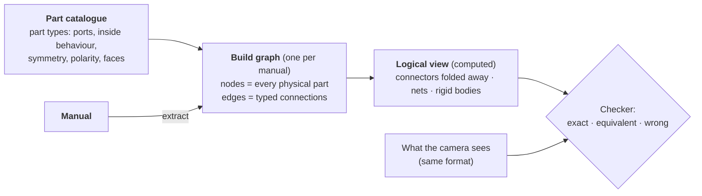

# Pinpoint — Build Graph Specification

> **Version:** 0.1 (draft) · **Date:** 1 October 2026
>
> How one manual becomes **one graph**: what the nodes and edges are, how everything is named, which connection types exist, and the rules that decide whether a build is correct. Scope: **Arduino / robotics** and **LEGO** (implemented first), **Sauder furniture** (design only).
>
> Every connection type and rule here is backed by the manual survey in [`research/`](./research/) and the decisions in [`RESEARCH.md`](./RESEARCH.md) (R1–R20).

---

## 1. Evidence base

| Area | Source | Size |
|---|---|---|
| **Sauder** | Sauder's own instruction booklets (hosted by retailers, as sauder.com blocks automated access) | **13 manuals (12 with readable steps), 543 instruction sentences** |
| **LEGO** | LDraw models of **official sets** (OMR), all parts looked up in the LDraw parts library | **30 sets, 22,423 pieces** (Classic, City, Creator, Technic; 1980s–2010s) |
| **Arduino** | CircuitQuest's Wokwi lessons, **48 of 53 based on official docs.arduino.cc tutorials**, plus its 95-card part library | **53 lessons, 1,090 connections** |

Reproduce with the scripts in [`research/scrape/`](./research/scrape/); summaries are in [`research/data/`](./research/data/).

---

## 2. The model in one picture



1. **One graph per manual** (R18). **Nodes are physical parts, every one of them**, including screws, dowels, wires and Technic pins (R16, R17).
2. **Edges are connections**, each with a **type** and **attributes**. Two parts may have several edges (a **multigraph**).
3. What happens **inside** a part (a wire conducts end to end; a resistor does not) lives in the **part catalogue**, never in the build graph.
4. The **logical view** is computed: connectors folded away, electrical nets and rigid bodies grouped. Correctness is always judged on the logical view, so any physical route to the same result is accepted.

---

## 3. Naming conventions

**Principle:** reuse each domain's official IDs inside one common pattern. IDs are lowercase ASCII, stable and deterministic.

| Thing | Pattern | Examples |
|---|---|---|
| **Part type** | `<domain>-<official id>[-<variant>]` | `resistor-220`, `arduino-uno`, `jumper-wire` · `lego-3001`, `lego-2780` · `sauder-430628-end`, `hw-cam-lock` |
| **Part instance** (node id) | short name + number | `r1`, `led2`, `uno`, `wire3` · `b12`, `pin4`, `axle2` · `end1`, `screw7`, `cam3` |
| **Repeated copy** | `<group><copy>.<id>` | `wheel1.tyre`, `wheel4.rim`, `drawer2.front` |
| **Port** | `<instance>:<port>`, sub-parts joined by `.` | `uno:13`, `r1:1`, `led1:A`, `bb1:18t.d` · `b7:stud.2.1`, `b7:anti.1.1`, `beam1:hole.3`, `axle2:end.a` · `end1:hole.t1`, `end1:face.more-holes` |
| **Edge** | `e<number>` | `e1`, `e42` |
| **Source label** | attribute, never an id | `{"id": "end1", "label": "B"}`, `{"id": "screw1", "label": "3S"}` |
| **Computed group** | `net:<lowest port>` · `body:<lowest instance>` | `net:uno:13`, `body:end1` |

**Domain prefixes:** plain names for electronics (as in the CircuitQuest library), `lego-<LDraw/BrickLink design number>` for LEGO, `sauder-<model>-<part>` for Sauder panels, `hw-<family>` for hardware shared across products.

**Units:** millimetres, right-handed, Z up. LDraw positions (1 LDU = 0.4 mm, −Y up) are converted on import.

---

## 4. Nodes

```json
{"id": "r1", "type": "resistor-220", "label": "R1", "group": "led-block", "copy": 2, "props": {"colour": "red"}}
```

| Field | Required | Meaning |
|---|---|---|
| `id` | ✅ | Instance name (§3) |
| `type` | ✅ | Part type in the catalogue |
| `label` | — | The manual's own name ("B", "3S", element ID) |
| `group`, `copy` | — | Repeated sub-assembly tag (§8); teaching and progress only |
| `props` | — | Instance properties that vary between copies of the same type: `colour`, `value`, `mirror` |

**Every physical item is a node.** Counts are checked against the manual's inventory (§9, rule V1).

---

## 5. Edges: connection types

A **small fixed set of types**; new domains add **attribute values**, not types.

| Type | Meaning | Evidence (counts from the survey) |
|---|---|---|
| **`joined`** | Held together; fixes relative position | Sauder "Fasten" ×162, "Insert" ×34, "Push" ×31, "Slide" ×14, "Turn" ×10 · LEGO: every stud, pin and axle connection · Arduino: 609 legs in breadboard holes |
| **`contact`** | Touching but not fastened | Shelf resting on supports; "Lay the BACK over your unit" (Sauder) |
| **`electrical`** | Current can flow between the two ports | Arduino: all 1,090 connections |
| **`blocks`** | Not touching, but one prevents the other being added later | "Be sure the WOOD DOWELS in the END insert into the SHELF"; a closed box blocks the shelf |
| **`anchored`** | Fixed to the **world** (floor, wall) | Sauder anti-tip "SAFETY STRAP" ×18 |

A connection that is both mechanical and electrical (a jumper wire in a breadboard) has **two edges**, `joined` and `electrical`, between the same ports.

### 5.1 Edge attributes

```json
{"id": "e7", "type": "joined", "u": "screw3", "v": "end1",
 "ports": {"end1": "hole.t1"}, "method": "screw", "freedom": "rigid",
 "reversible": "tool", "direction": {"from": "screw3", "into": "end1"}, "tool": "l-wrench"}
```

| Attribute | Values | Evidence |
|---|---|---|
| `ports` | port names on each side | Wokwi pins and holes; LDraw studs and holes; Sauder "holes #1 and #4" |
| `method` | `insert` · `push-on` · `screw` · `cam-lock` · `slide` · `snap` · `nail` · `hinge` · `stick` · `rest` · `solder` · `clip` · `twist` | Sauder verbs (Insert, Push, Fasten/Turn, Tighten cams, Slide into grooves, Nail, Peel and stick); CircuitQuest join styles (clip, twist, solder) |
| `holds_by` | `friction` · `form` · `force` · `material` · `gravity` · `spring` | LEGO clutch (friction); cam lock (form); screw (force); glue/solder (material); breadboard (spring contact) |
| `freedom` | `rigid` · `revolute` · `slider` · `cylindrical` · `ball` · `flexible` | Hinges ×12 and drawer slides ×32 (Sauder); LEGO hinges 410, ball joints 19, hoses 822; Fusion 360 joint types |
| `reversible` | `hand` · `tool` · `damaging` · `permanent` | LEGO / breadboard (hand); screws (tool); nails (damaging); solder, adhesive appliques (permanent) |
| `direction` | `null` or `{from, into}` | Dowel into hole; pin into beam; stud into anti-stud; male into female header |
| `tool` | `null` or tool id | "using the L-WRENCH (4)", screwdriver |
| `state` | `null` or a state name | Pushbutton pressed; drawer open; door closed |
| `condition` | `null` · `tight` · `square` · `aligned` · `flush` | "Tighten four SCREWS", "unit must be squared up", "equal margins" |

### 5.2 Port compatibility (which ports may join)

| Port kind A | ↔ Port kind B | `method` | `holds_by` | `freedom` | Areas |
|---|---|---|---|---|---|
| `stud` | `anti-stud` | insert | friction | rigid | LEGO (7,733 bricks/plates; 1,040 tiles have **no** top studs) |
| `pin` (friction) | `pin-hole` | insert | friction | rigid | LEGO Technic (3,930 pins) |
| `pin` (no friction) | `pin-hole` | insert | — | revolute | LEGO Technic |
| `axle` | `axle-hole` (cross) | insert | form | rigid (turns together) | LEGO Technic (1,557 axles) |
| `axle` | `pin-hole` (round) | insert | — | revolute | LEGO Technic |
| `clip` | `bar` | snap | spring | revolute | LEGO (209) |
| `ball` | `socket` | snap | spring | ball | LEGO (19) |
| `hinge` half | `hinge` half | insert | friction | revolute | LEGO (410), Sauder doors |
| `lead` / `leg` | `breadboard-hole` | insert | spring | rigid | Arduino (609) |
| `header-pin` | `socket` / `wire-end` | insert | spring | rigid | Arduino (301 board ↔ breadboard via wires) |
| `screw` | `hole` (pilot / threaded) | screw | force | rigid | Sauder (126 sentences) |
| `cam-dowel` / `cam-screw` | `hidden-cam` | cam-lock | form | rigid | Sauder (cam locks 55, cam dowels 7) |
| `dowel` / `metal-pin` | `hole` | insert | friction | rigid | Sauder (dowels 22, metal pins 25) |
| `nail` | panel + `edge` | nail | friction | rigid | Sauder back panels (8) |
| `panel-edge` | `groove` | slide | form | slider until closed | Sauder drawer bottoms ("Slide … into the grooves") |
| `slide` | `rail` | slide | form | slider | Sauder drawer slides (32) |
| `adhesive` | `surface` | stick | material | rigid | Sauder appliques, LEGO stickers (12) |

**Rule:** an edge is valid only if its two ports are a compatible pair in this table (or in the catalogue's own list).

---

## 6. Part catalogue: inside behaviour and freedoms

Stored once per **part type**, as CircuitQuest's library cards already do.

| Field | Meaning | Examples | Evidence |
|---|---|---|---|
| `ports` | Named ports with a **kind** (§5.2) | `stud.1.1` (stud), `A` (lead), `hole.t1` (screw hole) | CircuitQuest `pins` (34 cards) |
| `conducts` | Port groups that are **one electrical node** | Jumper wire ends; breadboard strips; `GND.1`=`GND.2` | `pin_aliases` (18 cards), `connector_only` |
| `through` | Ports joined **through** a component (not one node) | Resistor `1`–`2`; LED `A`→`C` (directed) | Circuit solver |
| `rigid` | Ports on one solid body (default for most parts) | All studs of a brick; screw head and shank | — |
| `moves` | Ports joined but free to move | Non-friction pin; hinge halves; drawer slide | LEGO hinges/pins; Sauder slides |
| `symmetric` | Interchangeable ports | Resistor legs; pushbutton contact groups | `symmetric_pins` (21 cards) |
| `polarized` | Orientation matters by law | LED, electrolytic capacitor, diode | `polarized` (13 cards) |
| `mirror_of` | The mirror-image part type | `lego-43722` ↔ `lego-43723` (Wing 2×3 right/left); Technic fairings #1/#2, #17/#18 | LEGO survey |
| `rotation` | Rotations that look identical | 2×4 brick: 180°; 2×2 brick: 90°; round: any | — |
| `faces` | Named faces when one side is correct | Sauder "surface with more holes" | Sauder booklets |
| `placement` | Rules for placing the part as one object | `legs_placed_together`, `straddles_center_gap` | CircuitQuest (59 and 20 cards) |
| `pin_domains` | Board pins that can stand in for each other | Uno digital 2–13, analog A0–A5 | CircuitQuest (12 cards) |
| `connector` | `true` if the part's only job is to join others (folded in the logical view) | Wire, breadboard, screw, dowel, Technic pin, axle joiner | — |

---

## 7. Logical view (computed)

1. **Expand** each part to its ports, adding the catalogue's inside edges (`conducts`, `through`, `rigid`, `moves`).
2. **Nets** = connected groups over `electrical` edges + `conducts`. Electrical connection is **transitive** through conductors, **not** through components (R4).
3. **Rigid bodies** = connected groups over `joined` (with `freedom: rigid`) + `rigid`.
4. **Fold connectors**: every `connector: true` part becomes an attribute of the connection it makes (`end1 ↔ topbot1 via screw ×2`).

---

## 8. Repeated sub-assemblies and overrides

**Requirement (R19):** if a manual builds something **N times**, the graph contains **N copies**: N× every part, N× every connection. Never one.

**Do copies differ? Yes, in every area.** From the survey:

| Difference | Sauder | LEGO | Arduino |
|---|---|---|---|
| **Identical copies** | "Repeat this step for the remaining DRAWERS" (16 drawer repeats out of 21 "Repeat" sentences) | 165 reused sub-models in 18 of 30 sets, up to 8 copies (8880 shock absorbers ×8) | `arrays`, `for-loop`: 6 LED + resistor blocks |
| **Different part** | "Repeat this step for the small drawers using the SMALL DRAWER FRONTS (K), SMALL DRAWER BACKS…" (424466); "Repeat… for the SHELF (G3)" | Near-copies differing by 1–2 parts: Technic Beam 13 ↔ Beam 9 (8081); 1×1 round plate ↔ round plate with tabs (31038) | `calibration`: same block with a 10 kΩ and a 220 Ω resistor |
| **Different colour** | — | Same sub-model used in two colours (10001); red car ↔ white car with identical parts (6753) | Traffic light: red, yellow, green LEDs (`gen-traffic-light`, `arduino-isp`) |
| **Mirrored** | "Repeat this step for the RIGHT DOOR (H)" (427257) | Left/right windows (31038), doors (5767), bed sides (8063); Wing 2×3 left ↔ right (6753); fairings #1/#2 (8081) | — |
| **Different attachment point** | Each drawer goes in its own opening | Each copy attaches at its own position | Each LED block goes to a different board pin (2, 3, 4…) |

**Therefore copies need overrides.** A repeated block is written once and expanded with per-copy changes:

```json
{"repeat": {"group": "drawer", "times": 3,
  "parts": [{"id": "front", "type": "sauder-424466-drawer-front"}, {"id": "side", "type": "sauder-424466-drawer-side"}],
  "edges": [{"type": "joined", "u": "front", "v": "side", "method": "screw"}],
  "overrides": {
    "3": {"replace": {"front": "sauder-424466-small-drawer-front", "side": "sauder-424466-small-drawer-side"}},
    "*": {"attach": {"front": "opening{copy}"}}
  }}}
```

| Override | Meaning | Example |
|---|---|---|
| `replace` | Use a different part type in this copy | Small drawer fronts; Beam 9 instead of 13 |
| `props` | Change instance properties | `{"led": {"colour": "yellow"}}`; `{"r": {"value": "10k"}}` |
| `mirror` | This copy is the mirror image (parts swapped for their `mirror_of`) | Right door; left wing |
| `add` / `remove` | Extra or missing part in this copy | 1×2 plate only on the trailer copy (6753) |
| `attach` | Where this copy connects to the rest | LED block *n* → pin *n*; drawer *n* → opening *n* |

After expansion the stored graph is flat: overrides only exist in the extraction step.

---

## 9. Rules

### Validity (is the extracted graph sound?)

| # | Rule |
|---|---|
| V1 | **Counts match the inventory**: number of nodes per type = the manual's parts list (Sauder parts and hardware pages; LEGO element list; Arduino parts list). Catches a forgotten "×4" |
| V2 | **Every part is used**: every non-tool node has at least one edge |
| V3 | **Compatible ports only** (§5.2) |
| V4 | **Ports exist** on the part type, and each single-use port (one LEGO stud, one header socket, one screw hole) is used at most once |
| V5 | **Order is possible**: `blocks` edges form no cycle |
| V6 | **Laws hold**: circuit solver passes (Arduino); stud geometry and stability (LEGO, when LDraw is available) |
| V7 | **One connected whole at the end** (unless the manual builds separate objects, e.g. several small LEGO models in one booklet) |

### Equivalence (different, but correct)

| # | Rule | Example |
|---|---|---|
| Q1 | **Physical route doesn't matter**: compare logical views | Resistor in another breadboard row |
| Q2 | **Identical instances are interchangeable** | `end1` ↔ `end2`; any of 4 identical wheels on any axle |
| Q3 | **Symmetric ports and rotations** are interchangeable | Resistor legs; 2×4 brick turned 180° |
| Q4 | **Aliases** are the same port | `uno:GND.1` = `uno:GND.2` |
| Q5 | **Pin domains** allow substitution, with a code change | LED on pin 12 instead of 13 (CircuitQuest `pin_substituted`) |
| Q6 | **Whole-build mirror** is allowed only if the manual allows variants | LUSTIGT's four layouts (IKEA, background) |
| Q7 | **Any order** that respects `blocks` edges | Sauder steps 1 and 2 in either order |

### Wrong (always)

| # | Rule | Example |
|---|---|---|
| W1 | Polarized part reversed | LED backwards |
| W2 | Mirror part swapped for its twin | Left wing on the right; left door on the right |
| W3 | Wrong face | Sauder panel with the "fewer holes" face out |
| W4 | Wrong override applied | A big drawer front where the small one belongs |

### Guidance

| # | Rule |
|---|---|
| G1 | **Check before** a `permanent` or `damaging` connection (solder, nails, adhesive); reversible ones can be checked after |
| G2 | A `blocks` edge triggers a warning **before** the blocking part is added |
| G3 | `condition` edges (tight, square) are checked at the end of their group |

---

## 10. Open questions (to settle while building)

1. LEGO: one `joined` edge per stud, or one per brick pair listing all studs in `ports`?
2. Should `blocks` edges come from the manual (LLM) or from geometry (LDraw)?
3. Is `contact` needed in v1?
4. Keep the `repeat` template in the stored file, or only the expanded graph?
5. How are LDraw's community-only parts (3.9% of pieces in the survey, 868 of 22,423, were not in the official library) handled?
