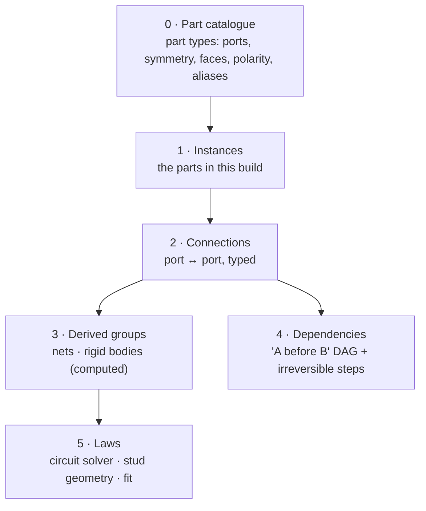
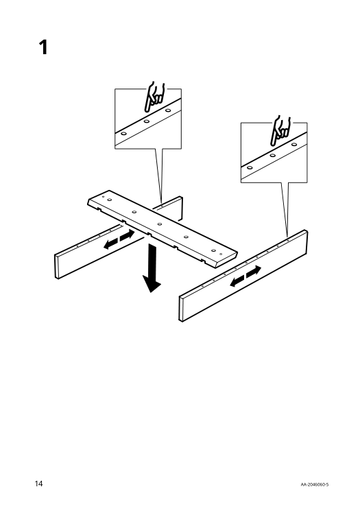
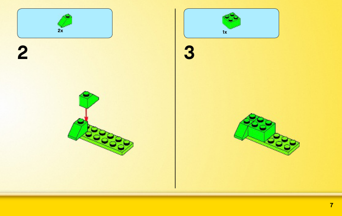
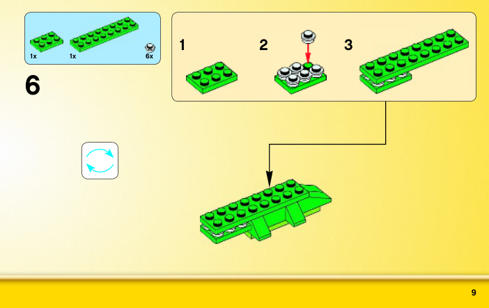
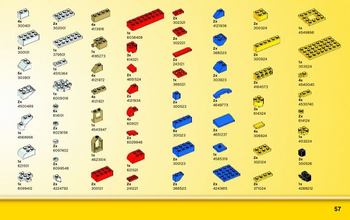

# Pinpoint — Research Log: Object Representation

> **Focus:** one general **object representation** that works for all three target areas: **Arduino / robotics**, **furniture (Sauder only, for now)** and **LEGO**. How to create it from instructions, and how to test it.
>
> **Note:** a graph is the leading **candidate**, not a decision. This is an exploration: the goal is whatever representation fits all three cases, which may turn out to be a graph, a set of graphs, or something else.
>
> **How to use this file:** add one entry per research question, newest findings inside the matching section. Each entry has a **question**, **findings** (with sources), a **verdict**, and **open points**. Mark anything not yet checked as *hypothesis* or *to verify*.
>
> Earlier research (Arduino tutor concept, VLM spatial limits, competitors) is in [`research-log.md`](./research-log.md).

### Source policy

**Only official, public manuals from the maker's own website.**

| Area | Official source | Status |
|---|---|---|
| **LEGO** | [lego.com building instructions](https://www.lego.com/en-us/service/building-instructions): search by set number; PDFs are served from `lego.com/cdn/product-assets/…` | ✅ Used (set 10696) |
| **Sauder** | sauder.com (support / assembly instructions, by model number) | ⚠️ **To verify by hand**: sauder.com blocks automated requests (HTTP 403). The Sauder PDF in R7 came from a **retailer's server (Menards)**; it is Sauder's own document, but not from Sauder's site |
| **Arduino** | [docs.arduino.cc](https://docs.arduino.cc/) built-in examples | ✅ Used by CircuitQuest |
| **IKEA** *(postponed)* | ikea.com product pages → assembly documents | ✅ Used (LUSTIGT) |

**Not official, flagged:** **LDraw / OMR** files are made by the LDraw **community**, not by LEGO. They are open and widely used, but are not an official LEGO source. Manual sites such as ManualsLib and Manuals+ are also third party.

---

## Contents

| # | Question | Status |
|---|---|---|
| [R1](#r1-are-there-well-written-instructions-we-can-turn-into-step-by-step-lessons) | Are there well-written instructions we can turn into step-by-step lessons? | ✅ First pass done |
| [R2](#r2-what-circuitquest-already-teaches-us) | What does CircuitQuest already teach us about representation? | ✅ First pass done |
| [R3](#r3-existing-ways-to-represent-assemblies) | How has assembly been represented before? | ✅ First pass done |
| [R4](#r4-logic-transitivity-does-12-and-23-mean-13) | Logic: does 1–2 and 2–3 mean 1–3? | 🟡 Hypotheses only |
| [R5](#r5-logic-symmetry-and-reversibility) | Logic: symmetry and reversibility | 🟡 Hypotheses only |
| [R6](#r6-draft-representation) | Draft general representation | 🟡 Sketch only |
| [R7](#r7-a-furniture-brand-with-well-written-manuals) | A furniture brand with well-written manuals | ✅ First pass done: **Sauder** |
| [R8](#r8-proposed-architecture-and-naming) | Proposed architecture and naming conventions | 🟡 Proposal |
| [R9](#r9-can-an-llmvlm-read-a-wordless-ikea-manual) | Can an LLM/VLM read a wordless IKEA manual? | 🟡 One informal test |
| [R10](#r10-decision-sauder-only-ikea-postponed) | **Decision:** Sauder only; IKEA postponed | ✅ Decided |
| [R11](#r11-identify-the-users-ikea-product-then-fetch-its-data) | Identify the user's IKEA product, then fetch its data? | ✅ First pass done |
| [R12](#r12-what-a-lego-manual-looks-like) | What does a LEGO manual look like? Does it have text? | ✅ One manual checked |

---

## R1. Are there well-written instructions we can turn into step-by-step lessons?

**Date:** 1 October 2026

**Question:** for each area, do instructions exist that are good enough (clear, complete and ideally machine-readable) to produce a component graph and a step-by-step lesson?

### Summary

| Area | Official instructions | Machine-readable source | Ready to use? |
|---|---|---|---|
| **Arduino / robotics** | Text tutorials with exact pins (Arduino docs, Project Hub) | **Wokwi `diagram.json`**, **Fritzing `.fzz`**: explicit pin-to-pin connections | ✅ **Yes.** Already proven in CircuitQuest |
| **LEGO** | Wordless PDF manuals for most sets, free on lego.com | **LDraw files** (Official Model Repository): every part, position, rotation and **build step** | ✅ **Yes, via LDraw.** Connections must be derived from geometry |
| **IKEA** | Wordless PDF manuals for every product, on ikea.com | **None official.** Research dataset **IKEA-Manual**: 102 objects with parts and assembly trees | ⚠️ **Partly.** Postponed; furniture uses **Sauder** instead (R10) |

### Arduino / robotics

- **Text tutorials are explicit.** Arduino's built-in examples name every part, value and pin (e.g. "LED anode to pin 13 through a 220 Ω resistor"). Text is the easiest input for an LLM.
- **Structured formats exist:**
  - **Wokwi `diagram.json`** stores each connection as a pair of pins, e.g. `["led1:A", "bb1:6b.i"]`. ([Wokwi diagram format](https://docs.wokwi.com/diagram-format))
  - **Fritzing `.fzz`** is a zip containing an XML sketch whose `<connectors>` element lists which part connects to which, and it can export an XML netlist. ([Fritzing sketch format](https://github.com/fritzing/fritzing-app/wiki/2.2-Sketch-file-format))
- **Already proven:** CircuitQuest's `guide_import` turns a real tutorial link into a lesson, and the `llm-lesson-gen` experiment found Claude Sonnet produced electrically equivalent lessons for all three Arduino Basics tutorials in one attempt (see R2).
- **Quality varies:** Project Hub and blog tutorials range from excellent to incomplete. A "well-written" filter is needed: all parts listed with values, every connection stated, code included.

**Verdict:** ✅ Arduino is ready. It is the reference domain for the representation.

### LEGO

- **Official manuals:** almost all LEGO instructions are free PDF downloads on lego.com, searchable by set number. Rebrickable lists ~29,000 instruction files for ~9,600 sets. ([LEGO help](https://www.lego.com/en-us/service/help-topics/article/how-to-download-building-instructions-online), [Rebrickable](https://rebrickable.com/help/where-can-i-download-lego-building-instructions/))
- **But they are images with no words.** Turning them into a machine plan is a research problem in itself: MEPNet (ECCV 2022) reconstructs assembly steps from manual images using keypoint detection and 2D–3D projection. ([MEPNet](https://arxiv.org/abs/2207.12572))
- **The better source: LDraw.** An open file format for LEGO models:
  - each part is one line: `1 <colour> x y z a b c d e f g h i <part.dat>`, i.e. part ID, colour, position and 3×3 rotation;
  - `0 STEP` marks the end of each building step, so **the steps are already in the file**;
  - **positions only, no explicit connections.** Which brick is attached to which must be **derived from geometry** (stud above anti-stud). That is a "real law" check, like electronics. ([LDraw spec](https://www.ldraw.org/article/218.html))
- **Official sets in LDraw:** the **Official Model Repository (OMR)** holds LDraw files of real LEGO sets, searchable by set number. ([OMR](https://library.ldraw.org/omr), [OMR spec](https://www.ldraw.org/article/593.html))
- **Physics precedent:** BrickGPT / LegoGPT (CMU, ICCV 2025) generates LEGO builds brick by brick, rejecting bricks that break **connectivity and stability** rules, with a 47,000-structure dataset (StableText2Lego). This shows LEGO correctness can be checked with physical rules. ([paper](https://arxiv.org/abs/2505.05469))

**Verdict:** ✅ LEGO is usable through **LDraw/OMR**: parts, positions and steps are given, and connections are derived by geometry. PDF manuals are a later, harder input.

*To verify:* how many sets the OMR covers; whether LDCad's "snap" connection metadata gives stud and connection points directly.

### IKEA

- **Official manuals:** every IKEA product has a downloadable PDF manual. They are **wordless by design** (since 1956) so they work in every country without translation. ([IKEA-Manual project](https://cs.stanford.edu/~rcwang/projects/ikea_manual/), [Cadasio on wordless instructions](https://www.cadasio.com/post/designing-assembly-instructions-without-words))
- **Useful structure in the PDFs:** the first pages show the **parts and hardware list** with drawings, quantities and part numbers. This is the most "machine-readable" part. *(To verify across several manuals.)*
- **No official structured data** (no CAD or connection files published).
- **Research datasets give ground truth:**
  - **IKEA-Manual** (NeurIPS 2022): **102 IKEA objects** with 3D parts split to match the manuals, **tree-structured assembly plans** ("how parts are connected during assembly"), manual segmentation and 2D–3D correspondence. **This is ready-made test data for our graph.** ([paper](https://arxiv.org/abs/2302.01881), [project and download](https://cs.stanford.edu/~rcwang/projects/ikea_manual/))
  - **IKEA Manuals at Work** (NeurIPS 2024): links manual steps to real assembly videos (4D grounding). ([paper](https://arxiv.org/abs/2411.11409))
- **AI models struggle with these manuals:** IKEA-Bench (2026) tested 19 VLMs on 29 IKEA products and found they struggle to match manual diagrams to real video. Adding text helps understanding but **hurts diagram-to-video matching**. ([paper](https://arxiv.org/abs/2604.00913))

**Verdict:** ⚠️ IKEA is the hardest. Use **IKEA-Manual** as ground truth to design and test the representation first; treat "PDF manual → graph" as a separate research step (parts list first, then steps).

---

## R2. What CircuitQuest already teaches us

**Date:** 1 October 2026 · **Source:** `~/Desktop/CirquitQuest` (`core/checker.py`, `core/physics.py`, `core/build_methods.py`, `core/guide_import.py`, `core/lesson_gen.py`, `library/parts/*.json`)

CircuitQuest already solves the representation problem **for electronics**. Its principles are the starting point for the general case.

| Principle | How CircuitQuest does it | General lesson |
|---|---|---|
| **Parts have named ports** | Pins like `r1:1`, `led1:A`, `uno:13` | Every part = a node with **ports**; connections join ports, not whole parts |
| **Conductors merge, components link** | Wires and breadboard strips are merged with **union-find** into **nets**; resistors and LEDs sit **between** nets | Two kinds of connection: **pass-through** (merge into one group) and **link** (join two different groups) |
| **Connectors disappear** | Breadboard and wires are `connector_only` and dropped from the final nets | The checked graph is the **logical** graph; how a connection was made physically is a separate layer |
| **Hardware equivalences** | `pin_aliases`: `uno:GND.1` = `uno:GND.3`; every hole in a breadboard strip is the same | Some ports are **the same port by design**; fold them before comparing |
| **Part symmetry** | `symmetric_pins`: a resistor's legs swap freely; a potentiometer's outer legs swap; an LED is `polarized` | Each part declares which ports are **interchangeable** |
| **"Different but correct" is graded** | A symmetric swap is "harmless", neither identical nor wrong | Results need three levels: **exact / equivalent / wrong** |
| **Same goal, different method** | `build_methods`: the same nets built with or without a breadboard (clips, twist, solder) | **What** is connected is separate from **how** it was connected |
| **Real laws** | `physics.py` solves the circuit (nodal analysis): currents, LED states, floating inputs | The graph can be checked by **laws**, not only by matching the tutorial |
| **State-dependent connections** | Buttons, slide switches and relays connect only in some states | Some edges are **conditional** |
| **Part facts live in data** | Library JSON cards hold pins, polarity, symmetry and aliases; the code is generic | Domain knowledge goes in **part cards**; the algorithm stays domain-free |
| **AI never decides correctness** | The LLM writes the lesson, a validator checks it, and the engine checks the build with plain logic | Keep this rule for all domains |

---

## R3. Existing ways to represent assemblies

**Date:** 1 October 2026

| Representation | What it captures | Use for us |
|---|---|---|
| **Liaison graph** | Nodes = parts, edges = physical contacts or joints | Matches our "component graph" |
| **Precedence relations** | "A must be done before B" | Our dependency layer |
| **AND/OR graph** (Homem de Mello & Sanderson, 1986–91) | **All** valid ways to split an assembly into sub-assemblies, compactly | A formal way to represent **any valid order**, our key feature ([AAAI 1986](https://aaai.org/papers/01113-AAAI86-184-and-or-graph-representation-of-assembly-plans/)) |
| **Assembly tree** (IKEA-Manual) | Which groups of parts are joined at each manual step | Ground truth for IKEA tests |
| **Netlist** (electronics) | Groups of pins that are electrically one node | Arduino ground truth (Wokwi, Fritzing, CircuitQuest) |
| **LDraw** | Part positions and steps, no connections | LEGO ground truth after deriving connections |
| **Physics-based planning** ("Assemble Them All", 2022) | Finds a valid order by planning **disassembly** with physics | Possible way to derive valid orders automatically ([paper](https://arxiv.org/abs/2211.03977)) |

**Takeaway:** the field already separates **what connects to what** (liaison graph, netlist) from **in which order** (precedence, AND/OR graph). Our representation should do the same.

---

## R4. Logic: transitivity (does 1–2 and 2–3 mean 1–3?)

**Status:** 🟡 *Hypotheses, to test with examples from all three areas.*

**Working hypothesis:** it depends on the **type** of connection. We need to separate:
- **direct connection**: an edge in the graph (1 is joined to 2);
- **same group**: 1 and 3 belong to the same connected whole, through 2.

| Case | 1–2 and 2–3 ⇒ 1–3? | Why |
|---|---|---|
| **Electrical, through a conductor** (wire, breadboard strip) | ✅ **Yes**: 1 and 3 are the **same net** | A conductor makes an equivalence relation (reflexive, symmetric, transitive), which is why CircuitQuest uses union-find |
| **Electrical, through a component** (resistor, LED) | ❌ **No** | The component **links two different nets**; its two legs are not the same node |
| **Electrical, through a switch or relay** | ⚠️ **Only in some states** | A conditional edge: transitive only while the switch is closed |
| **LEGO, "attached to"** | ❌ Not directly: brick 1 on 2 and 2 on 3 does not mean 1 touches 3 | Direct attachment is a physical contact |
| **LEGO, "same rigid build"** | ✅ **Yes** | All three move together: the same connected component |
| **IKEA, joint (dowel, cam lock, screw)** | ❌ Not directly | Same as LEGO: a joint is a contact |
| **IKEA, "same rigid body"** | ✅ **Yes, once all needed joints are made** | Only if the joints actually make it rigid (e.g. a frame needs its back panel to stay square) |

**Implication for the representation:** each connection type declares whether it is **pass-through** (merges ports into one group, so transitive) or **link** (joins two groups, so not transitive). Groups are computed (union-find for pass-through edges; connected components for "same rigid build").

**Tests to run:** for each area, build small examples where the transitive and non-transitive readings give **different** answers, and check which one matches reality.

---

## R5. Logic: symmetry and reversibility

**Status:** 🟡 *Hypotheses.*

### Part symmetry: can a part go in more than one way?

| Example | Symmetric? | Effect |
|---|---|---|
| Resistor legs | ✅ Interchangeable | Either orientation is correct (CircuitQuest: `symmetric_pins`) |
| LED legs | ❌ Polarised | Only one orientation works (a law: current flows anode → cathode) |
| LEGO 2×4 brick | ✅ 180° rotation looks identical | A rotated placement is the same build |
| LEGO 1×2 slope | ❌ Directional | Rotation changes the shape |
| IKEA wooden dowel | ✅ Either end | Interchangeable |
| IKEA side panel with pre-drilled holes | ⚠️ Often **mirror pairs** (left vs right) | Looks symmetric but isn't: a classic mistake |

**Representation:** each part card lists its **symmetry group** (which ports or orientations are interchangeable), as CircuitQuest's `symmetric_pins` does for electronics.

### Connection symmetry: is "A connects to B" the same as "B connects to A"?
- **Electrical contact:** symmetric.
- **"Sits on top of"** (LEGO stud into anti-stud), **"inserted into"** (dowel into hole): **directional**. The connection is symmetric as a relation ("attached"), but its **ports** are not (stud vs anti-stud, peg vs hole).

### Step reversibility: can a step be undone?

| Reversible | Not reversible |
|---|---|
| Breadboard wire, LEGO brick, IKEA cam lock, screw | Solder joint, glue, nailed IKEA back panel, a snapped clip |

**Why it matters:** irreversible steps limit "any order". The checker should **warn before** an irreversible step is done wrong, while reversible mistakes can just be pointed out.

---

## R6. Draft representation

**Status:** 🟡 *Sketch to be refined after R4 and R5 are tested. Written as a graph because that is the leading candidate; other forms stay open.*

```
Part        id, type → part card (ports, symmetry, polarity, aliases, reversible?)
Port        part:port_name          e.g. r1:1, brick7:stud(2,1), side_panel_L:hole3
Connection  port ↔ port, with:
              kind        pass-through | link | conditional
              direction   symmetric | directional (stud→anti-stud, peg→hole)
              reversible  yes | no
Groups      computed: nets (pass-through) and rigid bodies (connected components)
Dependency  "A before B" (only where physically required)
Laws        domain checks: circuit solver · stud geometry and stability · fit and squareness
```

**How to test it:**
1. **Arduino:** convert CircuitQuest lessons (Wokwi diagrams) into this format and check they round-trip.
2. **LEGO:** derive connections from 3–5 small OMR/LDraw sets; check the derived graph against the steps.
3. **IKEA:** convert 3–5 IKEA-Manual assembly trees; check every manual step maps to graph edges.
4. **Equivalence tests:** for each area, make "different but correct" variants (a swapped resistor, a rotated 2×4 brick, a flipped dowel) and wrong variants (a reversed LED, a mirrored side panel). The checker must classify each as exact, equivalent or wrong.

---

## R7. A furniture brand with well-written manuals

**Date:** 1 October 2026

**Question:** IKEA manuals are wordless. Is there a furniture brand whose manuals are well written enough to explore how to represent furniture generically?

### Candidates

| Brand / source | Manual style | Structure | Fit |
|---|---|---|---|
| **Sauder** (US, flat-pack) | **Text + drawings** on every step | Lettered parts with quantities, numbered hardware shown at actual size, step text naming parts, hardware, counts and tools | ✅ **Best fit** |
| **Tylko** (made-to-measure shelves) | Drawings only, but **personalised** to each shelf | Every part has a code (`C`, `Cl`, `W1`, `Bn`, `Bh`, `Bs`…), each step lists "the parts you need" with count and box number | ✅ Good second: very structured, no text |
| **Opendesk** (open-source furniture) | PDF assembly guide + **CAD files** (DXF/DWG) | Exact geometry of every part; CC licences | ⚠️ Useful for geometry; stopped publishing in 2020, now only in archives ([archive.org](https://archive.org/details/opendesk)) |
| **Ashley** | More written text than IKEA | Not checked in detail | ❓ To check |
| **Amazon Basics** | IKEA-like, minimal text | — | ❌ Same problem as IKEA |
| **IKEA** | Wordless | Parts list + drawings | ⚠️ Use **IKEA-Manual** dataset as 3D ground truth (R1) |

Sources: [Sauder manuals (Manuals+)](https://manuals.plus/category/sauder), [Tylko assembly FAQ](https://tylko.com/en-ot/faq/articles/self-assembly-disassembly/how-do-i-assemble-my-tylko-shelf), [Opendesk (Make:)](https://makezine.com/article/digital-fabrication/machining/opendesk-cnc-furniture/), [Ready-to-assemble brands](https://assemblysmart.com/ready-to-assemble-furniture-brands/).

### Checked example: Sauder 2-Cube Organizer (model 430628)

Read in full ([PDF](https://cdn.menardc.com/main/items/media/SAUDE001/Assembly_Instructions/2114705_instruct.PDF), 12 pages, 4 steps). *Note: this copy is hosted by a retailer (Menards); replace it with the copy from sauder.com once confirmed (see Source policy).*

**Parts list (page 2)**
- Panels: **B** END ×2, **D** TOP/BOTTOM ×2, **E** SHELF ×1
- Hardware: **1** wood dowel ×4, **2** applique card ×1, **3** 3-5/16" hex head screw ×8
- Tool: **4** L-wrench ×1

**Steps (verbatim)**
1. "Fasten the TOP/BOTTOMS (D) to one of the ENDS (B). Tighten four 3-5/16" HEX HEAD SCREWS (3) using the L-WRENCH (4)."
2. "Insert two WOOD DOWELS (1) into the END (B). Push the SHELF (E) onto the WOOD DOWELS (1) in the END (B)."
3. "Insert two WOOD DOWELS (1) into the remaining END (B). Fasten the END (B) to the TOP/BOTTOMS (D) and SHELF (E)… Be sure the WOOD DOWELS in the END insert into the SHELF."
4. Stick appliques over visible screw heads. (Cosmetic.)

Drawings add orientation hints: "Surface with more holes" / "Surface with fewer holes".

**Why this is ideal:** every step names **which parts**, **which hardware**, **how many**, and **which tool**. That is close to a connection list already, so an LLM can extract it from text, as with Arduino tutorials.

### What the example shows for the representation

| Observation in the manual | Representation idea | Parallel in other areas |
|---|---|---|
| "one of the ENDS (B)", B ×2 | The two ends are **interchangeable instances** of one part type | Two identical resistors; two identical LEGO bricks |
| D TOP/BOTTOM ×2, one label for both | Top and bottom are **symmetric** | Resistor legs (`symmetric_pins`) |
| "Surface with more / fewer holes" | Panels have **faces**; orientation matters | LED polarity; LEGO stud vs anti-stud |
| Dowels and screws join panels | **Hardware is a connector**: it joins two panels, like a wire or breadboard strip joins two pins | CircuitQuest drops connectors from the logical nets |
| Step 1 and step 2 touch different joints | Their **order can be swapped** | Wiring the LED before the resistor |
| Shelf E must be on its dowels **before** the second end closes the box | A **physical dependency**: the box would block it | Placing a LEGO brick before covering it |
| B1–D and D–B2 | B1 and B2 end up in **one rigid body** but are **not directly joined** | R4 transitivity: "same group" ≠ "directly connected" |

**Draft logical form of this product:**

```
Parts        B1, B2 (END) · D1, D2 (TOP/BOTTOM) · E (SHELF)
Joints       B1–D1  screw ×2      B1–D2  screw ×2      B1–E  dowel ×2
             B2–D1  screw ×2      B2–D2  screw ×2      B2–E  dowel ×2
Symmetry     B1 ↔ B2 · D1 ↔ D2
Orientation  each panel: face with more holes / fewer holes
Dependency   B1–E before B2 closes (B2–D1, B2–D2, B2–E made together)
Free order   {B1–D1, B1–D2} and {B1–E} in either order
Result       one rigid body {B1, B2, D1, D2, E}
```

*To verify:* whether sauder.com offers manuals by model number for direct download; check 3–5 more Sauder manuals (a drawer unit, a desk) for consistency, especially for moving parts (drawers, doors) that add **conditional** connections, like switches in electronics.

**Verdict:** ✅ Use **Sauder** as the main furniture source for designing the representation (text, lettered parts, explicit hardware). Use **Tylko** as a structured but wordless second case, and **IKEA-Manual** as 3D ground truth.

---

## R8. Proposed architecture and naming

**Date:** 1 October 2026 · **Status:** 🟡 *Proposal, based on R1–R7. To be tested on one example per area.*

### Is it "a connected graph"?

**Not quite, for three reasons:**
1. **During a build it is not connected.** Sub-assemblies are built separately (Sauder step 1 and step 2, IKEA LUSTIGT steps 1–3) and joined later. The representation must allow **several separate pieces** and only expect one connected whole at the end.
2. **Some connections join many ports at once.** An electrical net (a breadboard strip with 3 legs in it) is one connection between many pins: a **hyperedge**, not a simple edge. CircuitQuest handles this with union-find.
3. **Order is a separate structure.** "What connects to what" and "what must come first" are different questions (R3). Mixing them into one graph makes "any order" hard to check.

### Recommendation: a layered **port graph**



| Layer | Holds | Arduino | Furniture (Sauder) | LEGO (LDraw) |
|---|---|---|---|---|
| **0 · Part catalogue** | Reusable part **types**: ports, symmetry, faces, polarity, aliases, `connector`, `reversible` | `resistor-1k`: ports `1`,`2`, symmetric | `sauder-430628-end`: holes, two faces | `lego-3001` (2×4 brick): 8 studs, 8 anti-studs, 180° symmetric |
| **1 · Instances** | The parts **in this build**, each pointing to a type | `r1`, `led1`, `uno` | `end1`, `end2`, `topbot1`, `topbot2`, `shelf1` | `b1`…`b40` |
| **2 · Connections** | **Port ↔ port** links, each with a `kind` (below) | `r1:2 ↔ led1:A` | `end1:hole.t1 ↔ topbot1:hole.l1` via `screw1` | `b2:stud.1.1 ↔ b7:anti.1.1` |
| **3 · Derived groups** | **Computed, never stored**: nets (electrical) and rigid bodies (mechanical) | nets via union-find | rigid bodies via connected components | rigid bodies |
| **4 · Dependencies** | A **precedence DAG** over connections, plus flags for irreversible steps. **Any valid order = any topological order** of this DAG | (rarely needed) | `end1–shelf1` before `end2` closes | lower bricks before upper |
| **5 · Laws** | Domain validators run on layers 2–3 | circuit solver (CircuitQuest `physics.py`) | fit, squareness, hardware counts | stud alignment, stability |

**Connection kinds** (answers R4):

| `kind` | Meaning | Transitive? | Examples |
|---|---|---|---|
| `merge` | Ports become **one** node | ✅ Yes (union-find) | wire, breadboard strip, header socket |
| `link` | Two **different** nodes joined by a part | ❌ No | resistor, LED, motor |
| `join` | Mechanical contact; parts become **one rigid body** | ❌ Not directly, ✅ for "same body" | screw, dowel, cam lock, stud-in-anti-stud |
| `conditional` | Exists only in some **states** | ⚠️ Only in that state | button, relay, drawer, hinge |

**Connectors are parts too.** Screws, dowels and wires are **instances with ports** (`screw1`, `wire3`), so the system can count them against the parts list. Then, as CircuitQuest already does, they are **folded away** into a clean logical view (`end1 ↔ topbot1`) for checking.

**How "different but correct" works:** before comparing the expected build with what the camera sees, both are put into a **canonical form**:
1. fold **aliases** (all `uno:GND.*` → `uno:GND`; all holes in a strip → one strip);
2. fold **symmetric ports** (resistor legs; a 2×4 brick rotated 180°);
3. match **interchangeable instances** (`end1` ↔ `end2`, two identical resistors). This is a graph-matching (isomorphism) step; builds are small, so standard algorithms such as VF2 in NetworkX are fast enough.

The result is then **exact / equivalent / wrong**, as in CircuitQuest.

### Naming conventions

**Principle: reuse each domain's own official IDs wherever they exist, wrapped in one common pattern.**

| Thing | Pattern | Examples | Why |
|---|---|---|---|
| **Part type** | `domain-id` in kebab-case, using the official number if there is one | `resistor-1k`, `arduino-uno` · `lego-3001` (LDraw/BrickLink number) · `ikea-109536` (IKEA hardware number printed in the manual) · `sauder-430628-end` | Stable, searchable, matches CircuitQuest's library; official numbers make catalogue lookups possible |
| **Instance** | short lowercase name + number | `r1`, `led1`, `uno` · `end1`, `shelf1`, `screw3` · `b12` | Wokwi/CircuitQuest style; short enough for logs |
| **Source label** | kept as an attribute, never as the ID | `{"id": "end1", "label": "B"}` | Manual letters (Sauder "B") are only unique inside one manual |
| **Port** | `instance:port`, sub-parts separated by dots | `r1:1`, `led1:A`, `uno:13`, `bb1:18t.d` · `end1:hole.t1`, `end1:face.inner` · `b7:stud.2.1`, `b7:anti.2.1` | Already the Wokwi convention for pins and breadboard holes; dots give a natural hierarchy |
| **Connection** | `c` + number, or the port pair | `c4`, or `r1:2~led1:A` | `~` reads as "connected to" |
| **Step** | `s` + number, with the source step number as an attribute | `s3 {"source_step": 3}` | Steps are suggestions; the checker uses connections, not step numbers |
| **Derived group** | `net:<lowest port>` / `body:<lowest instance>` | `net:uno:13`, `body:end1` | Deterministic, so the same build always gets the same names |

**Units and coordinates:** millimetres, right-handed, Z up. LDraw uses its own units (1 LDU = 0.4 mm) and −Y up, so convert at import.

### Minimal example (Sauder 2-Cube Organizer)

```json
{
  "parts": [
    {"id": "end1",    "type": "sauder-430628-end",     "label": "B"},
    {"id": "end2",    "type": "sauder-430628-end",     "label": "B"},
    {"id": "topbot1", "type": "sauder-430628-topbot",  "label": "D"},
    {"id": "topbot2", "type": "sauder-430628-topbot",  "label": "D"},
    {"id": "shelf1",  "type": "sauder-430628-shelf",   "label": "E"},
    {"id": "dowel1",  "type": "hw-wood-dowel",         "label": "1"},
    {"id": "screw1",  "type": "hw-hex-screw-3-5-16",   "label": "3"}
  ],
  "connections": [
    {"id": "c1", "kind": "join", "ports": ["end1:hole.t1", "topbot1:hole.l1"], "via": "screw1"},
    {"id": "c5", "kind": "join", "ports": ["end1:hole.m1", "shelf1:hole.l1"], "via": "dowel1"}
  ],
  "dependencies": [
    {"before": "c5", "after": "c9", "why": "shelf must sit on end1's dowels before end2 closes the box"}
  ],
  "interchangeable": [["end1", "end2"], ["topbot1", "topbot2"]]
}
```
*(Shortened: the full build has 8 screws, 4 dowels and 12 connections.)*

---

## R9. Can an LLM/VLM read a wordless IKEA manual?

**Date:** 1 October 2026 · **Status:** 🟡 *One informal test (Claude reading one manual), plus published evidence. Not a benchmark.*

### Test: IKEA LUSTIGT wall shelf ([PDF](https://www.ikea.com/us/en/assembly_instructions/lustigt-wall-shelf__AA-2046060-5-100.pdf), AA-2046060-5)

20 pages: 10 pages of multilingual safety text, 1 tools page, 1 hardware page, 1 "possible layouts" page, 5 steps.



*Step 1 of the LUSTIGT manual: drawings and arrows only; the boards carry no letters or numbers.*

**What Claude could read reliably from the drawings:**

| Item | Read correctly? | Notes |
|---|---|---|
| Tools | ✅ | Phillips screwdriver, spirit level |
| Hardware | ✅ | One screw type, **109536 ×5** |
| Step 2 and 3 counts | ✅ | 2 screws + 3 screws = 5 ✔ matches the hardware page, a useful **consistency check** |
| Overall structure | ✅ | Five shelf boards slot onto a vertical spine; screwed through the spine; hung on the wall; three ladder-style clips added at shelf ends |
| **Valid alternative layouts** | ✅ | Page 13 shows **four** correct arrangements (shelves left/right in different patterns). IKEA itself documents "different but correct" |
| Step 4 wall screws | ✅ | Not included (the safety text says so); the icon compares wall plugs |

**What was uncertain or missing:**

| Problem | Why it matters |
|---|---|
| **Panels have no letters or part numbers** | The parts list has only the screw; boards must be identified by shape. Hard to name instances reliably |
| **Which face or edge of a board goes where** | Shown only by small "hand" close-ups of hole patterns, the fine spatial detail VLMs are weakest at (Spatial Blindspot, R1) |
| **Exactly which slot each shelf uses** | Arrows show sliding direction, not exact positions |
| **Exact hole each screw goes into** | Small magnified circles; position, not just count, is hard |

### Published evidence
- **IKEA-Bench (2026):** 19 VLMs on 29 IKEA products. They struggle to match manual diagrams to real video, and adding text **hurts** diagram-to-video matching. ([paper](https://arxiv.org/abs/2604.00913))
- **MEPNet (2022):** reading LEGO manuals precisely needed a **purpose-built** keypoint and 3D-projection model, not a general VLM. ([paper](https://arxiv.org/abs/2207.12572))
- **Manual-PA (2024):** learns 3D part assembly from instruction diagrams with a dedicated model. ([paper](https://arxiv.org/abs/2411.18011))

### Verdict

**Partly.** A VLM can get the **skeleton**: tools, hardware and counts, which parts join in each step, and the overall structure. It is **not reliable for the precise parts**: which face, which hole, which slot. That precision is exactly what a checker needs.

**Suggested approach for IKEA:**
1. VLM extracts the **skeleton** (parts by shape, hardware counts, joins per step).
2. **Consistency rules** catch errors (hardware totals match the parts page; every part is used; steps form a valid order).
3. Fill in precise geometry from **3D data** where available (IKEA-Manual's 102 objects), or let the **user confirm** ambiguous details once.
4. Compare with **Sauder** (text) to measure how much the missing words cost.

This makes "wordless manual → representation" a **research contribution** in its own right, rather than a dependency for the first prototype.

---

## R10. Decision: Sauder only, IKEA postponed

**Date:** 1 October 2026 · **Status:** ✅ Decided

**Decision:** for furniture, the project supports **Sauder only** for now. IKEA is postponed to future work.

**Why IKEA was not chosen as the starting point:**

| Reason | Evidence |
|---|---|
| **Manuals are wordless by design** | Every step is a drawing; there is no text to extract (R1, R9) |
| **Panels are not labelled** | The LUSTIGT parts list names only the screw (109536 ×5); boards have no letter or number (R9) |
| **The precise details are the hardest part for AI** | Which face, which hole and which slot appear only in small close-ups, the fine spatial detail VLMs are weakest at (R9; [Spatial Blindspot](https://arxiv.org/pdf/2601.09954)) |
| **Published results agree** | 19 VLMs struggle to align IKEA diagrams with real footage ([IKEA-Bench](https://arxiv.org/abs/2604.00913)); LEGO manuals needed a purpose-built model ([MEPNet](https://arxiv.org/abs/2207.12572)) |
| **No official structured data at scale** | IKEA publishes no part or connection files; its official 3D dataset has 5 products under a non-commercial licence (R11) |

**Why Sauder instead:** every step is written in words, parts are lettered with quantities, hardware is numbered with counts, and tools are named. An LLM can extract it from text the same way CircuitQuest extracts Arduino tutorials (R7).

**What would bring IKEA back:** a reliable "picture manual → representation" pipeline (R9 approach), or product data that includes parts (R11). Either is a research contribution in its own right.

---

## R11. Identify the user's IKEA product, then fetch its data?

**Date:** 1 October 2026

**Question:** if the user already has the IKEA product, can we **identify exactly which product it is**, pull its **part information from another source**, and then use the manual?

### Step 1: identify the exact product

| Method | Reliability | Notes |
|---|---|---|
| **Read the box label** | ✅ **Exact** | Every IKEA box shows the **8-digit article number** (e.g. `304.499.08`) and "Box 1(2)"-style package counts. Easy to read with OCR, no VLM needed ([IKEA: product details](https://www.ikea.com/ca/en/customer-service/knowledge/articles/e7cg2eg5-2536-47b9-bb1b-10003300c772.html)) |
| **Scan the box barcode** | ✅ Likely exact | The barcode reportedly encodes the article number. *To verify* the exact format |
| **Read the manual's document number** | ✅ **Exact** | Every manual carries its number, e.g. `AA-2046060-5` (LUSTIGT) |
| **Photo of the assembled product** | ⚠️ Good, not exact | IKEA's own app has visual search (GrokStyle) that finds "similar or the exact" product ([TechCrunch](https://techcrunch.com/2018/03/16/grokstyles-visual-search-tech-makes-it-into-ikeas-place-ar-app/)). Variants (size, colour) are easy to confuse |
| **VLM on the unassembled parts** | ❌ Poor | Before assembly the user has flat panels that look alike across many products. This is the wrong moment for visual recognition |

**Finding:** identifying the product is **easy and exact**, but through the **box label or manual number (OCR)**, not by a VLM looking at the parts.

### Step 2: fetch part information from elsewhere

| Source | What it gives | Limits |
|---|---|---|
| **IKEA product page** (by article number) | Official assembly PDF, package count, dimensions | No part or connection data ([how to find assembly documents](https://www.ikea.com/us/en/customer-service/knowledge/articles/1656c41a-1a58-4e59-a77a-bae69f28f1bb.html)) |
| **Spare-part numbers** in the manual | Hardware IDs (6–8 digits) and counts, orderable from IKEA | **Hardware only**; panels have no number ([IKEA spare parts](https://www.ikea.com/us/en/customer-service/knowledge/articles/3e09f6eb-5c91-48e4-8878-d8c144d36b38.html)) |
| **"View in 3D" model** on the product page | GLB model of the **assembled** product | Not officially downloadable (only via third-party scripts); assembled state, not parts; terms of use unclear |
| **IKEA 3D Assembly Dataset** (official, 2021) | GLB/OBJ of the assembled product with parts in the scene hierarchy, plus the manual, article and document numbers | **Only 5 products** (LACK, 2× EKET, BEKVÄM, DALFRED); **CC BY-NC-SA 4.0**: research only, **no commercial use** ([GitHub](https://github.com/IKEA/IKEA3DAssemblyDataset)) |
| **IKEA-Manual** (Stanford research) | 102 products with **separate parts** and assembly trees | Research dataset; fixed set of products (R1) |

**Finding:** apart from the hardware list, **no source gives panel-level part data at scale**. 3D data exists for **5 + 102 products**, for research use.

### Step 3: then use the manual

Knowing the exact product **helps** reading the manual:
- the hardware list and counts become **known facts**, used to check the VLM's reading;
- for the ~107 products with 3D data, the **geometry resolves** "which face, which hole";
- the right manual is fetched automatically, so the user never has to find it.

It does **not** remove the main problem: the steps are still **drawings**, and turning them into connections is the R9 challenge.

### Verdict

| Part of the idea | Possible? |
|---|---|
| Identify the exact product | ✅ Yes: OCR the box label or manual number (better than a VLM) |
| Fetch the official manual automatically | ✅ Yes, via the product page |
| Fetch part data from elsewhere | ⚠️ Only hardware at scale; full parts for ~107 research products, not for commercial use |
| Skip reading the drawings | ❌ No; the steps exist only as pictures |

This supports the R10 decision. It also defines a clean **future-work path for IKEA**: identify by label → fetch manual → VLM reads the skeleton → checked against the official hardware list → precise geometry from the 3D datasets where available.

---

## R12. What a LEGO manual looks like

**Date:** 1 October 2026

**Question:** are LEGO manuals also wordless, like IKEA's? What can be read from them?

### Example: LEGO Classic 10696 (Medium Creative Brick Box)

[Official PDF](https://www.lego.com/cdn/product-assets/product.bi.core.pdf/6114394.pdf), 60 pages, several small models.

**Steps: no words.** Each step is a picture with:
- a **parts box** showing which pieces to add, with **counts** ("2x");
- the **step number**;
- **red arrows** showing where a piece goes.



*Steps 2–3: a parts box (2× slope, 1× 2×2 brick), a red arrow for placement, no text.*

**Sub-assemblies and turning the model** are shown with symbols, not words: a framed box with mini-steps 1–2–3, then an arrow to where the sub-assembly attaches, and a rotate icon.



*Step 6: a sub-assembly built in its own box (mini-steps 1–3), then attached; the circular-arrows icon means "turn the model".*

**But the parts inventory is real text.** The last pages list **every element with its count and Element ID** as selectable text in the PDF, e.g. `4x 300401`, `2x 300101`, `5x 303901`.



*Page 57: the inventory. Each piece has a count and a 6–7 digit Element ID, extractable as text.*

### What this means

| | IKEA (LUSTIGT) | LEGO (10696) | Sauder |
|---|---|---|---|
| Step text | ❌ None | ❌ None | ✅ Full sentences |
| Parts per step | ⚠️ Drawn, unlabelled | ✅ **Parts box with counts** on every step | ✅ Named with letters |
| Parts inventory | ⚠️ Hardware only | ✅ **Every piece, Element ID + count, as text** | ✅ Letters + quantities |
| Sub-assemblies | Drawn | ✅ Marked with framed boxes | Text |
| Machine-readable alternative | ❌ | ✅ **LDraw / OMR** (R1) | — |

**Why LEGO is much easier than IKEA despite having no words:**
1. **Every piece is identified** by an Element ID in the inventory. Element IDs map to part shape and colour through catalogues such as Rebrickable and BrickLink *(to verify the exact lookup)*. Older 6-digit IDs appear to be the design number plus a colour code (`3004` + `01` = white 1×2 brick); newer 7-digit IDs are not structured that way.
2. **Each step's parts box** says exactly which pieces are added, so a VLM only has to recognise known pieces, not unknown panels.
3. **Positions sit on a stud grid**, so "where" is a discrete choice, which suits the grid approach (geometry + labelled grid + VLM) from the earlier research.
4. **LDraw files** of official sets give parts, positions and steps directly, with no image reading at all.

**Verdict:** ✅ LEGO manuals have no step text, but they are **far more structured** than IKEA's (identified pieces, per-step parts lists, a grid). For the first prototype use **LDraw/OMR files**; reading the PDF is a later option, helped by the text inventory.

*To verify:* whether set 10696 (or another small set) is in the OMR, so the same model can be compared in both forms.

---

## Next steps

- [ ] Write the Sauder 2-Cube Organizer fully in the R8 format, plus one Arduino lesson and one small LEGO set
- [ ] Collect 3–5 more Sauder manuals (include drawers or doors) and write each in the draft form
- [ ] Download 3–5 small LDraw/OMR sets; try deriving stud connections from positions
- [ ] Check the OMR coverage and LDCad snap metadata
- [ ] Collect 5 well-written Arduino tutorials and 2–3 robotics kit builds
- [ ] Build test cases for transitivity (R4) and symmetry (R5) in all three areas
- [ ] Refine the draft representation (R6)
- [ ] *(Postponed, R10)* IKEA: VLM extraction on 5–10 manuals scored against IKEA-Manual; inspect its assembly-tree format

---

## Sources

**Arduino / robotics**
- [Wokwi diagram.json format](https://docs.wokwi.com/diagram-format)
- [Fritzing sketch file format](https://github.com/fritzing/fritzing-app/wiki/2.2-Sketch-file-format)
- CircuitQuest source: `~/Desktop/CirquitQuest`, live at [circuitquest.onrender.com](https://circuitquest.onrender.com)

**LEGO**
- [LEGO Classic 10696 building instructions (PDF)](https://www.lego.com/cdn/product-assets/product.bi.core.pdf/6114394.pdf)
- [LEGO: download building instructions](https://www.lego.com/en-us/service/help-topics/article/how-to-download-building-instructions-online) · [Rebrickable instructions](https://rebrickable.com/help/where-can-i-download-lego-building-instructions/)
- [LDraw file format specification](https://www.ldraw.org/article/218.html) · [LDraw Official Model Repository](https://library.ldraw.org/omr) · [OMR specification](https://www.ldraw.org/article/593.html)
- [MEPNet: Translating a Visual LEGO Manual to a Machine-Executable Plan (ECCV 2022)](https://arxiv.org/abs/2207.12572)
- [BrickGPT / LegoGPT: Generating Physically Stable and Buildable Brick Structures from Text (ICCV 2025)](https://arxiv.org/abs/2505.05469)

**Furniture**
- [Sauder 2-Cube Organizer 430628 manual (PDF)](https://cdn.menardc.com/main/items/media/SAUDE001/Assembly_Instructions/2114705_instruct.PDF) · [Sauder manuals (Manuals+)](https://manuals.plus/category/sauder)
- [Tylko: how to assemble](https://tylko.com/en-ot/faq/articles/self-assembly-disassembly/how-do-i-assemble-my-tylko-shelf)
- [Opendesk CNC furniture (Make:)](https://makezine.com/article/digital-fabrication/machining/opendesk-cnc-furniture/)

**IKEA**
- [IKEA 3D Assembly Dataset (official, GitHub)](https://github.com/IKEA/IKEA3DAssemblyDataset)
- [IKEA: where to find product details](https://www.ikea.com/ca/en/customer-service/knowledge/articles/e7cg2eg5-2536-47b9-bb1b-10003300c772.html) · [IKEA: assembly instructions](https://www.ikea.com/us/en/customer-service/knowledge/articles/1656c41a-1a58-4e59-a77a-bae69f28f1bb.html) · [IKEA: small spare parts](https://www.ikea.com/us/en/customer-service/knowledge/articles/3e09f6eb-5c91-48e4-8878-d8c144d36b38.html)
- [GrokStyle visual search in IKEA Place (TechCrunch)](https://techcrunch.com/2018/03/16/grokstyles-visual-search-tech-makes-it-into-ikeas-place-ar-app/)
- [IKEA LUSTIGT wall shelf manual (PDF)](https://www.ikea.com/us/en/assembly_instructions/lustigt-wall-shelf__AA-2046060-5-100.pdf)
- [Manual-PA: Learning 3D Part Assembly from Instruction Diagrams (2024)](https://arxiv.org/abs/2411.18011)
- [IKEA-Manual: Seeing Shape Assembly Step by Step (NeurIPS 2022)](https://arxiv.org/abs/2302.01881) · [project page and dataset](https://cs.stanford.edu/~rcwang/projects/ikea_manual/)
- [IKEA Manuals at Work: 4D Grounding of Assembly Instructions on Internet Videos (NeurIPS 2024)](https://arxiv.org/abs/2411.11409)
- [IKEA-Bench: VLMs for Cross-Depiction Assembly Instruction Alignment (2026)](https://arxiv.org/abs/2604.00913)
- [Designing assembly instructions without words (Cadasio)](https://www.cadasio.com/post/designing-assembly-instructions-without-words)

**Assembly representation**
- [And/Or Graph Representation of Assembly Plans (Homem de Mello & Sanderson, AAAI 1986)](https://aaai.org/papers/01113-AAAI86-184-and-or-graph-representation-of-assembly-plans/)
- [Assemble Them All: Physics-Based Planning for Generalizable Assembly by Disassembly (2022)](https://arxiv.org/abs/2211.03977)
