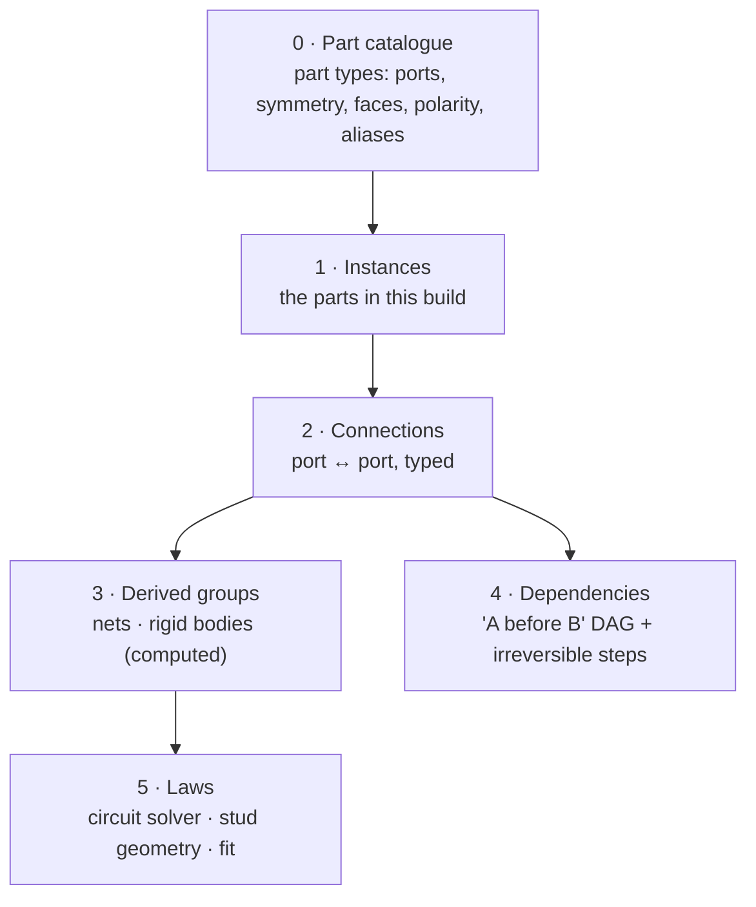
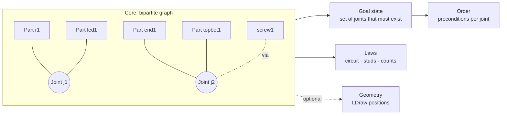
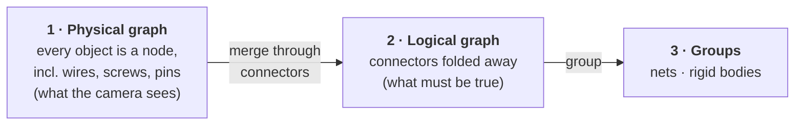
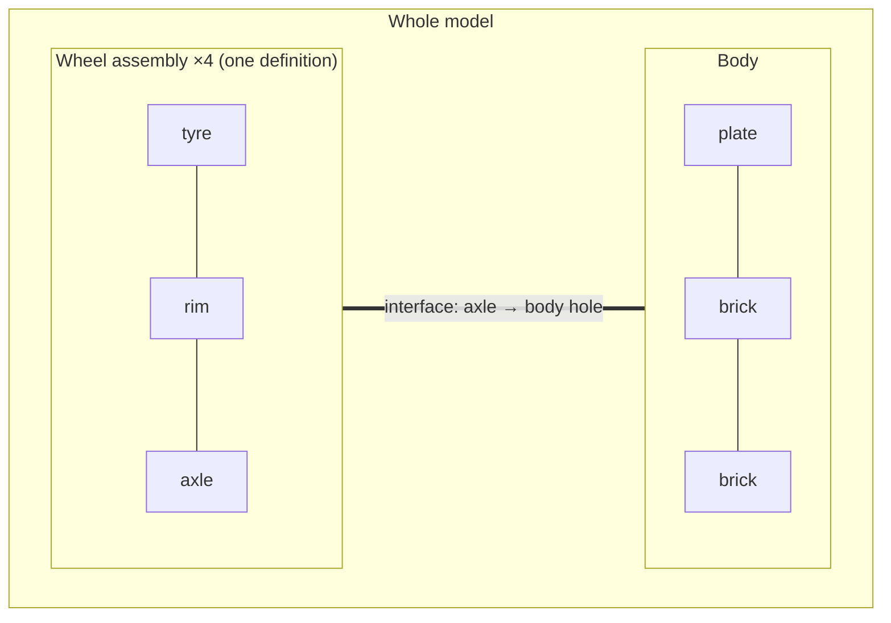

# Pinpoint — Research Log: Object Representation

> **Focus:** one general **object representation** that works for all three target areas: **Arduino / robotics**, **furniture (Sauder only, for now)** and **LEGO**. How to create it from instructions, and how to test it.
>
> **Note:** a graph is the leading **candidate**, not a decision. This is an exploration: the goal is whatever representation fits all three cases, which may turn out to be a graph, a set of graphs, or something else.
>
> **How to use this file:** add one entry per research question, newest findings inside the matching section. Each entry has a **question**, **findings** (with sources), a **verdict**, and **open points**. Mark anything not yet checked as *hypothesis* or *to verify*.
>
> Earlier research (Arduino tutor concept, VLM spatial limits, competitors) is in [`research-log.md`](./research-log.md).

### Source policy

**Only official, public manuals from the maker's own website.**

| Area | Official source | Status |
|---|---|---|
| **LEGO** | [lego.com building instructions](https://www.lego.com/en-us/service/building-instructions): search by set number; PDFs are served from `lego.com/cdn/product-assets/…` | ✅ Used (set 10696) |
| **Sauder** | sauder.com (support / assembly instructions, by model number) | ⚠️ **To verify by hand**: sauder.com blocks automated requests (HTTP 403). The Sauder PDF in R7 came from a **retailer's server (Menards)**; it is Sauder's own document, but not from Sauder's site |
| **Arduino** | [docs.arduino.cc](https://docs.arduino.cc/) built-in examples | ✅ Used by CircuitQuest |
| **IKEA** *(postponed)* | ikea.com product pages → assembly documents | ✅ Used (LUSTIGT) |

**Not official, flagged:** **LDraw / OMR** files are made by the LDraw **community**, not by LEGO. They are open and widely used, but are not an official LEGO source. Manual sites such as ManualsLib and Manuals+ are also third party.

**Exception (decided, R13):** LDraw is allowed as an **optional extension**: the official LEGO PDF is always the main source, and if the same set exists in LDraw, that file is used to make extraction easier and more precise.

---

## Contents

| # | Question | Status |
|---|---|---|
| [R1](#r1-are-there-well-written-instructions-we-can-turn-into-step-by-step-lessons) | Are there well-written instructions we can turn into step-by-step lessons? | ✅ First pass done |
| [R2](#r2-what-circuitquest-already-teaches-us) | What does CircuitQuest already teach us about representation? | ✅ First pass done |
| [R3](#r3-existing-ways-to-represent-assemblies) | How has assembly been represented before? | ✅ First pass done |
| [R4](#r4-logic-transitivity-does-12-and-23-mean-13) | Logic: does 1–2 and 2–3 mean 1–3? | 🟡 Hypotheses only |
| [R5](#r5-logic-symmetry-and-reversibility) | Logic: symmetry and reversibility | 🟡 Hypotheses only |
| [R6](#r6-draft-representation) | Draft general representation | 🟡 Sketch only |
| [R7](#r7-a-furniture-brand-with-well-written-manuals) | A furniture brand with well-written manuals | ✅ First pass done: **Sauder** |
| [R8](#r8-proposed-architecture-and-naming) | Proposed architecture and naming conventions | 🟡 Proposal |
| [R9](#r9-can-an-llmvlm-read-a-wordless-ikea-manual) | Can an LLM/VLM read a wordless IKEA manual? | 🟡 One informal test |
| [R10](#r10-decision-sauder-only-ikea-postponed) | **Decision:** Sauder only; IKEA postponed | ✅ Decided |
| [R11](#r11-identify-the-users-ikea-product-then-fetch-its-data) | Identify the user's IKEA product, then fetch its data? | ✅ First pass done |
| [R12](#r12-what-a-lego-manual-looks-like) | What does a LEGO manual look like? Does it have text? | ✅ One manual checked |
| [R13](#r13-decisions-ldraw-and-sauder-scope) | **Decisions:** LDraw as an extension; Sauder scope | ✅ Decided |
| [R14](#r14-brainstorm-graph-or-another-structure) | Brainstorm: graph or another structure? | 🟡 Brainstorm |
| [R15](#r15-first-principles-connection-types-and-part-freedoms) | First principles: connection types and part freedoms (incl. tents) | 🟡 Taxonomy draft |
| [R16](#r16-a-graph-that-accounts-for-connectors) | A graph that accounts for connectors (screws, wires, pins), part by part | 🟡 Proposal |
| [R17](#r17-parts-as-nodes-typed-connections-as-edges) | Parts as nodes, typed connections as edges: which edge types? | 🟡 Proposal, backed by literature |
| [R18](#r18-many-small-graphs-making-bigger-ones) | Many small graphs making bigger ones (hierarchy)? | ✅ **Decided: one graph per manual** |
| [R19](#r19-repeated-sub-assemblies) | Repeated sub-assemblies (the same piece built several times) | ✅ **Requirement set**; details open until build |
| [R20](#r20-manual-survey-connections-across-sauder-lego-and-arduino) | Manual survey: connections across Sauder, LEGO and Arduino; do repeated copies differ? | ✅ Done → [`GRAPH_SPEC.md`](./GRAPH_SPEC.md) |
| [R21](#r21-experiment-can-claude-build-the-graph) | Experiment: can Claude build the graph from 100 LEGO + 100 Arduino manuals? | 🟡 Set up; results in [`GRAPHGEN_RESULTS.md`](./GRAPHGEN_RESULTS.md) |

---

## R1. Are there well-written instructions we can turn into step-by-step lessons?

**Date:** 1 October 2026

**Question:** for each area, do instructions exist that are good enough (clear, complete and ideally machine-readable) to produce a component graph and a step-by-step lesson?

### Summary

| Area | Official instructions | Machine-readable source | Ready to use? |
|---|---|---|---|
| **Arduino / robotics** | Text tutorials with exact pins (Arduino docs, Project Hub) | **Wokwi `diagram.json`**, **Fritzing `.fzz`**: explicit pin-to-pin connections | ✅ **Yes.** Already proven in CircuitQuest |
| **LEGO** | Wordless PDF manuals for most sets, free on lego.com | **LDraw files** (Official Model Repository): every part, position, rotation and **build step** | ✅ **Yes, via LDraw.** Connections must be derived from geometry |
| **IKEA** | Wordless PDF manuals for every product, on ikea.com | **None official.** Research dataset **IKEA-Manual**: 102 objects with parts and assembly trees | ⚠️ **Partly.** Postponed; furniture uses **Sauder** instead (R10) |

### Arduino / robotics

- **Text tutorials are explicit.** Arduino's built-in examples name every part, value and pin (e.g. "LED anode to pin 13 through a 220 Ω resistor"). Text is the easiest input for an LLM.
- **Structured formats exist:**
  - **Wokwi `diagram.json`** stores each connection as a pair of pins, e.g. `["led1:A", "bb1:6b.i"]`. ([Wokwi diagram format](https://docs.wokwi.com/diagram-format))
  - **Fritzing `.fzz`** is a zip containing an XML sketch whose `<connectors>` element lists which part connects to which, and it can export an XML netlist. ([Fritzing sketch format](https://github.com/fritzing/fritzing-app/wiki/2.2-Sketch-file-format))
- **Already proven:** CircuitQuest's `guide_import` turns a real tutorial link into a lesson, and the `llm-lesson-gen` experiment found Claude Sonnet produced electrically equivalent lessons for all three Arduino Basics tutorials in one attempt (see R2).
- **Quality varies:** Project Hub and blog tutorials range from excellent to incomplete. A "well-written" filter is needed: all parts listed with values, every connection stated, code included.

**Verdict:** ✅ Arduino is ready. It is the reference domain for the representation.

### LEGO

- **Official manuals:** almost all LEGO instructions are free PDF downloads on lego.com, searchable by set number. Rebrickable lists ~29,000 instruction files for ~9,600 sets. ([LEGO help](https://www.lego.com/en-us/service/help-topics/article/how-to-download-building-instructions-online), [Rebrickable](https://rebrickable.com/help/where-can-i-download-lego-building-instructions/))
- **But they are images with no words.** Turning them into a machine plan is a research problem in itself: MEPNet (ECCV 2022) reconstructs assembly steps from manual images using keypoint detection and 2D–3D projection. ([MEPNet](https://arxiv.org/abs/2207.12572))
- **The better source: LDraw.** An open file format for LEGO models:
  - each part is one line: `1 <colour> x y z a b c d e f g h i <part.dat>`, i.e. part ID, colour, position and 3×3 rotation;
  - `0 STEP` marks the end of each building step, so **the steps are already in the file**;
  - **positions only, no explicit connections.** Which brick is attached to which must be **derived from geometry** (stud above anti-stud). That is a "real law" check, like electronics. ([LDraw spec](https://www.ldraw.org/article/218.html))
- **Official sets in LDraw:** the **Official Model Repository (OMR)** holds LDraw files of real LEGO sets, searchable by set number. ([OMR](https://library.ldraw.org/omr), [OMR spec](https://www.ldraw.org/article/593.html))
- **Physics precedent:** BrickGPT / LegoGPT (CMU, ICCV 2025) generates LEGO builds brick by brick, rejecting bricks that break **connectivity and stability** rules, with a 47,000-structure dataset (StableText2Lego). This shows LEGO correctness can be checked with physical rules. ([paper](https://arxiv.org/abs/2505.05469))

**Verdict:** ✅ LEGO is usable through **LDraw/OMR**: parts, positions and steps are given, and connections are derived by geometry. PDF manuals are a later, harder input.

*To verify:* how many sets the OMR covers; whether LDCad's "snap" connection metadata gives stud and connection points directly.

### IKEA

- **Official manuals:** every IKEA product has a downloadable PDF manual. They are **wordless by design** (since 1956) so they work in every country without translation. ([IKEA-Manual project](https://cs.stanford.edu/~rcwang/projects/ikea_manual/), [Cadasio on wordless instructions](https://www.cadasio.com/post/designing-assembly-instructions-without-words))
- **Useful structure in the PDFs:** the first pages show the **parts and hardware list** with drawings, quantities and part numbers. This is the most "machine-readable" part. *(To verify across several manuals.)*
- **No official structured data** (no CAD or connection files published).
- **Research datasets give ground truth:**
  - **IKEA-Manual** (NeurIPS 2022): **102 IKEA objects** with 3D parts split to match the manuals, **tree-structured assembly plans** ("how parts are connected during assembly"), manual segmentation and 2D–3D correspondence. **This is ready-made test data for our graph.** ([paper](https://arxiv.org/abs/2302.01881), [project and download](https://cs.stanford.edu/~rcwang/projects/ikea_manual/))
  - **IKEA Manuals at Work** (NeurIPS 2024): links manual steps to real assembly videos (4D grounding). ([paper](https://arxiv.org/abs/2411.11409))
- **AI models struggle with these manuals:** IKEA-Bench (2026) tested 19 VLMs on 29 IKEA products and found they struggle to match manual diagrams to real video. Adding text helps understanding but **hurts diagram-to-video matching**. ([paper](https://arxiv.org/abs/2604.00913))

**Verdict:** ⚠️ IKEA is the hardest. Use **IKEA-Manual** as ground truth to design and test the representation first; treat "PDF manual → graph" as a separate research step (parts list first, then steps).

---

## R2. What CircuitQuest already teaches us

**Date:** 1 October 2026 · **Source:** `~/Desktop/CirquitQuest` (`core/checker.py`, `core/physics.py`, `core/build_methods.py`, `core/guide_import.py`, `core/lesson_gen.py`, `library/parts/*.json`)

CircuitQuest already solves the representation problem **for electronics**. Its principles are the starting point for the general case.

| Principle | How CircuitQuest does it | General lesson |
|---|---|---|
| **Parts have named ports** | Pins like `r1:1`, `led1:A`, `uno:13` | Every part = a node with **ports**; connections join ports, not whole parts |
| **Conductors merge, components link** | Wires and breadboard strips are merged with **union-find** into **nets**; resistors and LEDs sit **between** nets | Two kinds of connection: **pass-through** (merge into one group) and **link** (join two different groups) |
| **Connectors disappear** | Breadboard and wires are `connector_only` and dropped from the final nets | The checked graph is the **logical** graph; how a connection was made physically is a separate layer |
| **Hardware equivalences** | `pin_aliases`: `uno:GND.1` = `uno:GND.3`; every hole in a breadboard strip is the same | Some ports are **the same port by design**; fold them before comparing |
| **Part symmetry** | `symmetric_pins`: a resistor's legs swap freely; a potentiometer's outer legs swap; an LED is `polarized` | Each part declares which ports are **interchangeable** |
| **"Different but correct" is graded** | A symmetric swap is "harmless", neither identical nor wrong | Results need three levels: **exact / equivalent / wrong** |
| **Same goal, different method** | `build_methods`: the same nets built with or without a breadboard (clips, twist, solder) | **What** is connected is separate from **how** it was connected |
| **Real laws** | `physics.py` solves the circuit (nodal analysis): currents, LED states, floating inputs | The graph can be checked by **laws**, not only by matching the tutorial |
| **State-dependent connections** | Buttons, slide switches and relays connect only in some states | Some edges are **conditional** |
| **Part facts live in data** | Library JSON cards hold pins, polarity, symmetry and aliases; the code is generic | Domain knowledge goes in **part cards**; the algorithm stays domain-free |
| **AI never decides correctness** | The LLM writes the lesson, a validator checks it, and the engine checks the build with plain logic | Keep this rule for all domains |

---

## R3. Existing ways to represent assemblies

**Date:** 1 October 2026

| Representation | What it captures | Use for us |
|---|---|---|
| **Liaison graph** | Nodes = parts, edges = physical contacts or joints | Matches our "component graph" |
| **Precedence relations** | "A must be done before B" | Our dependency layer |
| **AND/OR graph** (Homem de Mello & Sanderson, 1986–91) | **All** valid ways to split an assembly into sub-assemblies, compactly | A formal way to represent **any valid order**, our key feature ([AAAI 1986](https://aaai.org/papers/01113-AAAI86-184-and-or-graph-representation-of-assembly-plans/)) |
| **Assembly tree** (IKEA-Manual) | Which groups of parts are joined at each manual step | Ground truth for IKEA tests |
| **Netlist** (electronics) | Groups of pins that are electrically one node | Arduino ground truth (Wokwi, Fritzing, CircuitQuest) |
| **LDraw** | Part positions and steps, no connections | LEGO ground truth after deriving connections |
| **Physics-based planning** ("Assemble Them All", 2022) | Finds a valid order by planning **disassembly** with physics | Possible way to derive valid orders automatically ([paper](https://arxiv.org/abs/2211.03977)) |

**Takeaway:** the field already separates **what connects to what** (liaison graph, netlist) from **in which order** (precedence, AND/OR graph). Our representation should do the same.

---

## R4. Logic: transitivity (does 1–2 and 2–3 mean 1–3?)

**Status:** 🟡 *Hypotheses, to test with examples from all three areas.*

**Working hypothesis:** it depends on the **type** of connection. We need to separate:
- **direct connection**: an edge in the graph (1 is joined to 2);
- **same group**: 1 and 3 belong to the same connected whole, through 2.

| Case | 1–2 and 2–3 ⇒ 1–3? | Why |
|---|---|---|
| **Electrical, through a conductor** (wire, breadboard strip) | ✅ **Yes**: 1 and 3 are the **same net** | A conductor makes an equivalence relation (reflexive, symmetric, transitive), which is why CircuitQuest uses union-find |
| **Electrical, through a component** (resistor, LED) | ❌ **No** | The component **links two different nets**; its two legs are not the same node |
| **Electrical, through a switch or relay** | ⚠️ **Only in some states** | A conditional edge: transitive only while the switch is closed |
| **LEGO, "attached to"** | ❌ Not directly: brick 1 on 2 and 2 on 3 does not mean 1 touches 3 | Direct attachment is a physical contact |
| **LEGO, "same rigid build"** | ✅ **Yes** | All three move together: the same connected component |
| **IKEA, joint (dowel, cam lock, screw)** | ❌ Not directly | Same as LEGO: a joint is a contact |
| **IKEA, "same rigid body"** | ✅ **Yes, once all needed joints are made** | Only if the joints actually make it rigid (e.g. a frame needs its back panel to stay square) |

**Implication for the representation:** each connection type declares whether it is **pass-through** (merges ports into one group, so transitive) or **link** (joins two groups, so not transitive). Groups are computed (union-find for pass-through edges; connected components for "same rigid build").

**Tests to run:** for each area, build small examples where the transitive and non-transitive readings give **different** answers, and check which one matches reality.

---

## R5. Logic: symmetry and reversibility

**Status:** 🟡 *Hypotheses.*

### Part symmetry: can a part go in more than one way?

| Example | Symmetric? | Effect |
|---|---|---|
| Resistor legs | ✅ Interchangeable | Either orientation is correct (CircuitQuest: `symmetric_pins`) |
| LED legs | ❌ Polarised | Only one orientation works (a law: current flows anode → cathode) |
| LEGO 2×4 brick | ✅ 180° rotation looks identical | A rotated placement is the same build |
| LEGO 1×2 slope | ❌ Directional | Rotation changes the shape |
| IKEA wooden dowel | ✅ Either end | Interchangeable |
| IKEA side panel with pre-drilled holes | ⚠️ Often **mirror pairs** (left vs right) | Looks symmetric but isn't: a classic mistake |

**Representation:** each part card lists its **symmetry group** (which ports or orientations are interchangeable), as CircuitQuest's `symmetric_pins` does for electronics.

### Connection symmetry: is "A connects to B" the same as "B connects to A"?
- **Electrical contact:** symmetric.
- **"Sits on top of"** (LEGO stud into anti-stud), **"inserted into"** (dowel into hole): **directional**. The connection is symmetric as a relation ("attached"), but its **ports** are not (stud vs anti-stud, peg vs hole).

### Step reversibility: can a step be undone?

| Reversible | Not reversible |
|---|---|
| Breadboard wire, LEGO brick, IKEA cam lock, screw | Solder joint, glue, nailed IKEA back panel, a snapped clip |

**Why it matters:** irreversible steps limit "any order". The checker should **warn before** an irreversible step is done wrong, while reversible mistakes can just be pointed out.

---

## R6. Draft representation

**Status:** 🟡 *Sketch to be refined after R4 and R5 are tested. Written as a graph because that is the leading candidate; other forms stay open.*

```
Part        id, type → part card (ports, symmetry, polarity, aliases, reversible?)
Port        part:port_name          e.g. r1:1, brick7:stud(2,1), side_panel_L:hole3
Connection  port ↔ port, with:
              kind        pass-through | link | conditional
              direction   symmetric | directional (stud→anti-stud, peg→hole)
              reversible  yes | no
Groups      computed: nets (pass-through) and rigid bodies (connected components)
Dependency  "A before B" (only where physically required)
Laws        domain checks: circuit solver · stud geometry and stability · fit and squareness
```

**How to test it:**
1. **Arduino:** convert CircuitQuest lessons (Wokwi diagrams) into this format and check they round-trip.
2. **LEGO:** derive connections from 3–5 small OMR/LDraw sets; check the derived graph against the steps.
3. **IKEA:** convert 3–5 IKEA-Manual assembly trees; check every manual step maps to graph edges.
4. **Equivalence tests:** for each area, make "different but correct" variants (a swapped resistor, a rotated 2×4 brick, a flipped dowel) and wrong variants (a reversed LED, a mirrored side panel). The checker must classify each as exact, equivalent or wrong.

---

## R7. A furniture brand with well-written manuals

**Date:** 1 October 2026

**Question:** IKEA manuals are wordless. Is there a furniture brand whose manuals are well written enough to explore how to represent furniture generically?

### Candidates

| Brand / source | Manual style | Structure | Fit |
|---|---|---|---|
| **Sauder** (US, flat-pack) | **Text + drawings** on every step | Lettered parts with quantities, numbered hardware shown at actual size, step text naming parts, hardware, counts and tools | ✅ **Best fit** |
| **Tylko** (made-to-measure shelves) | Drawings only, but **personalised** to each shelf | Every part has a code (`C`, `Cl`, `W1`, `Bn`, `Bh`, `Bs`…), each step lists "the parts you need" with count and box number | ✅ Good second: very structured, no text |
| **Opendesk** (open-source furniture) | PDF assembly guide + **CAD files** (DXF/DWG) | Exact geometry of every part; CC licences | ⚠️ Useful for geometry; stopped publishing in 2020, now only in archives ([archive.org](https://archive.org/details/opendesk)) |
| **Ashley** | More written text than IKEA | Not checked in detail | ❓ To check |
| **Amazon Basics** | IKEA-like, minimal text | — | ❌ Same problem as IKEA |
| **IKEA** | Wordless | Parts list + drawings | ⚠️ Use **IKEA-Manual** dataset as 3D ground truth (R1) |

Sources: [Sauder manuals (Manuals+)](https://manuals.plus/category/sauder), [Tylko assembly FAQ](https://tylko.com/en-ot/faq/articles/self-assembly-disassembly/how-do-i-assemble-my-tylko-shelf), [Opendesk (Make:)](https://makezine.com/article/digital-fabrication/machining/opendesk-cnc-furniture/), [Ready-to-assemble brands](https://assemblysmart.com/ready-to-assemble-furniture-brands/).

### Checked example: Sauder 2-Cube Organizer (model 430628)

Read in full ([PDF](https://cdn.menardc.com/main/items/media/SAUDE001/Assembly_Instructions/2114705_instruct.PDF), 12 pages, 4 steps). *Note: this copy is hosted by a retailer (Menards); replace it with the copy from sauder.com once confirmed (see Source policy).*

**Parts list (page 2)**
- Panels: **B** END ×2, **D** TOP/BOTTOM ×2, **E** SHELF ×1
- Hardware: **1** wood dowel ×4, **2** applique card ×1, **3** 3-5/16" hex head screw ×8
- Tool: **4** L-wrench ×1

**Steps (verbatim)**
1. "Fasten the TOP/BOTTOMS (D) to one of the ENDS (B). Tighten four 3-5/16" HEX HEAD SCREWS (3) using the L-WRENCH (4)."
2. "Insert two WOOD DOWELS (1) into the END (B). Push the SHELF (E) onto the WOOD DOWELS (1) in the END (B)."
3. "Insert two WOOD DOWELS (1) into the remaining END (B). Fasten the END (B) to the TOP/BOTTOMS (D) and SHELF (E)… Be sure the WOOD DOWELS in the END insert into the SHELF."
4. Stick appliques over visible screw heads. (Cosmetic.)

Drawings add orientation hints: "Surface with more holes" / "Surface with fewer holes".

**Why this is ideal:** every step names **which parts**, **which hardware**, **how many**, and **which tool**. That is close to a connection list already, so an LLM can extract it from text, as with Arduino tutorials.

### What the example shows for the representation

| Observation in the manual | Representation idea | Parallel in other areas |
|---|---|---|
| "one of the ENDS (B)", B ×2 | The two ends are **interchangeable instances** of one part type | Two identical resistors; two identical LEGO bricks |
| D TOP/BOTTOM ×2, one label for both | Top and bottom are **symmetric** | Resistor legs (`symmetric_pins`) |
| "Surface with more / fewer holes" | Panels have **faces**; orientation matters | LED polarity; LEGO stud vs anti-stud |
| Dowels and screws join panels | **Hardware is a connector**: it joins two panels, like a wire or breadboard strip joins two pins | CircuitQuest drops connectors from the logical nets |
| Step 1 and step 2 touch different joints | Their **order can be swapped** | Wiring the LED before the resistor |
| Shelf E must be on its dowels **before** the second end closes the box | A **physical dependency**: the box would block it | Placing a LEGO brick before covering it |
| B1–D and D–B2 | B1 and B2 end up in **one rigid body** but are **not directly joined** | R4 transitivity: "same group" ≠ "directly connected" |

**Draft logical form of this product:**

```
Parts        B1, B2 (END) · D1, D2 (TOP/BOTTOM) · E (SHELF)
Joints       B1–D1  screw ×2      B1–D2  screw ×2      B1–E  dowel ×2
             B2–D1  screw ×2      B2–D2  screw ×2      B2–E  dowel ×2
Symmetry     B1 ↔ B2 · D1 ↔ D2
Orientation  each panel: face with more holes / fewer holes
Dependency   B1–E before B2 closes (B2–D1, B2–D2, B2–E made together)
Free order   {B1–D1, B1–D2} and {B1–E} in either order
Result       one rigid body {B1, B2, D1, D2, E}
```

**How Sauder products are identified**

| Identifier | Example (2-Cube Organizer) | Where | Use for us |
|---|---|---|---|
| **Model number** (5–6 digits) | `430628` | Manual cover and every page footer | **The product ID.** Selects the product and its manual |
| **SKU** | `211-4705` | Printed next to the model number | Retailer-specific (this one matches Menards' file name); secondary |
| **Lot number + date** | `567740`, 06/21/21 | Lower-right corner of the manual cover | Production batch; identifies the manual **version** |
| **Part letter** | `B` END, `D` TOP/BOTTOM | Part Identification page | Unique **only inside one manual**; Sauder asks for model number + part description to order replacements |
| **Hardware number** | `1` dowel, `3` screw | Hardware Identification page | Same: only meaningful inside one manual |

Sources: the manual itself; [Sauder: order replacement parts](https://www.sauder.com/service/replacement-parts).

**Naming consequence (R8):** part types become `sauder-<model>-<part>`, e.g. `sauder-430628-end`; the manual letter stays as `label`. Hardware stays `hw-<description>` until a cross-product Sauder hardware ID is found.

*To verify:* whether sauder.com offers manuals by model number for direct download; check 3–5 more Sauder manuals (a drawer unit, a desk) for consistency, especially for moving parts (drawers, doors) that add **conditional** connections, like switches in electronics.

**Verdict:** ✅ Use **Sauder** as the main furniture source for designing the representation (text, lettered parts, explicit hardware). Use **Tylko** as a structured but wordless second case, and **IKEA-Manual** as 3D ground truth.

---

## R8. Proposed architecture and naming

**Date:** 1 October 2026 · **Status:** 🟡 *Proposal, based on R1–R7. To be tested on one example per area.*

### Is it "a connected graph"?

**Not quite, for three reasons:**
1. **During a build it is not connected.** Sub-assemblies are built separately (Sauder step 1 and step 2, IKEA LUSTIGT steps 1–3) and joined later. The representation must allow **several separate pieces** and only expect one connected whole at the end.
2. **Some connections join many ports at once.** An electrical net (a breadboard strip with 3 legs in it) is one connection between many pins: a **hyperedge**, not a simple edge. CircuitQuest handles this with union-find.
3. **Order is a separate structure.** "What connects to what" and "what must come first" are different questions (R3). Mixing them into one graph makes "any order" hard to check.

### Recommendation: a layered **port graph**



| Layer | Holds | Arduino | Furniture (Sauder) | LEGO (LDraw) |
|---|---|---|---|---|
| **0 · Part catalogue** | Reusable part **types**: ports, symmetry, faces, polarity, aliases, `connector`, `reversible` | `resistor-1k`: ports `1`,`2`, symmetric | `sauder-430628-end`: holes, two faces | `lego-3001` (2×4 brick): 8 studs, 8 anti-studs, 180° symmetric |
| **1 · Instances** | The parts **in this build**, each pointing to a type | `r1`, `led1`, `uno` | `end1`, `end2`, `topbot1`, `topbot2`, `shelf1` | `b1`…`b40` |
| **2 · Connections** | **Port ↔ port** links, each with a `kind` (below) | `r1:2 ↔ led1:A` | `end1:hole.t1 ↔ topbot1:hole.l1` via `screw1` | `b2:stud.1.1 ↔ b7:anti.1.1` |
| **3 · Derived groups** | **Computed, never stored**: nets (electrical) and rigid bodies (mechanical) | nets via union-find | rigid bodies via connected components | rigid bodies |
| **4 · Dependencies** | A **precedence DAG** over connections, plus flags for irreversible steps. **Any valid order = any topological order** of this DAG | (rarely needed) | `end1–shelf1` before `end2` closes | lower bricks before upper |
| **5 · Laws** | Domain validators run on layers 2–3 | circuit solver (CircuitQuest `physics.py`) | fit, squareness, hardware counts | stud alignment, stability |

**Connection kinds** (answers R4):

| `kind` | Meaning | Transitive? | Examples |
|---|---|---|---|
| `merge` | Ports become **one** node | ✅ Yes (union-find) | wire, breadboard strip, header socket |
| `link` | Two **different** nodes joined by a part | ❌ No | resistor, LED, motor |
| `join` | Mechanical contact; parts become **one rigid body** | ❌ Not directly, ✅ for "same body" | screw, dowel, cam lock, stud-in-anti-stud |
| `conditional` | Exists only in some **states** | ⚠️ Only in that state | button, relay, drawer, hinge |

**Connectors are parts too.** Screws, dowels and wires are **instances with ports** (`screw1`, `wire3`), so the system can count them against the parts list. Then, as CircuitQuest already does, they are **folded away** into a clean logical view (`end1 ↔ topbot1`) for checking.

**How "different but correct" works:** before comparing the expected build with what the camera sees, both are put into a **canonical form**:
1. fold **aliases** (all `uno:GND.*` → `uno:GND`; all holes in a strip → one strip);
2. fold **symmetric ports** (resistor legs; a 2×4 brick rotated 180°);
3. match **interchangeable instances** (`end1` ↔ `end2`, two identical resistors). This is a graph-matching (isomorphism) step; builds are small, so standard algorithms such as VF2 in NetworkX are fast enough.

The result is then **exact / equivalent / wrong**, as in CircuitQuest.

### Naming conventions

**Principle: reuse each domain's own official IDs wherever they exist, wrapped in one common pattern.**

| Thing | Pattern | Examples | Why |
|---|---|---|---|
| **Part type** | `domain-id` in kebab-case, using the official number if there is one | `resistor-1k`, `arduino-uno` · `lego-3001` (LDraw/BrickLink number) · `ikea-109536` (IKEA hardware number printed in the manual) · `sauder-430628-end` | Stable, searchable, matches CircuitQuest's library; official numbers make catalogue lookups possible |
| **Instance** | short lowercase name + number | `r1`, `led1`, `uno` · `end1`, `shelf1`, `screw3` · `b12` | Wokwi/CircuitQuest style; short enough for logs |
| **Source label** | kept as an attribute, never as the ID | `{"id": "end1", "label": "B"}` | Manual letters (Sauder "B") are only unique inside one manual |
| **Port** | `instance:port`, sub-parts separated by dots | `r1:1`, `led1:A`, `uno:13`, `bb1:18t.d` · `end1:hole.t1`, `end1:face.inner` · `b7:stud.2.1`, `b7:anti.2.1` | Already the Wokwi convention for pins and breadboard holes; dots give a natural hierarchy |
| **Connection** | `c` + number, or the port pair | `c4`, or `r1:2~led1:A` | `~` reads as "connected to" |
| **Step** | `s` + number, with the source step number as an attribute | `s3 {"source_step": 3}` | Steps are suggestions; the checker uses connections, not step numbers |
| **Derived group** | `net:<lowest port>` / `body:<lowest instance>` | `net:uno:13`, `body:end1` | Deterministic, so the same build always gets the same names |

**Units and coordinates:** millimetres, right-handed, Z up. LDraw uses its own units (1 LDU = 0.4 mm) and −Y up, so convert at import.

### Minimal example (Sauder 2-Cube Organizer)

```json
{
  "parts": [
    {"id": "end1",    "type": "sauder-430628-end",     "label": "B"},
    {"id": "end2",    "type": "sauder-430628-end",     "label": "B"},
    {"id": "topbot1", "type": "sauder-430628-topbot",  "label": "D"},
    {"id": "topbot2", "type": "sauder-430628-topbot",  "label": "D"},
    {"id": "shelf1",  "type": "sauder-430628-shelf",   "label": "E"},
    {"id": "dowel1",  "type": "hw-wood-dowel",         "label": "1"},
    {"id": "screw1",  "type": "hw-hex-screw-3-5-16",   "label": "3"}
  ],
  "connections": [
    {"id": "c1", "kind": "join", "ports": ["end1:hole.t1", "topbot1:hole.l1"], "via": "screw1"},
    {"id": "c5", "kind": "join", "ports": ["end1:hole.m1", "shelf1:hole.l1"], "via": "dowel1"}
  ],
  "dependencies": [
    {"before": "c5", "after": "c9", "why": "shelf must sit on end1's dowels before end2 closes the box"}
  ],
  "interchangeable": [["end1", "end2"], ["topbot1", "topbot2"]]
}
```
*(Shortened: the full build has 8 screws, 4 dowels and 12 connections.)*

---

## R9. Can an LLM/VLM read a wordless IKEA manual?

**Date:** 1 October 2026 · **Status:** 🟡 *One informal test (Claude reading one manual), plus published evidence. Not a benchmark.*

### Test: IKEA LUSTIGT wall shelf ([PDF](https://www.ikea.com/us/en/assembly_instructions/lustigt-wall-shelf__AA-2046060-5-100.pdf), AA-2046060-5)

20 pages: 10 pages of multilingual safety text, 1 tools page, 1 hardware page, 1 "possible layouts" page, 5 steps.


*Step 1 of the LUSTIGT manual: drawings and arrows only; the boards carry no letters or numbers.*

**What Claude could read reliably from the drawings:**

| Item | Read correctly? | Notes |
|---|---|---|
| Tools | ✅ | Phillips screwdriver, spirit level |
| Hardware | ✅ | One screw type, **109536 ×5** |
| Step 2 and 3 counts | ✅ | 2 screws + 3 screws = 5 ✔ matches the hardware page, a useful **consistency check** |
| Overall structure | ✅ | Five shelf boards slot onto a vertical spine; screwed through the spine; hung on the wall; three ladder-style clips added at shelf ends |
| **Valid alternative layouts** | ✅ | Page 13 shows **four** correct arrangements (shelves left/right in different patterns). IKEA itself documents "different but correct" |
| Step 4 wall screws | ✅ | Not included (the safety text says so); the icon compares wall plugs |

**What was uncertain or missing:**

| Problem | Why it matters |
|---|---|
| **Panels have no letters or part numbers** | The parts list has only the screw; boards must be identified by shape. Hard to name instances reliably |
| **Which face or edge of a board goes where** | Shown only by small "hand" close-ups of hole patterns, the fine spatial detail VLMs are weakest at (Spatial Blindspot, R1) |
| **Exactly which slot each shelf uses** | Arrows show sliding direction, not exact positions |
| **Exact hole each screw goes into** | Small magnified circles; position, not just count, is hard |

### Published evidence
- **IKEA-Bench (2026):** 19 VLMs on 29 IKEA products. They struggle to match manual diagrams to real video, and adding text **hurts** diagram-to-video matching. ([paper](https://arxiv.org/abs/2604.00913))
- **MEPNet (2022):** reading LEGO manuals precisely needed a **purpose-built** keypoint and 3D-projection model, not a general VLM. ([paper](https://arxiv.org/abs/2207.12572))
- **Manual-PA (2024):** learns 3D part assembly from instruction diagrams with a dedicated model. ([paper](https://arxiv.org/abs/2411.18011))

### Verdict

**Partly.** A VLM can get the **skeleton**: tools, hardware and counts, which parts join in each step, and the overall structure. It is **not reliable for the precise parts**: which face, which hole, which slot. That precision is exactly what a checker needs.

**Suggested approach for IKEA:**
1. VLM extracts the **skeleton** (parts by shape, hardware counts, joins per step).
2. **Consistency rules** catch errors (hardware totals match the parts page; every part is used; steps form a valid order).
3. Fill in precise geometry from **3D data** where available (IKEA-Manual's 102 objects), or let the **user confirm** ambiguous details once.
4. Compare with **Sauder** (text) to measure how much the missing words cost.

This makes "wordless manual → representation" a **research contribution** in its own right, rather than a dependency for the first prototype.

---

## R10. Decision: Sauder only, IKEA postponed

**Date:** 1 October 2026 · **Status:** ✅ Decided

**Decision:** for furniture, the project supports **Sauder only** for now. IKEA is postponed to future work.

**Why IKEA was not chosen as the starting point:**

| Reason | Evidence |
|---|---|
| **Manuals are wordless by design** | Every step is a drawing; there is no text to extract (R1, R9) |
| **Panels are not labelled** | The LUSTIGT parts list names only the screw (109536 ×5); boards have no letter or number (R9) |
| **The precise details are the hardest part for AI** | Which face, which hole and which slot appear only in small close-ups, the fine spatial detail VLMs are weakest at (R9; [Spatial Blindspot](https://arxiv.org/pdf/2601.09954)) |
| **Published results agree** | 19 VLMs struggle to align IKEA diagrams with real footage ([IKEA-Bench](https://arxiv.org/abs/2604.00913)); LEGO manuals needed a purpose-built model ([MEPNet](https://arxiv.org/abs/2207.12572)) |
| **No official structured data at scale** | IKEA publishes no part or connection files; its official 3D dataset has 5 products under a non-commercial licence (R11) |

**Why Sauder instead:** every step is written in words, parts are lettered with quantities, hardware is numbered with counts, and tools are named. An LLM can extract it from text the same way CircuitQuest extracts Arduino tutorials (R7).

**What would bring IKEA back:** a reliable "picture manual → representation" pipeline (R9 approach), or product data that includes parts (R11). Either is a research contribution in its own right.

---

## R11. Identify the user's IKEA product, then fetch its data?

**Date:** 1 October 2026

**Question:** if the user already has the IKEA product, can we **identify exactly which product it is**, pull its **part information from another source**, and then use the manual?

### Step 1: identify the exact product

| Method | Reliability | Notes |
|---|---|---|
| **Read the box label** | ✅ **Exact** | Every IKEA box shows the **8-digit article number** (e.g. `304.499.08`) and "Box 1(2)"-style package counts. Easy to read with OCR, no VLM needed ([IKEA: product details](https://www.ikea.com/ca/en/customer-service/knowledge/articles/e7cg2eg5-2536-47b9-bb1b-10003300c772.html)) |
| **Scan the box barcode** | ✅ Likely exact | The barcode reportedly encodes the article number. *To verify* the exact format |
| **Read the manual's document number** | ✅ **Exact** | Every manual carries its number, e.g. `AA-2046060-5` (LUSTIGT) |
| **Photo of the assembled product** | ⚠️ Good, not exact | IKEA's own app has visual search (GrokStyle) that finds "similar or the exact" product ([TechCrunch](https://techcrunch.com/2018/03/16/grokstyles-visual-search-tech-makes-it-into-ikeas-place-ar-app/)). Variants (size, colour) are easy to confuse |
| **VLM on the unassembled parts** | ❌ Poor | Before assembly the user has flat panels that look alike across many products. This is the wrong moment for visual recognition |

**Finding:** identifying the product is **easy and exact**, but through the **box label or manual number (OCR)**, not by a VLM looking at the parts.

### Step 2: fetch part information from elsewhere

| Source | What it gives | Limits |
|---|---|---|
| **IKEA product page** (by article number) | Official assembly PDF, package count, dimensions | No part or connection data ([how to find assembly documents](https://www.ikea.com/us/en/customer-service/knowledge/articles/1656c41a-1a58-4e59-a77a-bae69f28f1bb.html)) |
| **Spare-part numbers** in the manual | Hardware IDs (6–8 digits) and counts, orderable from IKEA | **Hardware only**; panels have no number ([IKEA spare parts](https://www.ikea.com/us/en/customer-service/knowledge/articles/3e09f6eb-5c91-48e4-8878-d8c144d36b38.html)) |
| **"View in 3D" model** on the product page | GLB model of the **assembled** product | Not officially downloadable (only via third-party scripts); assembled state, not parts; terms of use unclear |
| **IKEA 3D Assembly Dataset** (official, 2021) | GLB/OBJ of the assembled product with parts in the scene hierarchy, plus the manual, article and document numbers | **Only 5 products** (LACK, 2× EKET, BEKVÄM, DALFRED); **CC BY-NC-SA 4.0**: research only, **no commercial use** ([GitHub](https://github.com/IKEA/IKEA3DAssemblyDataset)) |
| **IKEA-Manual** (Stanford research) | 102 products with **separate parts** and assembly trees | Research dataset; fixed set of products (R1) |

**Finding:** apart from the hardware list, **no source gives panel-level part data at scale**. 3D data exists for **5 + 102 products**, for research use.

### Step 3: then use the manual

Knowing the exact product **helps** reading the manual:
- the hardware list and counts become **known facts**, used to check the VLM's reading;
- for the ~107 products with 3D data, the **geometry resolves** "which face, which hole";
- the right manual is fetched automatically, so the user never has to find it.

It does **not** remove the main problem: the steps are still **drawings**, and turning them into connections is the R9 challenge.

### Verdict

| Part of the idea | Possible? |
|---|---|
| Identify the exact product | ✅ Yes: OCR the box label or manual number (better than a VLM) |
| Fetch the official manual automatically | ✅ Yes, via the product page |
| Fetch part data from elsewhere | ⚠️ Only hardware at scale; full parts for ~107 research products, not for commercial use |
| Skip reading the drawings | ❌ No; the steps exist only as pictures |

This supports the R10 decision. It also defines a clean **future-work path for IKEA**: identify by label → fetch manual → VLM reads the skeleton → checked against the official hardware list → precise geometry from the 3D datasets where available.

---

## R12. What a LEGO manual looks like

**Date:** 1 October 2026

**Question:** are LEGO manuals also wordless, like IKEA's? What can be read from them?

### Example: LEGO Classic 10696 (Medium Creative Brick Box)

[Official PDF](https://www.lego.com/cdn/product-assets/product.bi.core.pdf/6114394.pdf), 60 pages, several small models.

**Steps: no words.** Each step is a picture with:
- a **parts box** showing which pieces to add, with **counts** ("2x");
- the **step number**;
- **red arrows** showing where a piece goes.


*Steps 2–3: a parts box (2× slope, 1× 2×2 brick), a red arrow for placement, no text.*

**Sub-assemblies and turning the model** are shown with symbols, not words: a framed box with mini-steps 1–2–3, then an arrow to where the sub-assembly attaches, and a rotate icon.


*Step 6: a sub-assembly built in its own box (mini-steps 1–3), then attached; the circular-arrows icon means "turn the model".*

**But the parts inventory is real text.** The last pages list **every element with its count and Element ID** as selectable text in the PDF, e.g. `4x 300401`, `2x 300101`, `5x 303901`.


*Page 57: the inventory. Each piece has a count and a 6–7 digit Element ID, extractable as text.*

### What this means

| | IKEA (LUSTIGT) | LEGO (10696) | Sauder |
|---|---|---|---|
| Step text | ❌ None | ❌ None | ✅ Full sentences |
| Parts per step | ⚠️ Drawn, unlabelled | ✅ **Parts box with counts** on every step | ✅ Named with letters |
| Parts inventory | ⚠️ Hardware only | ✅ **Every piece, Element ID + count, as text** | ✅ Letters + quantities |
| Sub-assemblies | Drawn | ✅ Marked with framed boxes | Text |
| Machine-readable alternative | ❌ | ✅ **LDraw / OMR** (R1) | — |

**Why LEGO is much easier than IKEA despite having no words:**
1. **Every piece is identified** by an Element ID in the inventory. Element IDs map to part shape and colour through catalogues such as Rebrickable and BrickLink *(to verify the exact lookup)*. Older 6-digit IDs appear to be the design number plus a colour code (`3004` + `01` = white 1×2 brick); newer 7-digit IDs are not structured that way.
2. **Each step's parts box** says exactly which pieces are added, so a VLM only has to recognise known pieces, not unknown panels.
3. **Positions sit on a stud grid**, so "where" is a discrete choice, which suits the grid approach (geometry + labelled grid + VLM) from the earlier research.
4. **LDraw files** of official sets give parts, positions and steps directly, with no image reading at all.

**Verdict:** ✅ LEGO manuals have no step text, but they are **far more structured** than IKEA's (identified pieces, per-step parts lists, a grid). For the first prototype use **LDraw/OMR files**; reading the PDF is a later option, helped by the text inventory.

*To verify:* whether set 10696 (or another small set) is in the OMR, so the same model can be compared in both forms.

---

## R13. Decisions: LDraw and Sauder scope

**Date:** 1 October 2026 · **Status:** ✅ Decided

1. **LEGO: official PDF first, LDraw as an extension.** The official lego.com PDF is the primary source. **If the set is available in LDraw** (e.g. in the OMR), the LDraw file is used as well, giving the LLM exact parts, positions and steps instead of reading pictures.
2. **Sauder: shape the design, don't implement yet.** Sauder is **considered when designing the representation** (screws and dowels as connectors, panel faces, interchangeable parts, physical dependencies), so the structure will fit furniture later. It is **not implemented** in the first version.
3. **First implementation targets:** Arduino / robotics and LEGO.

---

## R14. Brainstorm: graph or another structure?

**Date:** 1 October 2026 · **Status:** 🟡 *Brainstorm. Options and trade-offs; no decision yet.*

### What the structure must handle

Collected from R1–R13:

| # | Requirement | Example |
|---|---|---|
| 1 | **Connections that join many points at once** | A breadboard strip with 3 legs; a screw through 2 panels; one stud row |
| 2 | **Symmetry and interchangeable parts** | Resistor legs; two identical END panels; a 2×4 brick rotated 180° |
| 3 | **Any valid order**, plus real dependencies | Wire the LED or the resistor first; the shelf before the second end |
| 4 | **Separate pieces during the build** | Sub-assemblies (LEGO step 6 box; Sauder steps 1 and 2) |
| 5 | **Conditional connections** | Button pressed; drawer open |
| 6 | **Checkable by laws** | Circuit solver; stud geometry; hardware counts |
| 7 | **An LLM can write it reliably** | From a tutorial, a Sauder manual, an LDraw file |
| 8 | **The camera can fill it in** | Detected connections map onto the same structure |
| 9 | **Geometry when available** | LDraw positions |
| 10 | **One structure for all areas** | Arduino, LEGO, later Sauder |

### Candidate structures

| Structure | Idea | Strengths | Weaknesses |
|---|---|---|---|
| **A. Simple graph** (liaison graph) | Parts = nodes, connections = edges | Simple; well known | Can't say **which point** of a part; can't join 3+ points in one connection (req. 1) |
| **B. Port graph** (R8 draft) | Parts have named ports; edges join ports | Says exactly where (`r1:2`, `b7:stud.2.1`); matches Wokwi/CircuitQuest | A 3-way connection needs several edges or a special rule |
| **C. Hypergraph** | One connection (hyperedge) can join **any number** of ports | Fits nets, screws and stud rows naturally (req. 1) | Less familiar; fewer ready-made tools |
| **D. Bipartite graph** (parts ↔ joints) | **Two kinds of node**: parts, and **joints**. A joint links to every port it joins | Same power as a hypergraph, but an ordinary graph, so standard tools work. Hardware (screws, wires) can sit on the joint | Slightly more nodes |
| **E. Tree** (assembly tree) | Sub-assemblies nested inside each other | Matches manuals and LDraw sub-models (req. 4) | Encodes **one** order; can't express "any order" (req. 3) |
| **F. AND/OR graph** | Every valid way to split the product into sub-assemblies | The formal answer to "any order" | Grows very fast; hard for an LLM to write |
| **G. Goal state + preconditions** (planning style, like PDDL) | The build is a **set of facts** that must be true at the end; each fact may list **preconditions** | "Any order" comes for free: whatever satisfies the preconditions is valid. Easy for an LLM ("this joint needs X first") | Needs a separate view for structure and geometry |
| **H. Constraint model** (CSP) | Variables = where each part goes; constraints = laws | "Different but correct" = **any solution** that satisfies the constraints | Heavier to solve; harder to explain to the user |
| **I. Scene graph** (positions) | Each part's position and rotation (LDraw, glTF) | Exact geometry; matches the camera's view | **No connections** (R1); they must be derived |
| **J. Triples / knowledge graph** | `subject – relation – object` statements | Very flexible; natural for an LLM to output | Too loose on its own; needs a schema |

### Emerging idea: not one structure, but one core plus views

No single structure meets all ten requirements. A promising combination:



1. **Core: a bipartite graph of parts and joints (D).** Joints are first-class: a joint lists the ports it connects, its `kind` (merge / link / join / conditional, R8), and the hardware used (screw, dowel, wire). This covers requirements 1, 2, 5, 8 and 10.
2. **Goal = the set of joints that must exist (G).** Checking a build means comparing the **set** of joints the camera sees with the goal set, not a sequence. Any order is accepted by default (req. 3).
3. **Order only where physics demands it:** each joint may have **preconditions** ("j9 needs j5"). No preconditions = any order (req. 3, 4).
4. **Laws run on the core** (req. 6). **Geometry is optional** and attached when LDraw exists (req. 9).
5. **What the LLM writes is plain JSON lists** (parts, joints, preconditions), close to triples (J), which is easy to generate and validate (req. 7).

**Same core, three areas:**

| Area | Parts | Example joint | Kind | Precondition |
|---|---|---|---|---|
| Arduino | `r1`, `led1`, `uno` | `j1: {r1:2, led1:A}` | merge (one net) | — |
| LEGO | `b2`, `b7` | `j4: {b2:stud.1.1, b2:stud.1.2, b7:anti.1.1, b7:anti.1.2}` | join | `j3` (b2 must be placed first) |
| Sauder *(design only)* | `end1`, `topbot1` | `j2: {end1:hole.t1, topbot1:hole.l1}` via `screw1` | join | — |

### Questions to settle next
1. **Joints as nodes (bipartite) or as hyperedges?** Same meaning; the choice is about tooling. Bipartite works with standard graph libraries (e.g. NetworkX).
2. **How fine is a LEGO joint?** One joint per stud, or one joint per brick-on-brick contact (listing all studs)? The second is closer to how people think.
3. **Where do symmetry rules live:** only in the part catalogue, or can a build override them?
4. **Do preconditions point to joints or to states?** "j9 needs j5" vs "j9 needs body {end1, shelf1} to exist".
5. **Is a step still useful?** Steps could become just suggested groupings of joints for teaching, not part of correctness.

---

## R15. First principles: connection types and part freedoms

**Date:** 1 October 2026 · **Status:** 🟡 *Taxonomy draft. Built from real manuals (Arduino, Sauder, IKEA, LEGO, a Coleman tent) and two engineering classifications.*

**Goal:** before choosing a structure (R14), list **every kind of connection** and **every freedom a part has** in real manuals. The structure must be able to express all of them, including domains not yet planned, such as **tents**.

### New evidence: a tent manual

**Coleman Evanston 6 tent** (model 2000001589). Its setup steps, verbatim ([PDF](https://needhamlibrary.org/wp-content/uploads/2022/10/LoT-user-guide-ColemanEvanston6PersonDomeTent.pdf)):

| Step text | What it adds to our picture |
|---|---|
| "Assemble all poles by interlocking the **shock-corded** sections" | **Pre-linked parts**: sections already tied by elastic; the user only completes the chain |
| "**Insert** black Main Poles **through** the black trimmed sleeves… forming an X" | **Threading**: a long part slides through a channel; **colour-coded matching** (black pole ↔ black sleeve) instead of IDs |
| "Make sure grey Main Poles **overlap** the black Main Poles" | **Layering**: "A over B" matters, not just "A touches B" |
| "Insert end of each pole into **pins** in the corners" | **Insertion** (pin into pole end) |
| "**Apply pressure** to each forming **arches**" | **Stressed connection**: the joint only holds while a part is **bent under tension** |
| "Attach **frame clips** along edges… to the poles" | **Clip/snap**, many identical, any order |
| "Stretch tent until **taut**, then secure metal loops… with **stakes**" | **Tension** as a required state; **anchoring to the ground** (the world is a part) |
| "**Hook and loop** fasteners… should be **centered** over the poles" | **Alignment** requirement; velcro |
| "Unfold tent… with the door facing the **desired direction**" · "narrow end **into the wind**" | **Free orientation to the world**, with a recommendation |

### Two engineering references

- **DIN 8593 (joining processes):** classifies joining into assembling, filling, mechanical means (screws, rivets), forming, welding, soldering, adhesives, and textile joining, and characterises each by **how the parts hold together** and **whether the joint can be undone** ([DIN 8593-0](https://www.dinmedia.de/en/standard/din-8593-0/65031206)).
- **Kinematic pairs (Reuleaux):** a joint is described by the **freedom it leaves**: rigid (0), revolute/hinge (1 rotation), prismatic/slide (1 translation), screw (1, coupled), cylindrical (2), spherical (3), planar (3) ([kinematic pair](https://en.wikipedia.org/wiki/Kinematic_pair)).
- **CAD "mates"** (e.g. coincident, concentric, parallel, distance) are how CAD tools describe assemblies: **constraints between features**, not part-to-part links. *(Background knowledge; to verify against a CAD source.)*

### Part 1: connection types seen in real manuals

| # | Mechanism | Examples | Areas |
|---|---|---|---|
| 1 | **Rest / gravity** (no fastening) | Rainfly draped over the tent; a shelf resting on pins | Tent, furniture |
| 2 | **Insertion (friction / form fit)** | Dowel in hole; LEGO stud in anti-stud; leg into breadboard hole; pole end onto pin | All |
| 3 | **Threaded** | Screw, bolt and nut, cam lock (twist to lock) | Furniture, robotics |
| 4 | **Snap / clip** | Tent frame clips; IKEA ladder clips; Technic pins; battery clips | All |
| 5 | **Sliding / threading** | Pole through a sleeve; shelf sliding into a groove (LUSTIGT step 1); drawer runners | Tent, furniture |
| 6 | **Hinge / pivot** | Door hinges; Technic axles; servo horns | Furniture, LEGO, robotics |
| 7 | **Tension / tie** | Guy lines; straps; velcro; zips; cable ties | Tent, general |
| 8 | **Pre-linked / elastic** | Shock-corded pole sections; poles bent into arches | Tent |
| 9 | **Electrical contact** | Wire in breadboard; jumper on header; screw terminal | Arduino |
| 10 | **Permanent material** | Solder; glue; nails; staples | Electronics, furniture |
| 11 | **Anchoring to the world** | Tent stakes into ground; wall screws (LUSTIGT); anti-tip straps | Tent, furniture |
| 12 | **Logical / configuration** | The Arduino sketch assigns pin 13 as an output; a pin swap needs a code change | Arduino |
| 13 | **Relation, not a joint** | "Grey pole **over** black pole"; rainfly **over** tent; "centred over" | Tent, LEGO |

**Observation:** the mechanisms keep growing with each new domain. A fixed list of "kinds" (as in R8: merge / link / join / conditional) will not survive tents or the next domain. **Describe each connection by properties instead.**

### Part 2: properties of a connection

| Property | Values | Examples |
|---|---|---|
| **Reversibility** | by hand · with a tool · damaging · permanent | LEGO brick (hand) · screw (tool) · snap clip that can break (damaging) · solder, glue, nails (permanent) |
| **Freedom left after joining** (kinematic pair) | rigid · hinge · slide · screw · cylinder · ball · flexible | Screwed panel (rigid) · door (hinge) · drawer, pole in sleeve (slide) · fabric, cords (flexible) |
| **How many parts it joins** | 2 · many | Dowel (2) · breadboard strip (many) · pole + sleeve + 2 pins (many) |
| **Direction** | symmetric · directed | Twisted wires (symmetric) · peg → hole, stud → anti-stud, male → female (directed) |
| **What holds it** | gravity · friction · form · force · material · tension | Rainfly (gravity) · LEGO (friction) · cam lock (form) · screw (force) · glue (material) · guy line (tension) |
| **Domain role** | mechanical · electrical · both · logical | Dowel · breadboard wire · screw terminal · code pin assignment |
| **Electrical behaviour** (if electrical) | same node (merge) · through a part (link) | Wire · resistor (R4) |
| **State dependence** | always · only in some states | Button, relay, zip, drawer, door |
| **Required condition** | none · tension · alignment · tightness · bent | "Taut", "centred over", "tighten", "form arches" |
| **Adjustable position** | fixed · choose from slots · continuous | Fixed hole · shelf-pin height, breadboard row · guy line length |
| **Tool needed** | none · named tool | L-wrench, screwdriver, mallet |
| **Order sensitivity** | free · needs access first · needs another joint first | Clips (free) · shelf before the box closes (access) · pins after poles are threaded (needs) |
| **Visible to the camera** | yes · partly · hidden | Wire (yes) · cam lock (partly) · screw inside a panel (hidden) |

### Part 3: freedoms of a part

| Freedom | Meaning | Examples | Correct? |
|---|---|---|---|
| **Identical instances** | Any copy of the part can go in any matching place | Two Sauder ENDs; identical bricks; identical stakes and clips; identical resistors | ✅ Swapping copies is the **same** build |
| **Rotational symmetry** | The part looks the same after a rotation | Resistor 180°; 2×4 brick 180°; 2×2 brick 90°; round brick, dowel, stake: any angle | ✅ Rotated = same |
| **End-to-end flip** | Either end can go first | Dowel; resistor; pole section (if symmetric) | ✅ Usually same |
| **Mirror pairs (chirality)** | Left and right versions that are **not** interchangeable | IKEA/Sauder left vs right side panels; LEGO left/right wedge plates | ❌ Swapping is **wrong**… |
| **Whole-build mirror** | The **entire** build mirrored is still valid | LUSTIGT's four official layouts (R9); tent door facing either way | ✅ …unless the **whole** build is mirrored consistently |
| **Faces / sides** | A part has a correct side | Sauder "surface with more holes"; finished vs raw edge; fabric inside vs outside | ❌ Wrong face = wrong |
| **Polarity** | Looks nearly symmetric but is **electrically directional** | LED, electrolytic capacitor, diode, battery | ❌ Reversed = wrong (a law) |
| **Position freedom** | Several places work equally | Any free breadboard row; any free GPIO pin (with a code change, CircuitQuest `pin_substituted`); shelf-pin height | ✅ Equivalent |
| **Substitution** | A **different** part works too | 220 Ω vs 330 Ω for an LED; any stake; a different-coloured brick if colour doesn't matter | ⚠️ Equivalent **if a law or rule allows it** |
| **Colour / code matching** | Identity comes from a colour code, not shape | Black pole ↔ black sleeve; Tylko colour-coded pieces | ❌ Mismatch = wrong even if it fits |
| **Pre-linked / composite** | Arrives partly connected | Shock-corded poles; Tylko pre-installed hardware; an Arduino board | Fixed facts, not steps |
| **Flexible / deformable** | Shape changes when used | Fabric, cords, wires, bent poles | Routing usually doesn't matter; tension may |
| **Reusable vs single-use** | Can be taken out and reused | Stake (reusable) · wall plug, glue (single use) | Affects how safely a mistake can be undone |

### Part 4: freedoms of the whole build

| Freedom | Examples |
|---|---|
| **Order** | Any order that respects real dependencies (R8, R14) |
| **Parallel sub-assemblies** | LEGO step-6 box; Sauder steps 1 and 2; assembling all tent poles first |
| **Whole-build variants** | LUSTIGT's 4 layouts; mirrored builds |
| **Orientation to the world** | Tent door direction; "narrow end into the wind"; furniture against a wall |
| **Optional parts** | Cosmetic appliques (Sauder step 4); extra hardware ("you may receive extra") |

### What this means for the structure

1. **Connections need properties, not a short list of kinds.** Each connection carries values for reversibility, freedom left, direction, holding mechanism, state, required condition and so on. New domains add **values**, not new structure.
2. **Parts need a symmetry description:** identical instances, rotation group, end flip, chirality (mirror pair), faces, polarity and colour code.
3. **Connections happen between features, not whole parts:** stud ↔ anti-stud, pole end ↔ pin, sleeve ↔ pole, leg ↔ hole. A **compatibility table** says which features can mate (like CAD mates).
4. **The world is a part:** ground, wall and floor get ports (stakes, wall screws).
5. **Relations that are not joints must fit too:** "over", "centred over", "facing the door".
6. **Some connections hold only under a condition** (taut, bent, tightened), so a connection can have a **state that must be reached**, not just "made / not made".
7. **Reversibility shapes guidance:** permanent or damaging connections must be checked **before** they are made; reversible ones can be checked after.

### Open questions
- Is "freedom left" (kinematic pair) needed in v1, or only for hinges and drawers later?
- Should colour coding be a part property (identity) or a matching rule between features?
- How are layering relations ("over") checked by the camera?
- Which properties can an LLM reliably extract from a manual, and which need the part catalogue?

---

## R16. A graph that accounts for connectors

**Date:** 1 October 2026 · **Status:** 🟡 *Proposal. Tents are paused for simplicity; scope is Arduino, LEGO and (design-only) Sauder.*

**Question:** what graph can represent **every** connection, part by part (every LEGO brick, every screw, every wire), including parts that only act as **connectors**?

### Do connectors exist in every area?

| Area | Pure connectors (their only job is to join) | Parts that are also connectors |
|---|---|---|
| **Arduino** | Jumper wires; breadboard strips; header sockets | The board itself: its GND pins are joined inside it |
| **Sauder** | Screws, dowels, cam locks, nails | — |
| **LEGO (System)** | None: bricks join directly, stud to anti-stud | **Every brick**: a plate laid across two bricks joins them |
| **LEGO (Technic)** | **Technic pins, axles, axle joiners, bushings** | Beams |

**Finding:** "connector" is **a role, not a category**. A wire and a screw are pure connectors, but a LEGO plate can be a structural part *and* the thing holding two other bricks together. The graph must not depend on labelling parts as connectors in advance.

### Proposal: three levels of the same graph



1. **Physical graph:** **every object is a node**, including every wire, screw, dowel and Technic pin, so counts match the parts list. Edges are **contacts between ports** ("this screw is in this hole"). This is part by part and is what the camera sees. Wokwi's `diagram.json` is already at this level (it includes the breadboard and wires).
2. **Logical graph:** the physical graph with connectors **folded away**: "end1 joined to topbot1 (2 screws)", "uno:13 and r1:1 are one net". This is what the build must achieve, and where **different but correct** is decided: two different wiring routes give the same logical graph.
3. **Groups:** computed from the logical graph: electrical **nets** and mechanical **rigid bodies**.

### The trick: ports as nodes, with internal edges

To fold connectors away without special-casing them, **make every port a node** and describe what happens **inside** each part with internal edges:

| Edge | Between | Meaning | Examples |
|---|---|---|---|
| **contact** | ports of **different** parts | They touch or are joined | `screw1:shank ↔ end1:hole.t1`; `b7:anti.1.1 ↔ b2:stud.1.1`; `wire1:a ↔ uno:13` |
| **internal · conducts** | ports of the **same** part | Electrically one node | Wire end to end; all holes in a breadboard strip; `uno:GND.1 ↔ uno:GND.2` |
| **internal · through** | ports of the **same** part | Joined, but **not** one node (a component in between) | `r1:1 → r1:2` (resistor); `led1:A → led1:C` (directed) |
| **internal · rigid** | ports of the **same** part | Part of one solid object | All studs and anti-studs of a brick; a screw's head and shank; a panel's holes |
| **internal · moves** | ports of the **same** part | Joined but free to move | A non-friction Technic pin (rotates); a hinge |

Then everything is plain graph search, the same for every area:
- **Nets** = connected groups of ports over `contact` + `internal · conducts` edges. *(Transitive, R4.)*
- **Rigid bodies** = connected groups over `contact` + `internal · rigid` edges.
- **Logical graph** = contract every **pure connector** (a part whose ports are all linked by `conducts` or `rigid`, and that has no other role) into the edge it creates.

A **connector** is then simply a part whose internal edges pass straight through, which is exactly what CircuitQuest's `connector_only` and `pin_aliases` already do for wires and breadboards.

### Worked examples

**Arduino: LED + resistor on a breadboard**
```
Physical:   uno:13 —contact— wire1:a ═conducts═ wire1:b —contact— bb1:3b.g ═conducts═ bb1:3b.h —contact— r1:1
            r1:1 ─through─ r1:2 —contact— bb1:6b.h ═conducts═ bb1:6b.i —contact— led1:A ─through→ led1:C …
Logical:    net{uno:13, r1:1}   net{r1:2, led1:A}   net{led1:C, uno:GND}
```
Moving the resistor to another breadboard row changes the **physical** graph, but not the **logical** one, so it is **equivalent**.

**Sauder: END joined to TOP with two screws**
```
Physical:   screw1:shank —contact— end1:hole.t1     screw1:shank —contact— topbot1:hole.l1
            screw2:shank —contact— end1:hole.t2     screw2:shank —contact— topbot1:hole.l2
            (each screw: head ═rigid═ shank; each panel: holes ═rigid═ each other)
Logical:    end1 ↔ topbot1  {via: screw ×2}
Groups:     body{end1, topbot1, screw1, screw2}
```

**LEGO System: brick b7 on brick b2, part by part**
```
Physical:   b7:anti.1.1 —contact— b2:stud.1.1    b7:anti.1.2 —contact— b2:stud.1.2   (… one edge per stud)
Logical:    b7 ↔ b2  {studs: 2×2 overlap}
```
No connector part: bricks join directly, so physical and logical are almost the same, and a **plate bridging two bricks** naturally becomes the thing that puts them in one rigid body.

**LEGO Technic: two beams joined by a pin**
```
Physical:   pin1:end.a —contact— beam1:hole.3     pin1:end.b —contact— beam2:hole.1
            friction pin: end.a ═rigid═ end.b     non-friction pin: end.a ═moves(rotate)═ end.b
Logical:    beam1 ↔ beam2  {via: pin1, freedom: rigid | rotates}
```

### Why this fits the earlier findings

| Earlier finding | How this graph handles it |
|---|---|
| Transitivity depends on the connection (R4) | `conducts` and `rigid` are traversed for groups; `through` is not |
| Connectors must be counted (R8, R11) | Every screw, wire and pin is a node |
| Different but correct (R8) | Compare **logical** graphs, after symmetry folding |
| Symmetry and polarity (R5, R15) | Internal edges: `through` can be directed (LED) or not (resistor); symmetric ports are listed in the part catalogue |
| Reversibility, freedom, direction (R15) | Properties on `contact` and `internal` edges |
| Separate sub-assemblies (R14) | The graph may have several components until the end |
| Order (R14) | Preconditions sit on logical connections, kept separately |

### Open questions
1. **LEGO granularity:** one `contact` edge per stud (exact, many edges) or one per brick pair with a list of studs? Per stud is easier to check from the camera on a grid; per brick pair is easier to read.
2. **Where internal edges come from:** the part catalogue (library cards, as CircuitQuest does), never from the LLM.
3. **Size:** a 500-piece LEGO set has thousands of stud ports. Is that fine for the checker (probably yes), and for the LLM (it should output logical connections only, and the physical level is derived)?
4. **Is a breadboard a connector?** It is a pure connector electrically, but it also holds parts in place mechanically. Do we need both layers at once?

---

## R17. Parts as nodes, typed connections as edges

**Date:** 1 October 2026 · **Status:** 🟡 *Proposal, backed by literature.*

**Idea (from the user):** **every physical part is a node**, including screws, dowels, wires and Technic pins. **Edges are connections, each with a type** (contact, or whatever other kinds exist). Which edge types do we need?

### Is this an established approach?

**Yes.** It is the classic **liaison graph** from assembly engineering, usually extended with **attributes on the edges**:

| Source | What it says |
|---|---|
| **Whitney, *Mechanical Assemblies* (2004)** | In the **liaison diagram**, nodes are parts and lines are joints. He separates a **mate** (a joint that **fixes position**) from a **contact** (touching, but **not locating**) ([MIT OCW notes](https://ocw.mit.edu/courses/2-875-mechanical-assembly-and-its-role-in-product-development-fall-2004/5baabc86dc23c4bfaedad8bdb64aa0c8_cls6_7cnstrnt04.pdf)) |
| **Bonino et al. (CAD journal, 2024)** | Each part is a node; information goes **"in the edges and in their attributes"**. Two standard graphs: the **Liaison Graph** (contacts) and the **Blocking/Precedence Graph** (which part blocks another's path, used for **order**). Edges can be **weighted by contact type** ([paper](https://cad-journal.net/files/vol_21/CAD_21(6)_2024_1045-1062.pdf)) |
| **Fusion 360 Gallery assembly dataset (Autodesk)** | 8,251 real CAD assemblies stored as **NetworkX node-link graphs**. Joint types: **rigid, revolute, slider, cylindrical, pin-slot, planar, ball** ([dataset docs](https://github.com/AutodeskAILab/Fusion360GalleryDataset/blob/master/docs/assembly_joint.md), [JoinABLe, CVPR 2022](https://arxiv.org/abs/2111.12772)) |

**Verdict:** ✅ "Parts as nodes, typed and attributed edges" is the standard representation. It is also **simpler and more readable** than R16's ports-as-nodes. **The same information fits**: the ports move into **edge attributes**, and each part's **inside behaviour** (a wire conducts end to end; a resistor does not) moves into the **part catalogue**.

### Proposed edge types

A **small, fixed set of types**, each with **open attributes** (the R15 lesson: new domains add attribute values, not new types).

| Edge type | Meaning | Examples | Literature |
|---|---|---|---|
| **`joined`** | Held together; fixes relative position | LEGO stud in anti-stud; screw in panel; dowel in hole; wire in breadboard hole; Technic pin in beam | Whitney's **mate** |
| **`contact`** | Touching, **not** fastened | A shelf resting on shelf pins; two bricks side by side; a panel against the wall | Whitney's **contact** |
| **`electrical`** | Current can flow between them | Wire end ↔ breadboard hole; header pin ↔ socket; screw terminal | Netlist |
| **`blocks`** | **Not touching**, but one is in the way of the other being added | END B2 blocks shelf E once closed; a top brick blocks a bottom one | Blocking/precedence graph |
| **`relation`** *(optional)* | A spatial rule that is not a joint | "aligned with", "over", "facing" | (from R15; mostly tents, kept for later) |

One physical connection can carry **more than one** type: a jumper wire pushed into a breadboard is both **`joined`** (held by friction) and **`electrical`**. The graph is a **multigraph**: the same two parts may have several edges.

### Edge attributes

| Attribute | Values | Example |
|---|---|---|
| `ports` | which feature on each part | `{"b2": "stud.1.1", "b7": "anti.1.1"}`; `{"wire1": "a", "bb1": "3b.g"}` |
| `method` | how it is made | insert · screw · snap · slide · place · glue · solder · nail |
| `holds_by` | what keeps it together | friction · form · force · material · gravity |
| `freedom` | motion left (Fusion 360 joint types) | rigid · revolute · slider · cylindrical · ball |
| `reversible` | can it be undone | hand · tool · damaging · permanent |
| `direction` | which side goes into which | `null` or `{"from": "dowel1", "into": "end1"}` |
| `tool` | tool needed | L-wrench · screwdriver · none |
| `state` | only in some states (switches, drawers) | `null` or `"pressed"` |

### What lives in the part catalogue, not in the graph

| Inside behaviour of a part | Example | Used for |
|---|---|---|
| Which ports **conduct** to each other | Wire end a ↔ end b; breadboard strip holes; `uno:GND.1` ↔ `uno:GND.2` | Computing **nets** |
| Which ports are joined **through** a component | Resistor `1` → `2`; LED `A` → `C` (directed) | Circuit laws, not nets |
| Which ports are **interchangeable** | Resistor legs; a 2×4 brick rotated 180° | "Different but correct" |
| Faces, polarity, mirror pair | Sauder "more holes" face; LED polarity; left/right panels | Orientation checks |

**Pure connectors** (wire, screw, dowel, Technic pin) are then just parts whose catalogue says "everything passes straight through". The logical view (R16 level 2) is computed by **contracting** them, with no special edge type needed.

### Worked example (JSON, NetworkX-style)

```json
{
  "nodes": [
    {"id": "uno",   "type": "arduino-uno"},
    {"id": "bb1",   "type": "breadboard-half"},
    {"id": "wire1", "type": "jumper-wire"},
    {"id": "r1",    "type": "resistor-220"},
    {"id": "b2",    "type": "lego-3001"},
    {"id": "b7",    "type": "lego-3001"},
    {"id": "end1",  "type": "sauder-430628-end", "label": "B"},
    {"id": "topbot1","type": "sauder-430628-topbot", "label": "D"},
    {"id": "screw1","type": "hw-hex-screw-3-5-16", "label": "3"}
  ],
  "edges": [
    {"u": "wire1", "v": "uno",  "type": "joined",     "ports": {"wire1": "a", "uno": "13"}, "method": "insert", "reversible": "hand"},
    {"u": "wire1", "v": "uno",  "type": "electrical", "ports": {"wire1": "a", "uno": "13"}},
    {"u": "wire1", "v": "bb1",  "type": "joined",     "ports": {"wire1": "b", "bb1": "3b.g"}, "method": "insert"},
    {"u": "wire1", "v": "bb1",  "type": "electrical", "ports": {"wire1": "b", "bb1": "3b.g"}},
    {"u": "b7",    "v": "b2",   "type": "joined",     "ports": {"b7": "anti.1.1", "b2": "stud.1.1"}, "method": "insert", "holds_by": "friction", "freedom": "rigid"},
    {"u": "screw1","v": "end1", "type": "joined",     "ports": {"end1": "hole.t1"}, "method": "screw", "tool": "l-wrench", "reversible": "tool"},
    {"u": "screw1","v": "topbot1","type": "joined",   "ports": {"topbot1": "hole.l1"}, "method": "screw"}
  ]
}
```

### Trade-off against R16 (ports as nodes)

| | **Parts as nodes (R17)** | Ports as nodes (R16) |
|---|---|---|
| Readability | ✅ One node per real object | ❌ Many nodes per object |
| What an LLM writes | ✅ Natural ("screw1 joins end1") | ⚠️ Verbose |
| Matches literature and tools | ✅ Liaison graph; Fusion 360 / NetworkX | ⚠️ Less common |
| Computing nets and rigid bodies | ⚠️ Needs the catalogue's inside rules (one extra step) | ✅ Plain graph search |
| Same information? | ✅ Yes: ports are edge attributes | ✅ Yes |

**Recommendation:** use **parts as nodes** as the stored representation. Expand to ports internally only when computing nets or rigid bodies.

### Open questions
1. **LEGO edge granularity:** one `joined` edge per stud, or one per brick pair with a list of studs in `ports`? *(Same question as R16.)*
2. **`electrical` as its own edge or as an attribute** of `joined`? Separate edges make "show me all electrical connections" trivial; one edge keeps counts simple.
3. **`blocks` edges:** written by the LLM from the manual, or derived from geometry (LDraw) where available?
4. Do we need **`contact`** in v1, or only `joined` + `electrical`?

---

## R18. Many small graphs making bigger ones?

**Date:** 1 October 2026 · **Status:** ✅ *Decided (see below): **one graph per manual**.*

> **Decision (1 October 2026):** each manual produces **exactly one graph**: all its parts as nodes, all its connections as edges. No separate sub-graphs. A sub-assembly from the manual is at most an **optional tag** on the nodes (e.g. `"group": "wheel"`), used for teaching and progress, never for correctness. The analysis below is kept as background.

**Idea (from the user):** build the representation from **many small graphs** that combine into bigger ones, ending in the whole object. For LEGO: small sub-assemblies → bigger sections → the full model.

### Evidence that real builds are hierarchical

| Source | Hierarchy it shows |
|---|---|
| **LEGO manuals** | Framed **sub-assembly boxes** with their own mini-steps, then attached to the main model (10696 step 6, R12) |
| **LDraw MPD files** | A model is split into **submodels** (`0 FILE wheel.ldr`). The main model references them; a submodel can be **used several times** and **nested** ([LDraw MPD](https://wiki.ldraw.org/wiki/MPD)) |
| **IKEA-Manual** | Assembly plans are **trees** of sub-assemblies (R1) |
| **Sauder** | Steps 1 and 2 build two separate pieces that step 3 joins (R7) |
| **Electronics** | Modules and shields: a motor-driver board is a small circuit used as one part |
| **Engineering literature** | The **Hierarchical Attributed Liaison Graph (HALG)** describes a product as layers of sub-assemblies, each layer a liaison graph, with connection attributes such as type, direction and stability ([Springer, 2005](https://link.springer.com/article/10.1007/s00170-005-0036-7)) |

### Benefits

| Benefit | Example |
|---|---|
| **Reuse** | Define a LEGO wheel assembly once, use it 4 times (as LDraw already does) |
| **Matches how manuals teach** | One sub-assembly = one teaching chunk ("build the wing, then attach it") |
| **Smaller problems** | Checking a 500-piece set is easier as 20 checks of 25 pieces |
| **Parallel work** | Sub-assemblies can be built in any order, even by two people |
| **Natural for the LLM** | Extract one sub-assembly at a time from the manual |
| **Progress** | "Wing: done ✅, body: 60%" |

### The catch: people don't always build the manual's way

A builder may skip the sub-assembly and **attach parts straight onto the main model**. The result is identical, but the manual's hierarchy was never followed. If correctness were tied to the hierarchy, a correct build would be marked **wrong**, the exact problem the project exists to fix.

**Rule:** the hierarchy is a **suggestion for teaching and tracking**, **not** part of correctness, **unless physics requires it** (e.g. a part that cannot be reached once the model is closed). That case is already covered by **dependencies** (`blocks` edges, R17).

### Proposal: one flat graph plus a hierarchy overlay



1. **Flat graph = the truth.** All parts and all connections (R17). The checker always compares flat graphs, so any build route is accepted.
2. **Groups = the overlay.** A group is a named set of nodes that can contain other groups (a tree, or a DAG when reused):
   - `kind: "manual"`: a sub-assembly from the manual, used for teaching and progress;
   - `kind: "module"`: a reusable definition used several times (the wheel ×4), expanded into the flat graph at load time;
   - `kind: "required"`: must really be built first (physics), backed by a dependency;
   - `kind: "derived"` *(computed)*: what is actually connected right now (rigid bodies / nets), used to track what the user has built.
3. **Interfaces.** A group lists the **edges that leave it** ("wheel attaches to body via axle → hole"). From outside, a group then behaves like a single part with ports, which is how a module or shield works in electronics.

**Example (JSON sketch):**
```json
{
  "groups": [
    {"id": "wheel",  "kind": "module", "nodes": ["tyre", "rim", "axle"], "interface": [{"node": "axle", "port": "end.b"}]},
    {"id": "wheel_fl", "instance_of": "wheel"},
    {"id": "wheel_fr", "instance_of": "wheel"},
    {"id": "body",   "kind": "manual", "nodes": ["p1", "p2", "p3"]},
    {"id": "model",  "kind": "manual", "groups": ["body", "wheel_fl", "wheel_fr"]}
  ]
}
```

### Verdict

**Good idea, with one condition:** the small graphs must be an **overlay on one flat graph**, not the only representation. Then we get reuse, teaching chunks, smaller checks and progress tracking, without rejecting builders who take a different route.

### Open questions
1. Can groups **overlap** (a part in two groups), or must they nest strictly? LDraw and manuals nest strictly; derived groups may overlap with manual ones.
2. When a module is reused, how are instance names generated? (`wheel_fl.tyre`, using the R8 dot convention?)
3. Should the camera check **group by group** (cheaper, matches the manual) while the final check uses the flat graph?

---

## R19. Repeated sub-assemblies

**Date:** 1 October 2026 · **Status:** ✅ *Requirement set; details open until we build it.*

> **Requirement (1 October 2026):** when a manual says a sub-assembly is made **N times**, the final graph **must contain N separate copies** (N× every part, N× every connection), never one. How the LLM writes it, templates, mirroring and overrides stay **open until we try building it**. The proposal below is background.

**Question:** many manuals build **the same sub-assembly several times** (four wheels, two identical legs, "repeat for the other side"). How does one graph per manual handle that?

### How manuals show it *(general knowledge; to confirm on real examples)*

| Area | Typical form |
|---|---|
| LEGO | A sub-assembly box with a **multiplier** ("2x", "4x"); sometimes a **mirrored** version for the other side |
| Sauder / furniture | "**Repeat** steps 3–4 for the other side"; "assemble two legs" |
| Arduino | The same circuit block several times (e.g. 3 LEDs, each with its own resistor) |

### Proposal

| Stage | What happens |
|---|---|
| **1 · Extraction (LLM)** | The LLM writes the sub-assembly **once**, with `"repeat": 4` (and `"mirror": true` if the manual shows a mirrored copy). This keeps its output short and matches the manual |
| **2 · Expansion (code)** | Code **expands** it into 4 explicit copies in the one graph, with generated names: `wheel1.tyre`, `wheel2.tyre`… Every copy's parts are real nodes, so **counts are exact** (4 tyres, 4 rims) |
| **3 · Tags** | Each copy's nodes get `"group": "wheel"` and `"copy": 1…4` (the optional tag from R18) |
| **4 · Checking** | The checker compares graphs **up to symmetry** (R8). Identical copies are **interchangeable as whole groups**: any finished wheel can go on any axle, and swapping two wheels gives an equivalent graph |

**Mirrored copies:** if the manual says left and right are mirror images, the copies are **not** interchangeable with each other (R15: mirror pairs). Copy 1 left can only be swapped with other left copies.

**Consistency check:** after expansion, total part counts must match the manual's **inventory** (LEGO's Element ID list, Sauder's parts list). A forgotten "×4" shows up immediately as a count mismatch.

**Order:** copies can be built in any order, one after another or interleaved. This already follows from "the flat graph is the truth".

### Example

```json
{"template": {"id": "wheel", "repeat": 4,
              "parts": [{"id": "tyre", "type": "lego-…"}, {"id": "rim", "type": "lego-…"}],
              "edges": [{"u": "tyre", "v": "rim", "type": "joined"}]}}
```
expands to
```
nodes: wheel1.tyre, wheel1.rim, wheel2.tyre, wheel2.rim, wheel3.tyre, wheel3.rim, wheel4.tyre, wheel4.rim
edges: wheel1.tyre—wheel1.rim, …, wheel4.tyre—wheel4.rim     (+ each wheel's edge to the body)
```

### Open questions
1. Keep the **template** in the stored file (smaller, shows intent), or store only the expanded graph (simpler)?
2. Can a repeated copy differ slightly ("same as before, but use the red brick")? If so, copies need **overrides**. **→ Answered in R20: yes, in all three areas.**

---

## R20. Manual survey: connections across Sauder, LEGO and Arduino

**Date:** 1 October 2026 · **Status:** ✅ Done. Output: **[`GRAPH_SPEC.md`](./GRAPH_SPEC.md)** (naming, connection types, rules). Scripts and data: [`research/`](./research/).

**Questions:** (1) what kinds of connection appear in real manuals, and (2) **do repeated copies of a sub-assembly ever differ** (R19 open question)?

### What was scraped

| Area | Source | Size |
|---|---|---|
| Sauder | Sauder's own booklets, retailer-hosted (sauder.com blocks bots) | 13 manuals, 543 sentences |
| LEGO | LDraw models of 30 official sets + LDraw parts library | 22,423 pieces |
| Arduino | CircuitQuest lessons (48 of 53 from docs.arduino.cc) + part library | 1,090 connections |

### Connections found

**Sauder:** the actions are **Fasten** (162), **Insert** (34), **Push** (31), **Slide** (14), **Turn** (10), **Peel/stick** (7). The hardware is screws (126 mentions), **cam locks** (55), back panels (46), **drawer slides** (32), brackets (31), metal pins (25), dowels (22), **anti-tip straps** (18), handles (13), **hinges** (12), nails (8), glides, interlock tracks and cam dowels. New compared with earlier entries: **cam locks** (twist to lock), **grooves** (a panel slides into grooves in three other panels, with no hardware), **anchoring to the wall**, and **conditions** ("unit must be squared up", "equal margins").

**LEGO (by piece count):** studs on bricks/plates 7,733 · **Technic pins 3,930** · Technic beams 2,190 · **axles 1,557** · tiles (no top studs) 1,040 · axle joiners and bushes 919 · **flexible** hoses, tubes and chains 822 · minifigure parts 731 · wheels/tyres 542 · gears and turntables 444 · **hinges 410** · doors/windows 371 · **clips and bars 209** · **ball joints 19** · **stickers 12**. So LEGO **does have pure connectors** (pins, axles, joiners), and several **moving** joints.

**Arduino:** legs in breadboard holes 609 · board pin ↔ breadboard via wire 301 · breadboard ↔ breadboard via wire 180. Connector parts in the library: jumper wire (two kinds), alligator clip wire, breadboard, solder, heat-shrink, USB cable. Placement rules already in the library: `legs_placed_together` (59 cards), `straddles_center_gap` (20), `pin_domains` (12).

### Do repeated copies differ? **Yes, in every area.**

| Difference | Sauder | LEGO | Arduino |
|---|---|---|---|
| Identical | "Repeat… for the remaining DRAWERS" (16 of 21 repeats) | 165 reused sub-models in 18 of 30 sets, up to ×8 | 6 identical LED blocks (`arrays`) |
| **Different part** | "Repeat… for the small drawers **using the SMALL DRAWER FRONTS (K)**…" | Beam 13 ↔ Beam 9; round plate ↔ round plate with tabs | 10 kΩ vs 220 Ω in the same block (`calibration`) |
| **Different colour** | — | Red car ↔ white car, identical parts (6753); one sub-model in two colours (10001) | Red / yellow / green LEDs (traffic light) |
| **Mirrored** | "Repeat… for the **RIGHT DOOR** (H)" | Left/right windows, doors, bed sides; Wing 2×3 **left ↔ right** | — |
| **Where it attaches** | each drawer in its own opening | each copy at its own position | each LED block on its own pin |

**Decision for the spec:** copies are expanded to N real copies (R19), with **overrides** for `replace`, `props` (colour, value), `mirror`, `add`/`remove` and `attach`. See GRAPH_SPEC §8.

### Limits
- Sauder PDFs came from retailers' servers, not sauder.com (source policy).
- Hardware and verb counts come from keyword matching, so they are approximate.
- LEGO near-copies were found by comparing part lists (same parts, or all but 1–2 differing); some are coincidental, but the clear left/right and colour cases were checked by hand.
- 3.9% of LEGO pieces (868) are LDraw parts outside the official library and were not classified.

---

## R21. Experiment: can Claude build the graph?

**Date:** 1 October 2026 · **Status:** 🟡 Set up; results in [`GRAPHGEN_RESULTS.md`](./GRAPHGEN_RESULTS.md) once run.

**Question:** given our spec (connection types, rules, naming) and the catalogue, how well and how fast does Claude turn a real manual into the graph, and can it create part types the first time it meets them (store on demand)? For now the program is given the manual's link or set number directly; identifying the product comes later.

**Code:** [`graphgen/`](./graphgen/). The pipeline per manual:
1. Send the manual to Claude (structured output = the `ExtractedGraph` schema; spec, hint and catalogue in a cached system prompt).
2. Add new part types to the catalogue, marked `unverified` (store on demand).
3. Expand repeats into N real copies, with overrides.
4. Check the spec rules (unknown parts, missing/over-used ports, incompatible ports, unused parts).
5. Compute the logical view (nets), score against the answer key, record time, tokens and cost.

**Test sets** (built by `research/scrape/lego_official.py` and `arduino_official.py`):

| Domain | Input Claude reads | Answer key |
|---|---|---|
| LEGO (100 sets) | The **official lego.com instructions PDF** (pictures) | Parts: the official set inventory from **Rebrickable**'s public database (element ID → part and colour). Connections: **LDraw** model of the same set; which plain brick/plate/tile designs clutch which, computed from 3D positions |
| Arduino (100 tutorials) | The **official Arduino tutorial** (markdown from github.com/arduino/docs-content) + up to 2 circuit images | 48 have **CircuitQuest's verified circuit** (electrical nets compared by signature). The rest are scored on the spec rules and on whether every part family the tutorial lists is present |

**Model:** Claude Sonnet 5 (chosen by the user to test cost first), adaptive thinking, effort `high`.

**Known limits of the scoring:**
- LEGO connections are compared by **design pair** among plain bricks, plates and tiles only; slopes, Technic, minifigures etc. are not scored.
- The Arduino answer key is CircuitQuest's circuit; where it differs from the tutorial (e.g. an extra LED in Button) those parts are excluded by hand only for known cases.
- Arduino nets are compared strictly: a resistor placed on the other side of an LED (electrically equivalent) counts as different.

---

## Next steps

- [ ] Settle the R14 questions, then write one Arduino lesson and one small LEGO set in the chosen structure
- [ ] Find a small LEGO set available both as an official PDF and in LDraw (R13)
- [ ] Collect 3–5 more Sauder manuals (include drawers or doors) and write each in the draft form
- [ ] Download 3–5 small LDraw/OMR sets; try deriving stud connections from positions
- [ ] Check the OMR coverage and LDCad snap metadata
- [ ] Collect 5 well-written Arduino tutorials and 2–3 robotics kit builds
- [ ] Build test cases for transitivity (R4) and symmetry (R5) in all three areas
- [ ] Refine the draft representation (R6)
- [ ] Test: a manual with a repeated sub-assembly ("4x") must produce a graph with 4 copies; check total part counts against the manual's parts list
- [ ] *(Postponed, R10)* IKEA: VLM extraction on 5–10 manuals scored against IKEA-Manual; inspect its assembly-tree format

---

## Sources

**Arduino / robotics**
- [Wokwi diagram.json format](https://docs.wokwi.com/diagram-format)
- [Fritzing sketch file format](https://github.com/fritzing/fritzing-app/wiki/2.2-Sketch-file-format)
- CircuitQuest source: `~/Desktop/CirquitQuest`, live at [circuitquest.onrender.com](https://circuitquest.onrender.com)

**LEGO**
- [LEGO Classic 10696 building instructions (PDF)](https://www.lego.com/cdn/product-assets/product.bi.core.pdf/6114394.pdf)
- [LEGO: download building instructions](https://www.lego.com/en-us/service/help-topics/article/how-to-download-building-instructions-online) · [Rebrickable instructions](https://rebrickable.com/help/where-can-i-download-lego-building-instructions/)
- [LDraw file format specification](https://www.ldraw.org/article/218.html) · [LDraw Official Model Repository](https://library.ldraw.org/omr) · [OMR specification](https://www.ldraw.org/article/593.html)
- [MEPNet: Translating a Visual LEGO Manual to a Machine-Executable Plan (ECCV 2022)](https://arxiv.org/abs/2207.12572)
- [BrickGPT / LegoGPT: Generating Physically Stable and Buildable Brick Structures from Text (ICCV 2025)](https://arxiv.org/abs/2505.05469)

**Furniture**
- [Sauder 2-Cube Organizer 430628 manual (PDF)](https://cdn.menardc.com/main/items/media/SAUDE001/Assembly_Instructions/2114705_instruct.PDF) · [Sauder manuals (Manuals+)](https://manuals.plus/category/sauder)
- [Tylko: how to assemble](https://tylko.com/en-ot/faq/articles/self-assembly-disassembly/how-do-i-assemble-my-tylko-shelf)
- [Opendesk CNC furniture (Make:)](https://makezine.com/article/digital-fabrication/machining/opendesk-cnc-furniture/)

**IKEA**
- [IKEA 3D Assembly Dataset (official, GitHub)](https://github.com/IKEA/IKEA3DAssemblyDataset)
- [IKEA: where to find product details](https://www.ikea.com/ca/en/customer-service/knowledge/articles/e7cg2eg5-2536-47b9-bb1b-10003300c772.html) · [IKEA: assembly instructions](https://www.ikea.com/us/en/customer-service/knowledge/articles/1656c41a-1a58-4e59-a77a-bae69f28f1bb.html) · [IKEA: small spare parts](https://www.ikea.com/us/en/customer-service/knowledge/articles/3e09f6eb-5c91-48e4-8878-d8c144d36b38.html)
- [GrokStyle visual search in IKEA Place (TechCrunch)](https://techcrunch.com/2018/03/16/grokstyles-visual-search-tech-makes-it-into-ikeas-place-ar-app/)
- [IKEA LUSTIGT wall shelf manual (PDF)](https://www.ikea.com/us/en/assembly_instructions/lustigt-wall-shelf__AA-2046060-5-100.pdf)
- [Manual-PA: Learning 3D Part Assembly from Instruction Diagrams (2024)](https://arxiv.org/abs/2411.18011)
- [IKEA-Manual: Seeing Shape Assembly Step by Step (NeurIPS 2022)](https://arxiv.org/abs/2302.01881) · [project page and dataset](https://cs.stanford.edu/~rcwang/projects/ikea_manual/)
- [IKEA Manuals at Work: 4D Grounding of Assembly Instructions on Internet Videos (NeurIPS 2024)](https://arxiv.org/abs/2411.11409)
- [IKEA-Bench: VLMs for Cross-Depiction Assembly Instruction Alignment (2026)](https://arxiv.org/abs/2604.00913)
- [Designing assembly instructions without words (Cadasio)](https://www.cadasio.com/post/designing-assembly-instructions-without-words)

**Assembly representation**
- [A hierarchical approach to disassembly sequence planning (HALG), Springer 2005](https://link.springer.com/article/10.1007/s00170-005-0036-7)
- [LDraw MPD (multi-part document) format](https://wiki.ldraw.org/wiki/MPD)
- [Whitney: Kinematic constraint in assembly (MIT OCW 2.875)](https://ocw.mit.edu/courses/2-875-mechanical-assembly-and-its-role-in-product-development-fall-2004/5baabc86dc23c4bfaedad8bdb64aa0c8_cls6_7cnstrnt04.pdf)
- [Bonino et al.: Liaison-Based Enriched CAD Model Representation for Assembly Tasks (CAD journal, 2024)](https://cad-journal.net/files/vol_21/CAD_21(6)_2024_1045-1062.pdf)
- [Fusion 360 Gallery assembly joint dataset](https://github.com/AutodeskAILab/Fusion360GalleryDataset/blob/master/docs/assembly_joint.md) · [JoinABLe (CVPR 2022)](https://arxiv.org/abs/2111.12772)
- [Coleman Evanston 6 tent setup guide (PDF)](https://needhamlibrary.org/wp-content/uploads/2022/10/LoT-user-guide-ColemanEvanston6PersonDomeTent.pdf)
- [DIN 8593-0: Manufacturing processes, joining (overview)](https://www.dinmedia.de/en/standard/din-8593-0/65031206)
- [Kinematic pair (Wikipedia)](https://en.wikipedia.org/wiki/Kinematic_pair)
- [And/Or Graph Representation of Assembly Plans (Homem de Mello & Sanderson, AAAI 1986)](https://aaai.org/papers/01113-AAAI86-184-and-or-graph-representation-of-assembly-plans/)
- [Assemble Them All: Physics-Based Planning for Generalizable Assembly by Disassembly (2022)](https://arxiv.org/abs/2211.03977)
